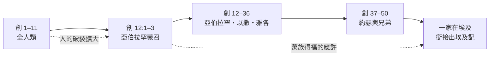
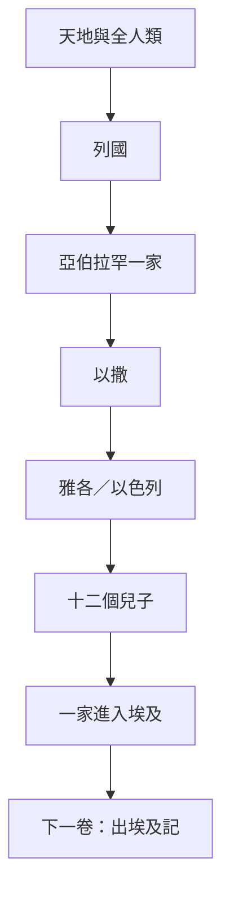
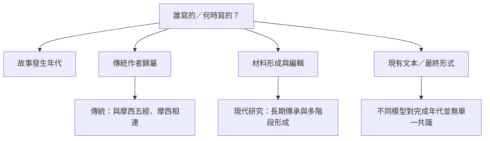

<!-- book-introduction-navigation:start -->
| [[01 創世記/全書目錄及綱要|全書目錄及綱要]] | [[01 創世記/第1章|開始讀第1章]] |
| :--- | ---: |
<!-- book-introduction-navigation:end -->

# 創世記 Introduction

*聖經第一卷書*

《創世記》不是只在回答「世界怎麼開始」。它先把鏡頭拉到天地與全人類，再一路推近到一個家庭：亞伯拉罕、以撒、雅各和約瑟。人一次又一次把事情弄壞，但神沒有放棄祂對世界的心意；從第12章開始，「一個家族要成為萬族得福的管道」成為後面整本聖經很重要的一條主線。

<!-- sources: CT00, GT00, KC0, BH, BIBLEPROJECT, ENTER_THE_BIBLE -->

---

## 一分鐘認識這卷書

| | |
| --- | --- |
| **位置** | 摩西五經第一卷；舊約與整本聖經的開場 |
| **章數** | 50 章 |
| **希伯來書名** | בְּרֵאשִׁית（Bereshith，「起初」） |
| **希臘／中文書名** | Genesis，意為「起源、出生、生成」 |
| **故事範圍** | 從創造與人類起源，一直到約瑟去世、雅各一家住在埃及 |
| **最重要的轉折** | 第12章——從全人類的破裂，轉向亞伯拉罕一家與「萬族得福」的應許 |

<!-- sources: CT00, KC0, BH, BIBLEPROJECT, ENTER_THE_BIBLE -->

---

## 為什麼叫「創世記」？

希伯來聖經是直接取開頭第一個字 **בְּרֵאשִׁית（Bereshith）** 來稱呼這卷書，意思就是「起初」。希臘文傳統則使用 **Genesis**，表達「起源、出生、生成」。兩個名字剛好從不同角度抓到這卷書的特色：它一直在追問——**事情是怎麼走到今天這一步的？**

所以《創世記》談的不只是天地的起初，也談人、婚姻與家庭、罪與死亡、列國、以色列先祖、約與應許的起頭。它甚至也把下一卷書的開場準備好了：為什麼《出埃及記》一開始，以色列人會住在埃及？答案就在《創世記》最後十幾章。

<!-- sources: CT00, GT00, KC0, BH -->

---

## 先看懂整卷書的鏡頭怎麼移動

如果只記一個結構，先記 **1–11章 → 12–50章**。前半段看全世界，後半段聚焦一個家族；第12章就是鏡頭轉向的鉸鏈。

| 範圍 | 鏡頭 | 這一段在做什麼 |
| --- | --- | --- |
| **1–11章** | 全人類的故事 | 創造、伊甸園、該隱與亞伯、洪水、列國、巴別塔。問題一步步擴大：人離開神，也彼此傷害。 |
| **12章** | 轉折點 | 神呼召亞伯蘭，應許土地、後裔與祝福；焦點縮小到一個家庭，但目標仍指向「地上的萬族」。 |
| **12–36章** | 亞伯拉罕、以撒、雅各 | 應許在一個很不完美的家族裡往前走；信心、失敗、衝突、保守與更新反覆出現。 |
| **37–50章** | 約瑟與兄弟 | 家族衝突把約瑟帶到埃及，最後反而成為全家在饑荒中得保存的途徑，也把舞台交給《出埃及記》。 |

> [!tip] 家譜不是休息時間
> 除了「1–11／12–50」的大分法，書內還反覆出現「這是……的後代／記略」一類 **toledot** 公式。它像一組路標，把創造之後的故事一段一段往下一代推進。家譜因此不是可以全部跳過的附錄，而是《創世記》本身的骨架之一。

<!-- sources: CT00, GT00, BH, BIBLEPROJECT, ENTER_THE_BIBLE, YALE -->

---

## 從「世界很好」到「一家人成了應許的載體」

整卷《創世記》的鏡頭一直在縮小，但神關心的範圍並沒有跟著縮小。

**1. 創造**  
神把秩序、生命與美善帶進世界，人受造承擔神形像與治理的使命。

**2. 破裂**  
人選擇按自己的方式定義善惡，罪從個人蔓延到家庭、社會與列國。

**3. 審判與保守**  
洪水與巴別顯出罪的嚴重；但故事並沒有在審判結束，神仍保存受造界，也繼續祂的計畫。

**4. 呼召亞伯拉罕**  
第12章突然把鏡頭放到一個人和他的後裔身上。可是這個選擇不是「從此只管這一家」；應許一開始就把「地上的萬族」放在終點。

**5. 應許穿過失敗**  
亞伯拉罕、以撒、雅各一家並不理想。害怕、欺騙、偏愛、爭鬥、不孕與等待一次又一次讓應許看起來像要斷掉，但土地、後裔與祝福的主線仍繼續往前。

**6. 進入埃及**  
到了約瑟的故事，人的惡意與神的保守被放在同一條故事線上。創世記結束時，以色列一家已經住在埃及——下一卷《出埃及記》的舞台就此搭好。

<!-- sources: CT00, BH, BIBLEPROJECT, ENTER_THE_BIBLE -->

---

## 誰寫的？什麼時候寫的？——先把四個問題拆開

這是《創世記》導論最容易被一句話寫壞的地方。**故事發生在什麼年代、傳統把作者歸給誰、材料何時形成、今天這個文本何時完成**，其實是不同問題。

| 問題 | 這一層在問什麼？ |
| --- | --- |
| **故事年代** | 《創世記》的敘事從創造一路延伸到族長與約瑟時代。這是故事所描寫的年代，**不等於寫作日期**。 |
| **傳統作者歸屬** | 猶太教與基督教長期把摩西五經與摩西聯繫在一起；CT00、KingComments、BibleHub 也沿用這條傳統理解。 |
| **傳統成書框架** | 常把寫作放在出埃及後的摩西時期，約主前十五至十四世紀、西奈／曠野背景。 |
| **現代學術成書觀** | 許多現代研究者把《創世記》理解為長期流傳、寫作與編輯的成果，並討論不同材料層與後期整合；至於每一層究竟何時形成，學界仍有不同模型。 |

> [!important] 不把不同層次的問題混在一起
> 這裡不會把其中一邊寫成「已經證明另一邊錯」。比較負責任的做法，是把**傳統作者歸屬**與**現代文本形成研究**並列，並告訴讀者它們各自在回答什麼問題。
>
> 像 J／E／P 這類來源模型，可以幫助理解近代五經研究怎麼觀察重複敘事、用詞與文本層次；但不應把某一套重建模型寫成已經毫無爭議的事實。

<!-- sources: CT00, GT00, KC0, BH, ENTER_THE_BIBLE, YALE -->

---

## 讀《創世記》時，腦中要有哪個世界？

《創世記》的故事舞台從整個世界逐漸縮到古代近東：美索不達米亞、迦南，最後到埃及。亞伯拉罕家族的遷移、牧養生活、婚姻與繼承、城邑、饑荒與土地交易，放回這個大環境裡讀，很多原本看起來只是「人物做了一件奇怪的事」的段落，就會多出一層背景。

尤其 1–11 章，不適合只剩下現代科學爭論。古代美索不達米亞也流傳創造與洪水故事，例如 Atrahasis 與 Gilgamesh 傳統；《創世記》與它們有可以比較的地方，也有非常不同的神觀、人觀與敘事目的。**「存在平行材料」不等於可以直接簡化成「誰抄誰」**，實際的傳承關係比這複雜得多。

> [!note] 先問文本在回答什麼
> 古代作者不是拿著二十一世紀的科學課本在寫作。這不代表科學問題不能問，而是讀經時最好把兩個問題分開：**這段經文想向原始讀者宣告什麼？**以及**今天的歷史、考古與自然科學能驗證到哪裡？**

<!-- sources: ENTER_THE_BIBLE, YALE -->

---

## 這卷書為什麼值得寫？

從傳統的五經框架來看，《創世記》是在幫助以色列群體回答最基本的身份問題：**你們的神是誰？世界從哪裡來？罪與死亡為什麼存在？你們的祖先是誰？為什麼會有土地、後裔與祝福的應許？又為什麼你們最後會在埃及？**

可是它的視野從來不只停在以色列。第12章最關鍵的地方就在這裡：神把一個家族分別出來，卻把「地上的萬族」放進這個家族蒙召的目的裡。換句話說，**揀選不是把世界忘掉，而是神回應世界破裂的一種方式。**

<!-- sources: CT00, BH, BIBLEPROJECT, ENTER_THE_BIBLE -->

---

## 抓住這幾條線，50章就不會散掉

### 創造與美善

《創世記》不是從「世界很糟」開始，而是先說世界出於神的創造、可以居住、可以繁衍，也被神看為好。後面的罪、暴力與審判，都發生在這個「原本美好」的背景上。

### 人想自己定義善惡

從伊甸園開始，人不斷嘗試脫離神、自己掌握善惡與人生方向；結果不是越來越完整，而是羞恥、嫉妒、暴力、破裂與死亡一路擴大。

### 祝福與咒詛

「祝福」不是創世記第12章才突然出現的詞。從創造、生養眾多，到挪亞，再到亞伯拉罕，祝福一直往前走；而第12章更把「你要蒙福」與「萬族要因你得福」綁在一起。

### 約與應許

挪亞之約面向受造界；亞伯拉罕的應許則集中在土地、後裔與祝福。故事最常製造的張力就是：**神說會有，但眼前看起來偏偏不可能。**沒有孩子、沒有土地、家庭分裂、饑荒、被賣到埃及——應許正是在這些反方向的情況裡往前走。

### 揀選不是偏愛的終點

神把亞伯拉罕一家分別出來，但目的仍指向萬族。所以《創世記》裡的「特別揀選」與「普世祝福」不是互相排斥，而是同一條線的兩端。

### 兄弟衝突與和好

該隱與亞伯、以實瑪利與以撒、以掃與雅各、約瑟與哥哥們——「兄弟怎麼一起活」幾乎一再回來。到了約瑟故事，前面反覆出現的兄弟敵對終於走到一個不同的結局：報復沒有成為最後一句話，和好與保存生命反而成了高潮。

### 神的信實穿過人的失敗

族長並不是一群毫無瑕疵的英雄。正因為人物常常害怕、欺騙、偏愛、爭鬥，甚至自己把家庭搞得一團亂，神仍推動祂所說過的應許才變得格外突出。讀《創世記》，與其一直問「這個人值不值得模仿」，有時更值得問：**在這群不完美的人當中，神正在做什麼？**

<!-- sources: CT00, BIBLEPROJECT, ENTER_THE_BIBLE -->

---

## 《創世記》其實很會說故事

**重複與對照**  
同類事件會在不同世代再次出現：兄弟競爭、妻子不孕、長幼次序翻轉、離開與歸回、饑荒與寄居。重複不是偷懶，而是在邀請讀者比較：這一次跟上一次有什麼一樣？又有什麼改變？

**家譜是轉場工具**  
家譜會把時間快速推進，也把「誰承接哪一條故事線、誰成為哪一族」交代清楚。反覆出現的 **toledot** 公式，更像整卷書內建的章節路標。

**人物不是扁平榜樣**  
亞伯拉罕、雅各、約瑟等人物都有信心，也都有複雜性。敘事記載一件事，並不自動等於經文在稱讚那件事；很多時候，故事讓後果、人物關係與神後來的介入自己說話。

**約瑟故事的節奏明顯不同**  
37–50章比前面的族長短篇更像一個連續長篇故事：人物誤認、隱藏身份、伏筆、試探、反轉與揭露一層一層推進，所以讀起來會有很不一樣的節奏。

<!-- sources: GT00, ENTER_THE_BIBLE, YALE -->

---

## 《創世記》不是一座孤島

它最後把約瑟收殮在埃及，下一卷《出埃及記》就從「以色列人在埃及」接棒。土地、後裔、祝福、神同在、罪與死亡、祭、安息、神形像、列國等主題，也會一路被後面的律法書、先知書、詩歌智慧書與新約重新拾起。

因此讀《創世記》很好的方法之一，不是每讀完一個故事就急著找一句「人生小教訓」，而是問：

> [!question] 讀完一段，可以問自己
> **這段故事把哪一條大主線往前推了一步？**
>
> 是後裔？土地？祝福？約？兄弟關係？人的罪？神的保守？還是「萬族得福」？

<!-- sources: CT00, KC0, BIBLEPROJECT -->

---

## 第一次讀，可以這樣抓

- **先看神做了什麼，再看人物做了什麼。** 神才是全書真正不斷出場的主角。
- 每次看到「**福／咒詛、後裔、地、約、兄弟、長子、饑荒、離開／歸回**」時，留意它是不是在重複或翻轉前面的故事。
- 家譜先不要全跳過，至少看它把哪一個故事接到哪一個故事，以及焦點最後落到誰身上。
- 讀到 1–11章的科學、歷史與古代近東問題時，把「**文本想說什麼**」與「**現代研究能驗證什麼**」分開問。
- 讀族長故事時，不要預設聖經記載某人的行為就等於贊成那個行為；敘事常常讓後果自己說話。
- 如果50章一次看太大，可以照 [[01 創世記/全書目錄及綱要|全書目錄及綱要]] 的四段往下讀，再回來看本頁的大圖，你會比較容易看到同一條故事線。

<!-- sources: BIBLEPROJECT, ENTER_THE_BIBLE, YALE -->

---

> [!info]- 本頁來源與方法
> **四套既有註釋來源**：CT00、GT00、KC0、BH。BibleProject、Enter the Bible、Yale 是補強層，**不加入四家註釋的共識票數**。
>
> - **CT00**｜[CCBibleStudy《創世記提要》](https://www.ccbiblestudy.org/Old%20Testament/01Gen/01CT00.htm)
> - **GT00**｜[CCBibleStudy《創世記導論拾穗》](https://www.ccbiblestudy.org/Old%20Testament/01Gen/01GT00.htm)
> - **KC0**｜[KingComments — Genesis Introduction](https://www.kingcomments.com/en/bible-studies/Gen/0)
> - **BH**｜[BibleHub — Genesis Summary and Study Bible](https://biblehub.com/genesis/)
> - **BibleProject**｜[Book of Genesis Guide](https://bibleproject.com/guides/book-of-genesis/)
> - **Enter the Bible**｜[Genesis](https://enterthebible.org/courses/genesis/)
> - **Yale Bible Study**｜[Genesis Introduction](https://yalebiblestudy.org/courses/genesis/lessons/genesis-introduction-study-guide/)
>
> GT00 本身是多家導論與註釋的合輯，因此遇到內部分歧時，會保留它實際引用的子來源，不把某一家的看法冒充成「GT00 全體共識」。BibleHub 內部即使整合多種底層資料，這個專案仍把它當成同一個 BH 來源維度。
>
> 作者、年代、文類與歷史問題若有分歧，本頁會把不同框架放在它們各自回答的問題層次裡，不用單一來源替其他來源下裁決。

---

<!-- book-introduction-navigation:start -->
| [[01 創世記/全書目錄及綱要|全書目錄及綱要]] | [[01 創世記/第1章|開始讀第1章]] |
| :--- | ---: |
<!-- book-introduction-navigation:end -->
