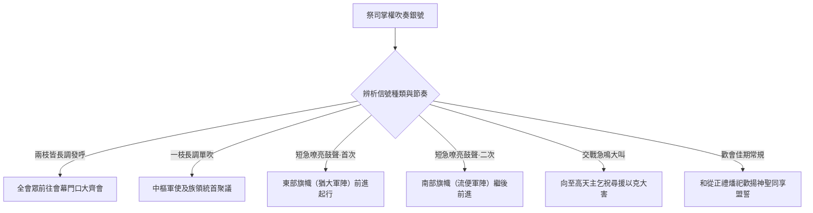
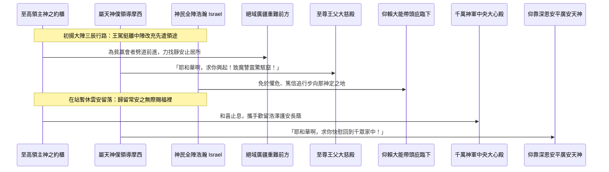

# 民數記 第10章

1. 耶和華曉諭摩西說：
2. 你要用銀子做[[銀號|兩枝號]]，都要錘出來的，用以招聚會眾，並叫眾營[[拔營起行|起行]]。
3. 吹這[[銀號|號]]的時候，全會眾要到你那裡，聚集在[[會幕（帳幕整體）|會幕]]門口。
4. 若單吹一枝，眾首領，就是以色列軍中的統領，要聚集到你那裡。
5. 吹出大聲的時候，東邊安的營都要[[拔營起行|起行]]。
6. 二次吹出大聲的時候，南邊安的營都要[[拔營起行|起行]]。他們將起行，必吹出大聲。
7. 但招聚會眾的時候，你們要吹[[銀號|號]]，卻不要吹出大聲。
8. 亞倫子孫作祭司的要吹這[[銀號|號]]；這要作你們世世代代永遠的定例。
9. 你們在自己的地，與欺壓你們的敵人打仗，就要用[[銀號|號]]吹出大聲，便在耶和華─你們的神面前得蒙紀念，也蒙拯救脫離仇敵。
10. 在你們快樂的日子和節期，並月朔，獻[[燔祭（olah）|燔祭]]和[[平安祭（shelamim）|平安祭]]，也要吹[[銀號|號]]，這都要在你們的神面前作為紀念。我是耶和華─你們的神。
11. 第二年二月二十日，[[雲彩（anan）|雲彩]]從[[法櫃的帳幕]]收上去。
12. 以色列人就按站[[拔營起行|往前行]]，離開[[西乃的曠野]]，[[雲彩（anan）|雲彩]]停住在[[巴蘭的曠野]]。
13. 這是他們照耶和華藉摩西所吩咐的，初次[[拔營起行|往前行]]。
14. 按著軍隊首先[[拔營起行|往前行]]的是猶大營的纛。統領軍隊的是亞米拿達的兒子拿順。
15. 統領以薩迦支派軍隊的是蘇押的兒子拿坦業。
16. 統領西布倫支派軍隊的是希倫的兒子以利押。
17. [[會幕（帳幕整體）|帳幕]]拆卸，[[革順子孫|革順的子孫]]和[[米拉利子孫|米拉利的子孫]]就抬著帳幕先[[拔營起行|往前行]]。
18. 按著軍隊[[拔營起行|往前行]]的是流便營的纛。統領軍隊的是示丟珥的兒子以利蓿。
19. 統領西緬支派軍隊的是蘇利沙代的兒子示路蔑。
20. 統領迦得支派軍隊的是丟珥的兒子以利雅薩。
21. [[哥轄子孫|哥轄人]]抬著聖物先[[拔營起行|往前行]]。他們未到以前，抬[[會幕（帳幕整體）|帳幕]]的已經把帳幕支好。
22. 按著軍隊[[拔營起行|往前行]]的是以法蓮營的纛，統領軍隊的是亞米忽的兒子以利沙瑪。
23. 統領瑪拿西支派軍隊的是比大蓿的兒子迦瑪列。
24. 統領便雅憫支派軍隊的是基多尼的兒子亞比但。
25. 在諸營末後的是但營的纛，按著軍隊[[拔營起行|往前行]]。統領軍隊的是亞米沙代的兒子亞希以謝。
26. 統領亞設支派軍隊的是俄蘭的兒子帕結。
27. 統領拿弗他利支派軍隊的是以南的兒子亞希拉。
28. 以色列人按著軍隊[[拔營起行|往前行]]，就是這樣。
29. 摩西對他岳父（或作：內兄）─[[何巴|米甸人流珥的兒子何巴]]─說：我們要[[拔營起行|行路]]，往耶和華所應許之地去；他曾說：我要將這地賜給你們。現在求你和我們同去，我們必厚待你，因為耶和華指著以色列人已經應許給好處。
30. [[何巴]]回答說：我不去；我要回本地本族那裡去。
31. 摩西說：求你不要離開我們；因為你知道我們要在曠野安營，你可以當作我們的眼目。
32. 你若和我們同去，將來耶和華有什麼好處待我們，我們也必以什麼好處待你。
33. 以色列人離開耶和華的山，[[拔營起行|往前行]]了三天的路程；[[約櫃|耶和華的約櫃]]在前頭行了三天的路程，為他們尋找安歇的地方。
34. 他們拔營[[拔營起行|往前行]]，日間有耶和華的[[雲彩（anan）|雲彩]]在他們以上。
35. [[約櫃]][[拔營起行|往前行]]的時候，摩西就說：耶和華啊，求你興起！願你的仇敵四散！願恨你的人從你面前逃跑！
36. [[約櫃]]停住的時候，他就說：耶和華啊，求你回到以色列的千萬人中！

<!-- fhl-map-links:start -->
## 相關地圖

- [[appendix/fhl_maps/maps/019|〈出圖二〉以色列人出埃及到西乃山]]
- [[appendix/fhl_maps/maps/020|〈民圖一〉從西乃山到加低斯]]
- [[appendix/fhl_maps/maps/024|〈民圖五〉出埃及和進迦南的旅程]]
- [[appendix/fhl_maps/maps/025|〈申圖一〉應許之地全圖]]
<!-- fhl-map-links:end -->

---

## 本章知識節點

### 文化
- [[銀號]]

### 主題
- [[會幕（帳幕整體）]]
- [[約櫃]]

### 原文
- [[燔祭（olah）]]
- [[平安祭（shelamim）]]
- [[雲彩（anan）]]

### 地點
- [[法櫃的帳幕]]
- [[西乃的曠野]]
- [[巴蘭的曠野]]

### 歷史
- [[拔營起行]]

### 人物
- [[革順子孫]]
- [[米拉利子孫]]
- [[哥轄子孫]]
- [[何巴]]

### 解經爭議
- [[流珥葉忒羅與何巴的稱謂關係]]

### 神學
- [[約櫃前行與停住的宣告]]

---

## 本章整理

### 銀號的製作原則與多重功能分析（1-10節）
在西乃山下的定例指引告一段落前，耶和華向摩西頒佈了一項關於行軍治理與宗教召集的根本指示：用純銀打造兩枝 [[銀號]]。經文特別指出這兩枝銀號必須「都要錘出來的」（第2節）。在製作材質與工藝上，釋經學者強調銀子在聖經的神學意涵中皆表徵「救贖」，而整塊純銀經過錘打拉伸塑形，除了代表器具結構本身的純一無雜外，更預表了神的拯救必須歷經痛苦、壓榨與十字架的考驗（參 CT 註解；KC、BH）。因此，由銀號發出的命令毫無私人情感渲染，全端定基於神聖的救贖主權上。吹奏此二銀號的職責被嚴密規定「惟獨交由亞倫子孫作祭司的吹奏」（第8節），此作為全體選民世世代代永遠不廢的定例，宣告地上軍隊的一動一靜全是神聖話語與大祭司權柄的反映。

就功用而言，銀號具有嚴密區分與明確節奏的音號辨別：若兩枝同時悠長地吹響，即表示呼召全體會眾前來聚集於 [[會幕（帳幕整體）|會幕]] 門口，聽候律令發佈與獻禮致敬；若單單悠長地吹奏一枝號筒，則僅為召集代表十二支派的大首領與千夫長舉行領軍中樞大會。當遭遇長征移動的緊要關口時，祭司便吹出急促而響亮的大聲作為起行的戒備號令；初次大聲吹作時，安營於東面的猶大軍隊領陣前邁，二次大聲發動時，南面陣列繼進相接。除了行軍起行外，當將來於應許之境內面對外侮、與強敵抗決之時，激烈鼓噪的吹號成了向真神祈乞憐憫的靈戰呼禱，促使耶和華看顧、救拔他們得免寇讎與大禍。再者，當歲時盛氣的慶和吉期、節慶並各月初的月朔來臨際，隨著眾長不曾停竭之完奉聖犧——不論為盡火直升的 [[燔祭（olah）|燔祭]]、亦是神人歡享融席的 [[平安祭（shelamim）|平安祭]]——伴響的高宏號樂，正是信眾感恩得蒙耶和華恆常記述眷顧的榮譽明證。

| 信號形式與吹法 | 聲浪特性 | 指定行動或禮儀回應 | 神學意涵與解經詮譯 |
| :--- | :--- | :--- | :--- |
| **雙筒齊吹長音** | 悠揚穩篤、遍徹諸營 | 十二支派全眾抵達會幕門口共集 | 表白上主宏恩與君權統理號召一眾會民咸心聆訓 |
| **單管引發長調** | 單一高純、明確辨別 | 千人總長與全團領首速往帳中議見 | 反映軍階次序不紊以及神命自領導層向外傳達之理 |
| **連續大叫短鳴** | 快猛雄壯、緊扣軍情 | 各個守邊集團按先後方陣啟運進離 | 教導神家戰士聽順令發而奮起直前不敢游遲 |
| **危戰長空鳴奏** | 急振堅猛、仰上求應 | 在危難與交兵處呼告救拔祈免失挫 | 重建救贖盟契信心，賴真上帝的應命致遠勝患 |
| **喜事及月朔吹調** | 悅穆溫美、和獻祭物 | 佐襯正禮祭禮焚昇朝向聖主歡頌 | 是宣告選族得享天上長慰、誓表盟愛牢固的歡頌銘錄 |

### 初次拔營與行軍陣容的大氣部署（11-28節）
歷史上最具深遠代表的進旅日子最終降至：出埃及記及民數記長逾十一個多月，以色列部民深居靜學的黃金孕安期就此宣告畢業。在「第二年二月二十日」，正是在正月守正逾越節、二月補慶餘眾歸成過後，象徵永在聖恩至強領禦的王權記號即刻動態轉顯：「[[雲彩（anan）|雲彩]] 從 [[法櫃的帳幕]] 收上去。」（民十11）。這是一個前所未有的宣示動作，促成了全體會伍終正式離捨習久棲止的安適舊野、首次揮寫磅礴整列無雙的 [[拔營起行]]；十二族眾順依天上信號，「離開 [[西乃的曠野]]」後，依站前行，直至那指路的靈駕雲團轉移停留於一處曠瀚考驗的新領地：[[巴蘭的曠野]]（第12節）。

在這個令人深思的百萬行軍編列實體運轉當中，神非但彰顯了行雲引發的大理，更將民數記第一章至第四章所籌劃之精嚴架構全然落在軍事踐行裡。走在戰陣之最首的是由東向長雄猶大宗隊組成的第一戰鬥集群，勇當前驅闢破荒嶺險道。當先行軍鋒一去，大軍立即進行井接無誤的聖儀安置分區：專責幕棚拆搬的高貴兵團——[[革順子孫]] 與 [[米拉利子孫]] 抬負厚牆幕被與實木柱骨先行登發；其出陣用意至高極重，乃為搶在流便之南征壯騎隨過、直至攜抱聖心重器者的神職同袍即將蒞止之那刻前，以最快光景早於抵點重新立起會所大殿（參第17節）。

繼流便大營於中部拱護相行後，行進大隊的核心中樞正位來臨：這即是由 [[哥轄子孫]] 親挑力擔的至尊古神禮品一伙。學問各家如 GT 及 KC 異口同聲讚明：「哥轄族以背膀苦托無價的最高至聖擺器（含及金壇、銀燈及主誓石函之駕等），徐徐推離隨進。因為在前行子民抵步以前，會帳框架已經借力先抬人員建就完備，使重器到地即得長入定位安休無慮。」隨後是由西向以法蓮大方隊及鎮殿收防北邊強豪但支派大方隊護持後部；徹底建構了一派神主不論在休營不動或奔越黃沙皆獨為萬兵環抱中心的極尚風貌。

| 序列隊伍與軍事組分 | 主任支派或利未職分 | Leading Leader / 職責指派 | 神學結構定位與運營功用 |
| :--- | :--- | :--- | :--- |
| **第一集群（開途先鋒）** | 猶大、以薩迦、西布倫 | 拿順等統領軍帥 | 開荒挺出浩大干戈，率民突入嚴冥考驗的大塞境 |
| **會堂硬件與織布搬遷組** | 革順族與米拉利族 | 以牛雙與牛駕分載會棚與底板 | 使帷幔樑柱趕赴下一營區得以迅即成搭成居 |
| **第二集群（南向巨屏）** | 流便、西緬、迦得 | 以利蓿等支派長 | 肩扛護背神駕中段，給付堅固的中堅掩體防罩 |
| **聖物崇奉中央陣** | 哥轄族 | 親身由背肌承受至寶重物 | 顯現真神同往居其眾伍心骨的核心至誠 |
| **第三集群（西向拱佐）** | 以法蓮、瑪拿西、便雅憫 | 以利沙瑪等氏長 | 繼踵頂承大陣身後半腹以維嚴靜浩壯之道 |
| **第四集群（收疆巨壁）** | 但、亞設、拿弗他利 | 亞希以謝等元佐 | 肩擔斷殿並拾收一切疲疲行友的終止保禦 |

### 摩西與何巴：神聖指引與人間智慧的協調（29-32節）
在大地遷動臨至危險之夕上，經籍突然夾入了一頁閃爍真醇溫馨的神情與人意謀對話錄。偉岸君僕摩西面對即度邁進生怯的大土沙漠，誠厚直率懇勉他的一位貴親友相齊攜行——這便極為著稱的故事主人公 [[何巴]]。經文中對親朋語稱有記載云：「摩西對他岳父（或作：內兄）—米甸人流珥的兒子何巴—說：我們要行路，往耶和華所應許之地去；他曾說：我要將這地賜給你們。現在求你和我們同去，我們必厚待你，因為耶和華指著以色列人已經應許給好處。」這一節裡關於名稱身份歸向的陳書，引來解經界對古來譯音釋疑的長年辨正，也就是常說的 [[流珥葉忒羅與何巴的稱謂關係]]。學者群（如 CT 黃迦勒箋讀、以及 KC 導解等）明辨其原文字詞其實代表一般由婚姻共結的內親關係（通包父、親或者長堂哥弟），因此解為摩西內兄較符時序。

初始遭遇的，是何巴依常情答還不願拋鄉奔老舊山家的回退願念；然摩西拒不絕心放棄，再度追陳極致赤心的挽願理由：「求你不要離開我們；因為你知道我們要在曠野安營，你可以當作我們的眼目。」針對這一席再三相請的懇辭，不同經典評價與注釋傳統一度曾有相反意見撞突。偶有一脈疑說摩西似存信心低薄與依靠人的意氣；然而當世廣獲盛推之主流經學真悟（包含 GT 本與丁氏精箋、以及全英文權威叢書如 BibleHub 經典引釋等）則嚴密闢出真見：這並非常識衰無或者輕褻天恩，相反地，神之無限超自然雲牽跟人間對山川氣侯實境深通無對的本世經驗「絕不互相為敵」！何巴長曉大沙漠底深隱水孔的天然智謀與眼力，全然在至聖主君愛悅引統之下獲得了高崇接納與器用的位置；這種將屬天的無上恩澤和眾家天下豪賢傾誠共存的高美胸局，不僅成就一席福音召呼的高貴模樣，更是遠瞻了異族知心豪民終因相信同受父主無涯分澤的美勝見狀！

### 約櫃前引的奇異恩赦與勝敵歸息的聖詞（33-36節）
行經前史嚴嚴鋪述的行旅規則完畢後，這幕萬卷頌揚的一卷在句點前迸開了聖經長編空前無偶的新神顯。照前指宣示之常章，至尊法櫃理應身宿於哥轄中陣裡與流便隨走而同在；但在這次揮別昔年棲止之聖潔高嶺的「初朝首航三日長行」上，作為萬聖頂上明皇主體的 [[約櫃]]，居然完全自序超越而離脫常軌，特蒙旨愛衝赴前路成為開途領首！「以色列人離開耶和華的山，往前行了三天的路程；耶和華的約櫃在前頭行了三天的路程，為他們尋找安歇的地方。」（第33節）。此番神聖前引散發極強烈之主愛護存神學：不是使極貧羸軟心怯的大群奴生子眾在未曉的大荒絕漠獨闖拼沙，而為天帝化身聖帥，攜帶誓言大旨挺馳危地劈解兇頑，在廣長之砂間預遍搜索一處堪以托賴安息的好良定土！

伴隨這一超越榮冕的大前倡，無懈的偉大神僕必定配作震發青天之至高長誓。每當靈雲興風領率起發或是駐降靜頓，摩西仰觀至上都誓發長史不輟的雙引呼禱，斯即震撼千載之聖辭：[[約櫃前行與停住的宣告]]。當偉力奔起揚戰中，摩西宏口激呼：「耶和華啊，求你興起！願你的仇敵四散！願恨你的人從你面前逃跑！」（第35節，其神韻在日後為詩篇六十八篇首起長歌垂收引用）；而在榮駕長久停駐定安之那夕，他再度詠和安慰的平安聖詠：「耶和華啊，求你回到以色列的千萬人中！」（第36節）。此間無出其二的神學深刻洞悉證明，屬天之王的心魂早就決定「其榮辱將依順臣子的榮辱為本身一脈共榮」，民寇一如同歸帝敵；不拘行走與戰還是休頓與歇，救恩全陣永遠獨賴那位前邁破敵、死中三晨翻勝的主權君皇為長永依歸。

### 跨章節脈絡與神學綜合與結晶
縱論民數記第10章於全套摩西五經內部及歷史遞演的大鏈上，實質乃屬於全體天上長途歷涉最重要的巨型中途樞紐分界台。回扣舊事，自出埃及記第19章以色列選兵到達西乃雄原起至本冊這刻第10章第10節為止，整個旅軍皆被靜置在西乃巍峨雷光神約垂教的小園當中——這堪號全體受恩家徒處一堂、領受千條教誨禮文而無庸冒戰涉禍的「靜態陶養定型之階」。但打從本節神角鳴長大振的一剎起，一切先前在安雅講堂受習的神言金規，全部得立即走遠舊鄉、赴向千山沙原深川去演繹極之危絕並寸實試驗的「動態天旅操兵之旅」。

如此深長的典則明講示出：即便擁足最高天啟的無雙救典（如銀金祭品與錘鍊儀令），基督勇衛與屬天部伍若脫去軍令至純之依循或是失去自心深處對神居常伴相依的心依，一切大志唯墮如無頭虛狂；天命之路的精粹正顯正在：不管遭遇前走激衝或是頓伏默候，以純銀自壓碎出宣誓之十字架長愛為標竿，仰視王袍在前方自覓平安休土無不竭竭自得！這便構架並照亮千載往昔與來世凡步踏這途浩征神友至極恆純的天路靈意。

**參考資料**
https://www.ccbiblestudy.org/Old%20Testament/04Num/04CT10.htm
https://www.ccbiblestudy.org/Old%20Testament/04Num/04GT10.htm
https://www.kingcomments.com/en/bible-studies/Num/10
https://biblehub.com/study/numbers/10.htm
