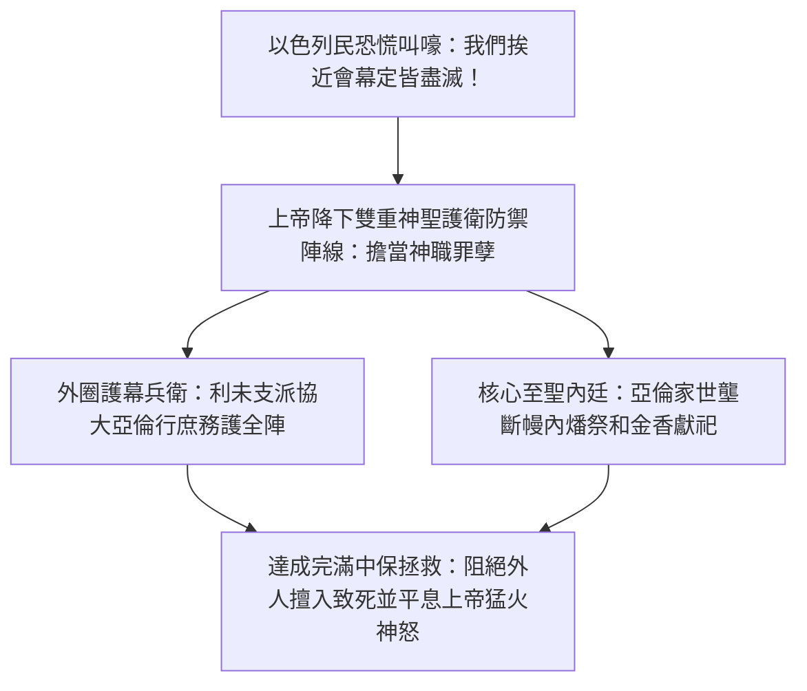
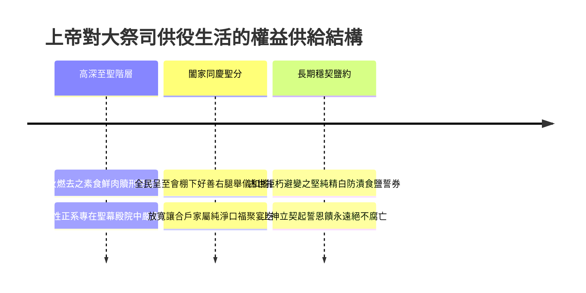
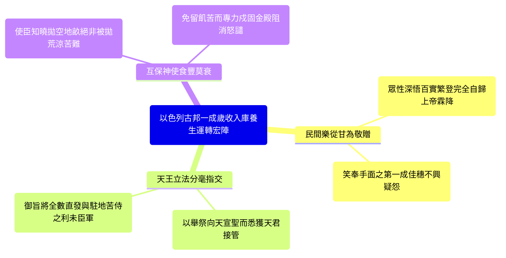

# 民數記 第18章

1. 耶和華對亞倫說：你和你的兒子，並你本族的人，要一同擔當干犯聖所的罪孽。你和你的兒子也要一同擔當干犯[[亞倫和他兒子（祭司）|祭司]]職任的罪孽。
2. 你要帶你弟兄[[利未支派|利未人]]，就是你祖宗支派的人前來，使他們與你聯合，服事你，只是你和你的兒子，要一同在法櫃的帳幕前供職。
3. 他們要守所吩咐你的，並守全帳幕，只是不可挨近聖所的器具和壇，免得他們和你們都死亡。
4. 他們要與你聯合，也要看守會幕，辦理帳幕一切的事，只是外人不可挨近你們。
5. 你們要看守聖所和壇，免得忿怒再臨到以色列人。
6. 我已將你們的弟兄[[利未支派|利未人]]從以色列人中揀選出來歸耶和華，是給你們為賞賜的，為要辦理會幕的事。
7. 你和你的兒子要為一切屬壇和幔子內的事一同守[[亞倫和他兒子（祭司）|祭司]]的職任。你們要這樣供職；我將祭司的職任給你們當作賞賜事奉我。凡挨近的外人必被治死。
8. 耶和華曉諭亞倫說：我已將歸我的[[舉祭（terumah）|舉祭]]，就是以色列人一切分別為聖的物，交給你經管；因你受過膏，把這些都賜給你和你的子孫，當作永得的分。
9. 以色列人歸給我[[至聖的供物（聖與至聖之分）|至聖的供物]]，就是一切的素祭、贖罪祭、贖愆祭，其中所有存留不經火的，都為至聖之物，要歸給你和你的子孫。
10. 你要拿這些當至聖物吃；凡男丁都可以吃。你當以此物為聖。
11. 以色列人所獻的[[舉祭（terumah）|舉祭]]並搖祭都是你的；我已賜給你和你的兒女，當作永得的分；凡在你家中的潔淨人都可以吃。
12. 凡油中、新酒中、五穀中至好的，就是以色列人所獻給耶和華初熟之物，我都賜給你。
13. 凡從他們地上所帶來給耶和華初熟之物也都要歸與你。你家中的潔淨人都可以吃。
14. 以色列中一切永獻的都必歸與你。
15. 他們所有奉給耶和華的，連人帶牲畜，凡頭生的，都要歸給你；只是人頭生的，總要贖出來；不潔淨牲畜頭生的，也要贖出來。
16. 其中在一月之外所當贖的，要照你所估定的價，按聖所的平，用銀子五舍客勒贖出來（一舍客勒是二十季拉）。
17. 只是頭生的牛，或是頭生的綿羊和山羊，必不可贖，都是聖的，要把他的血灑在壇上，把他的脂油焚燒，當作馨香的火祭獻給耶和華。
18. 他的肉必歸你，像被搖的胸、被舉的右腿歸你一樣。
19. 凡以色列人所獻給耶和華聖物中的[[舉祭（terumah）|舉祭]]，我都賜給你和你的兒女，當作永得的分。這是給你和你的後裔、在耶和華面前作為永遠的[[立約的鹽|鹽約]]（鹽即不廢壞的意思）。
20. 耶和華對亞倫說：你在以色列人的境內不可有產業，在他們中間也不可有分。我就是你的分，是你的產業。
21. 凡以色列中出產的[[十分之一]]，我已賜給利未的子孫為業；因他們所辦的是會幕的事，所以賜給他們為酬他們的勞。
22. 從今以後，以色列人不可挨近會幕，免得他們擔罪而死。
23. 惟獨[[利未支派|利未人]]要辦會幕的事，擔當罪孽；這要作你們世世代代永遠的定例。他們在以色列人中不可有產業；
24. 因為以色列人中出產的[[十分之一]]，就是獻給耶和華為[[舉祭（terumah）|舉祭]]的，我已賜給[[利未支派|利未人]]為業。所以我對他們說：在以色列人中不可有產業。
25. 耶和華吩咐摩西說：
26. 你曉諭[[利未支派|利未人]]說：你們從以色列人中所取的[[十分之一]]，就是我給你們為業的，要再從那十分之一中取十分之一作為[[舉祭（terumah）|舉祭]]獻給耶和華，
27. 這[[舉祭（terumah）|舉祭]]要算為你們場上的穀，又如滿酒醡的酒。
28. 這樣，你們從以色列人中所得的[[十分之一]]也要作[[舉祭（terumah）|舉祭]]獻給耶和華，從這十分之一中，將所獻給耶和華的舉祭歸給[[亞倫和他兒子（祭司）|祭司]]亞倫。
29. 奉給你們的一切禮物，要從其中將至好的，就是分別為聖的，獻給耶和華為[[舉祭（terumah）|舉祭]]。
30. 所以你要對[[利未支派|利未人]]說：你們從其中將至好的舉起，這就算為你們場上的糧，又如酒醡的酒。
31. 你們和你們家屬隨處可以吃；這原是你們的賞賜，是酬你們在會幕裡辦事的勞。
32. 你們從其中將至好的舉起，就不致因這物擔罪。你們不可褻瀆以色列人的聖物，免得死亡。

---

## 本章知識節點

### 神學
- [[擔當干犯聖所與祭司職任的罪孽]]
- [[祭司與利未人的職任為神之賞賜]]
- [[耶和華是事奉者的業與分]]
- [[利未人的什一奉獻]]
- [[永遠當祭司的職任]]

### 文化
- [[古代近東以什一奉獻為神職薪酬]]
- [[贖銀五舍客勒]]

### 主題
- [[立約的鹽]]
- [[至聖的供物（聖與至聖之分）]]

### 原文
- [[舉祭（terumah）]]
- [[十分之一]]

### 人物
- [[利未支派]]
- [[亞倫和他兒子（祭司）]]

---

## 本章整理

### 祭司與利未人於會幕的防禦、中保與職任賞賜（v1-7）

民數記第十八章在出埃及往返荒野的舊約敘事中，建構了一座將震懾惶恐的災禍危機轉化為神權秩序與眷顧保證的壯觀里程碑。在上一階段歷史（第十至十七章）經歷可拉黨反叛、二百五十尊銅香爐遭到聖火燒毀、甚至地裂吞殺等嚴重浩劫後，最後由亞倫那尊擺陳於法櫃下夜宿生長出枯芽及成熟杏桃的木杖作為最高神蹟裁判。百姓在遭遇大面積死亡與刑罰後，陷入極致的恐懼與魂魄震盪，朝摩西狂吼哀號：「我們死啦！我們滅亡啦！都滅亡啦！凡挨近耶和華帳幕的是必死的。我們都要死亡嗎？」（十七12-13）。面對此等走入信仰極端崩潰的高壓態勢，上帝不再假手第三者，而是難得地在曠野旅程中直抵當庭面朝大祭司發號施命；神不為宣揚恐嚇，而是在此宣告建置完善的中保代價防護陣勢，揭示[[擔當干犯聖所與祭司職任的罪孽]]之嚴格重命。

黃迦勒在其《基督徒文摘》中深入拆解了這一幕歷史與信仰心態的對比：一般屬血肉的凡心每當瞻見高聳華嚴的神職位階時，往往將其視為耀榮誇譽和權益享受的好處而多起貪鬥；然而上帝首句曉諭卻破除世俗狂夢，挑明受召站於聖門與金壇先鋒處並非為了炫弄尊榮，而是誓欲站在聖怒暴火的前鋒刃嶺，肩承全體凡民因逾越或輕慢神廟儀律所可能釀出的神罪殃咎。丁良才也在《拾穗》裡指出，「利未」本義原有聯合與同行事役的情懷，上帝召派全個[[利未支派]]來協助陪伴[[亞倫和他兒子（祭司）]]一同當差，實為設立一道向外輻射的嚴格防禦護城：利未軍團擔任庶務防哨阻絕常客闖入；亞倫血裔則死立帳間至聖金壇和內層地幕中殿掌權。這種明確無保留的分職分疆制止了野民自任盲衝而遭火戮，使天怒止息於中保之盾前。

在極端嚴酷並分明畫定紅界的警訓過後，造者卻口吐芳香將這一苦戰苦承、日夕處於高壓奉祀下的重大差役升華為天上有福的話語，這也是經文中揭宣的[[祭司與利未人的職任為神之賞賜]]。「我已將你們的弟兄利未人從以色列人中揀選出來歸耶和華，是給你們為賞賜的……我將祭司的職任給你們當作賞賜事奉我。凡挨近的外人必被治死。」KingComments 的研讀觀點認為，這句宣諭將世間爭奪權柄的無常鬥詭徹底摧光：大位神宰絕不允許任何出於自慢驕狠的小民來武力掠權；因為能行使挽回罪民、阻擋刑戮的神務重差，完全是造天者胸懷平白無由賜頒於忠順信客手中至真無私的餽賞喜樂；能替眾生吃苦擋過、成全主命，實屬莫大的生命珍酬，與上帝的[[永遠當祭司的職任]]彼此貫徹呼應。

| 會幕差役安全區劃 | 特授承擔之職工領域 | 當得之榮幸特赦與天命法禁 |
| :--- | :--- | :--- |
| 利未同宗隨仕戰團 | 看護會棚全般各具運件庶事、戍定外圈阻卻民奔。 | 不得摸觸金色至聖內心陳具與高燒火座，觸違必罹凶殃。 |
| 亞倫傳承大祭司長 | 直往帳幕奧帷內極核心地；主握純金噴煙及灑獻潔血之盛典。 | 肩任聖堂和祭政干犯過端，享有創君賞餽至恩長賞與不移眷守。 |

### 祭司的永恆供養與立約之鹽、無地產的超越應許（v8-20）

當上帝親向亞倫及至親家系定下擔帶刑重、捍衛內閣的高標身位後，神同樣開展了一輪為長年堅留神陣而絕棄塵壤謀利的服差兵臣們奠定的長期伙養盛典。經中首提把全國呈獻的各號佳奉歸為大亞倫宗支子裔長食之權，而這供分條律具體細化為祭食雙階的嚴肅分層：其最端極貴的高層正是[[至聖的供物（聖與至聖之分）]]。「以色列人歸給我至聖的供物，就是一切的素祭、贖罪祭、贖愆祭，其中所有存留不經火的，都為至聖之物，要歸給你和你的子孫。」根據眾經家的嚴格考查，凡名為至聖之不焚食團與好肉，皆嚴厲勒令唯獨大亞倫世居中的清淨男丁才得以在院宇聖處咬嚼享安，且絕不可任意帶往凡俗村肆，也不得任與女人共嚐。

與這極其苛嚴的至聖階份相互陪伴對應的，乃是一般被稱呼為聖物的平安奉祭、歸還願物以及浩蕩豐厚的首熟獻貢。經言論示，上帝特喜將所有全地獻至會門垂恩敬恭之搖胸以及象徵向永恆尊皇敬致垂直奉上大榮的[[舉祭（terumah）]]之純良右腿，通予指歸亞倫合門之輩。於此項常規聖物當中，上帝解開嚴刑男丁專用框架，宣告凡事奉長使戶內未染不潔的所有眷親兒女通都能夠在家安喜慶中共食歡樂，此即賜作祂們終年賴護不匱之生機泉源。乃至民間農原野上凡獲頂優無玷的新酒、極美金麥及純香橄欖果滴之初得獻珍，亦都源源不絕湧流成祭軍的常善口祿。

而在全權述安各種牲果歸回制度時，經文特別針對以色列人誓還與奉贖的原則劃分得一清二楚：凡牛羊牧畜之中頭生的，由於早已為上帝指定歸神專作獻呈的犧牲，其性為絕對良純自尊，一律不可任意自願用錢財抵贖；彼等之赤純活血必定灑塗在殿內浩火台邊，並火焚膏油直作直抵主懷的馨香真氣。相對而言，人間家中出誕之首男、或是百品非潔之頑獸頭丁，則不可逕拉入火場化煙，皆當照章進行身段收回回購；這更立定了通代盛名的[[贖銀五舍客勒]]長制。「其中在一月之外所當贖的，要照你所估定的價，按聖所的平，用銀子五舍客勒贖出來（一舍客勒是二十季拉）。」依丁良才及舊約嚴謹考古視野，當時通流標準乃是以會棚內特存不二的銀斤砝碼折計斤量；規定必滿月乃是躲渡古地嬰弱高險早夭潮浪，以標準一舍客勒約十二克論計，五枚精銀既是誠愛謝贖拯救免災的崇高奉心，實為支養長年苦看主陣大軍的一股厚實公費。

這一系列龐豐廣厚的神榮佳釀告宣，都被全能者加上一句直透萬載絕不落淚搖落的立盟長令，亦成了聖經經典中著名的[[立約的鹽]]之聖誓承諾。「這是在耶和華面前作為永遠的鹽約。」多位重量解經巨匠（無論 CT、GT 或是 BibleHub）咸認於遠古地近東鄰土邦結信要文，習慣愛借耐候強防朽滅、永不受腐損化的鹹固白鹽出為誓約互存見證。上天既將大賞口資封上鹽約古璽，代表神不叫祂真正站在風陵負苛護民的直仕戰團面臨口窮腹竭或隨意改奪俸錄，而是抱載天經長情、堅韌不衰地供應下去。

就在頒佈這一席浩富延久的百般酬報偉則最端頂之處，創造天地無極的主仙，冷然而莊肅地摔給全亞倫家族一帖能震駭天下俗目、卻深埋萬丈天恩的終段宣告，正是[[耶和華是事奉者的業與分]]之屬天高峰：「你在以色列人的境內不可有產業，在他們中間也不可有分。我就是你的分，是你的產業。」黃迦勒無限動容地指出，狂亂世界的俗塵百族向來慣於悲搶斤塊田原爭得短命家城，卻無人識懂敢將生命撇棄泥疆地業之福；因為宇宙真正能夠一息主命千載浩劫的造命之恩君主本人——祂至高偉大的性德無限豐盛，完全成了信服者在萬世間坐享至優最茂的靈域藏庫！棄拋地角小私，直換榮君入命、擁為永存產業，方為超凡勝局成王之路。

### 利未人的什一奉獻與古代近東神職薪酬制度（v21-24）

當祭司之至聖權益與天安分守皆悉數底定之後，天王之眼旋即關切了替以民守禦四周大門的整旅哥轄與眾分營使子，明確奠立全個社團命運共享並相互回饋的經濟磐石，正是關於全軍必有依賴相濟之正道。「凡以色列中出產的十分之一，我已賜給利未的子孫為業；因他們所辦的是會幕的事，所以賜給他們為酬他們的勞。」這也是歷史中第一期極為確言清楚揭曉、指涉[[十分之一]]用途是充作大會幕勞動臣民代償工賞的一紙經典文宣。

為了使研讀民心真賞這一恩綱底蘊，丁良才、KingComments 乃至專業的《舊約聖經背景註釋》深度開揭了其中的政治文明獨步之優勢，正是[[古代近東以什一奉獻為神職薪酬]]的高貴社群意向。縱覽遠西元前千百多年東非至中亞的浩繁舊土文獻（囊括埃及王室、烏加里特古卷或美索不達米亞王朝紀錄），課徵地出十一的重規其實履履出現；無奈彼處諸強大率都仰向權限壟斷的皇殿豪相，十分供收淪為了滋榮君陵帝京、屯兵耀陣及豪壯祭堂的帝王專稅。然而摩西大律底下的社國互生結構呈現空前特異的美美慈祥：神命耕桑眾萌奉送的首獲初十分其一，完全是順從喜頌天王的名目徵納回來，緊隨隨便被王道全分毫莫留轉付作彼時不分迦南山原、夜夕苦戌會圍為救民人離罪殃譴之無地平利未家族。

這一法定理據宣訴到底，擊落了常俗對神殿納糧之猜妒怨語：百姓把血汗出得十金奉入大幕非但不是為皇霸驕凌的勒捐搾剝，實是社群間向著那些身甘斷走繼往土地買爭、一朝獨承聖禍護社為重的苦戰忠直者奉報既該又公合理的平權心籌。經書亦再三警誡並言申「惟獨利未人要辦會幕的事，擔當罪孽」，若無彼輩分立凶界擋譴，全群平氓踩過紅線只能遭受立刻燒毀死亡的巨禍；故把豐登喜穗均發於使員同慶，正是安護全社之最高愛和良藥。

### 利未人再度呈交頂上初熟：十分之一中取十分之一（v25-32）

在其建立起由以色列千萬軍將齊心供給利未薪祿的高曠美橋完畢處，直明本命、拒容傲縱肆意孳生的永神法廷，更是對那些手抱一成眾收喜榮無缺的衛隊使臣們劈落一道醒夢並雙向洗罪的重命——即為世人仰歌的[[利未人的什一奉獻]]：「你曉諭利未人說：你們從以色列人中所取的十分之一，就是我給你們為業的，要再從那十分之一中取十分之一作為舉祭獻給耶和華……從其中將至好的，就是分別為聖的，獻給耶和華為舉祭。」

黃迦勒在其痛陳肉情好自傲揚的專章筆繪上尖挑此事之重義：屬血心的僕役極容易因居前身侍聖主，隨產生不可一世與主張事天役苦必豁除對王上供奉的放縱暗驕！神言一擊重震：絕不得以替神供職為免謝免酬金牌！身當受領龐繁良麥一成甜實之際，務要比肩常民倍出虔誠俯仰天下，隨立精篩遍淘，再將得獲之十分之金其裡取掏精金好份百分一之「十分裡又十分其一」高擎化入舉貢之位！且所挑定交赴者不容摻沙挾穢，非是絕對首號頂半最醇最好的第一珍華，不敢向上神和祭門恭轉！

| 二度取上獻主原則 | 所呈薦物力的揀析準確定位 | 當受護赦與免坐死刑的屬靈心鑑 |
| :--- | :--- | :--- |
| 首一精拿極鮮奉獻 | 於收聚百民如山萬斗十分厚資理中，徹底揀定頂面良粹再割一成高舉轉供大祭正族。 | 剿止近衛自驕傲視脫貢放迷，證嚴居顯任長差神臣尤必為全世標率竭忠再仰天上大王。 |
| 九重殘資化恩稱潔 | 打完極鮮首供後手邊隨存之九成收金，頓獲全淨神榮祝福如同從民自田好穀初下。 | 宣彰依律去貪歸還極尚後，全堂眷親隨奔何址處處享飲都為無禍吉樂；杜免神刑死斬。 |

丁良才、KingComments 與 BibleHub 同具灼力揚唱此事裡含藏的大愛良性連環體制：於這壯遠的靈光大禮網路下，兆黎歡讚把嘉歲遞入利未門裡；利未眾歡懷恭敬挑精拔粹奉高與長兄亞倫殿台；亞倫家長沐榮愛中立火朝聖心；沒有任何人高高居外而得傲然掠取苦役不回首敬天。且更加妙趣的祝安要點在於，唯獨於此二度精華呈好完結過後，留在利未合戶掌懷深處所保留之那龐多餘下糧食果香，才終於蒙上帝正意算作等如民戶自麥場、酒醡親拔手穫之白白淨糧；彼輩始得於東西任何府落平肆口宴歡啖而永除被責暴亡噩災，成全一片平安康寧、充滿感恩和睦。

**參考資料**
https://www.ccbiblestudy.org/Old%20Testament/04Num/04CT18.htm
https://www.ccbiblestudy.org/Old%20Testament/04Num/04GT18.htm
https://www.kingcomments.com/en/bible-studies/Num/18
https://biblehub.com/study/numbers/18.htm
