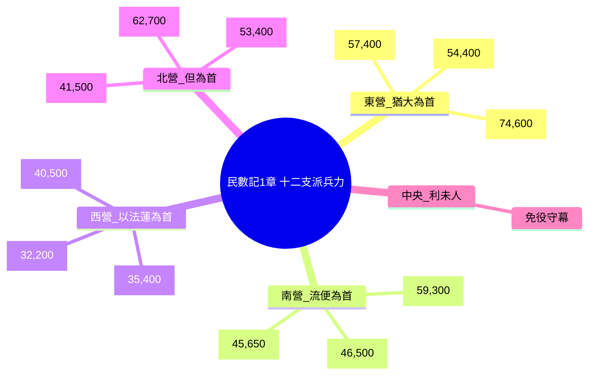
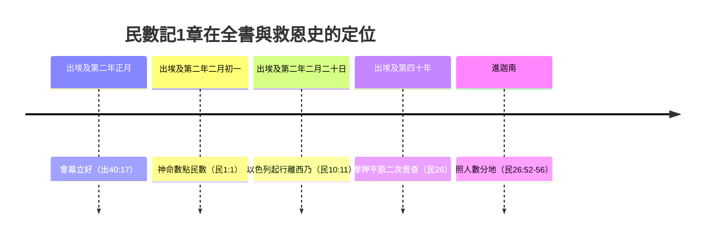

# 民數記 第1章

1. 以色列人出埃及地後，第二年二月初一日，耶和華在[[西乃的曠野]]、[[會幕（帳幕整體）|會幕]]中曉諭[[摩西]]說：
2. 你要按以色列全會眾的[[家室與宗族|家室]]、[[家室與宗族|宗族]]、人名的數目[[數點民數|計算所有的男丁]]。
3. 凡以色列中，[[二十歲以外能打仗的|從二十歲以外]]，能出去打仗的，你和[[亞倫]]要照他們的軍隊[[數點民數|數點]]。
4. 每支派中必有一人作本支派的[[十二族長協助數點|族長]]，幫助你們。
5. 他們的名字：屬[[流便]]的，有示丟珥的兒子以利蓿；
6. 屬西緬的，有蘇利沙代的兒子示路蔑；
7. 屬猶大的，有亞米拿達的兒子拿順；
8. 屬以薩迦的，有蘇押的兒子拿坦業；
9. 屬西布倫的，有希倫的兒子以利押；
10. 約瑟子孫、屬[[以法蓮]]的，有亞米忽的兒子以利沙瑪；屬[[瑪拿西]]的，有比大蓿的兒子迦瑪列；
11. 屬便雅憫的，有基多尼的兒子亞比但；
12. 屬但的，有亞米沙代的兒子亞希以謝；
13. 屬亞設的，有俄蘭的兒子帕結；
14. 屬迦得的，有丟珥的兒子以利雅薩；
15. 屬拿弗他利的，有以南的兒子亞希拉。
16. 這都是從會中選召的，各作本支派的[[十二族長協助數點|首領]]，都是以色列軍中的[[十二族長協助數點|統領]]。
17. 於是，[[摩西]]、[[亞倫]]帶著這些按名指定的人，
18. 當二月初一日招聚全會眾。會眾就照他們的[[家室與宗族|家室]]、[[家室與宗族|宗族]]、人名的數目，[[二十歲以外能打仗的|從二十歲以外]]的，都述說自己的[[家室與宗族|家譜]]。
19. 耶和華怎樣吩咐[[摩西]]，他就怎樣在[[西乃的曠野]][[數點民數|數點]]他們。
20. 以色列的長子，[[流便]]子孫的後代，照著[[家室與宗族|家室]]、[[家室與宗族|宗族]]、人名的數目，[[二十歲以外能打仗的|從二十歲以外]]，凡能出去打仗、[[數點民數|被數的]]男丁，共有四萬六千五百名。
21. 併於上節。
22. 西緬子孫的後代，照著[[家室與宗族|家室]]、[[家室與宗族|宗族]]、人名的數目，[[二十歲以外能打仗的|從二十歲以外]]，凡能出去打仗、[[數點民數|被數的]]男丁，共有五萬九千三百名。
23. 併於上節。
24. 迦得子孫的後代，照著[[家室與宗族|家室]]、[[家室與宗族|宗族]]、人名的數目，[[二十歲以外能打仗的|從二十歲以外]]，凡能出去打仗、[[數點民數|被數的]]，共有四萬五千六百五十名。
25. 併於上節。
26. 猶大子孫的後代，照著[[家室與宗族|家室]]、[[家室與宗族|宗族]]、人名的數目，[[二十歲以外能打仗的|從二十歲以外]]，凡能出去打仗、[[數點民數|被數的]]，共有七萬四千六百名。
27. 併於上節。
28. 以薩迦子孫的後代，照著[[家室與宗族|家室]]、[[家室與宗族|宗族]]、人名的數目，[[二十歲以外能打仗的|從二十歲以外]]，凡能出去打仗、[[數點民數|被數的]]，共有五萬四千四百名。
29. 併於上節。
30. 西布倫子孫的後代，照著[[家室與宗族|家室]]、[[家室與宗族|宗族]]、人名的數目，[[二十歲以外能打仗的|從二十歲以外]]，凡能出去打仗、[[數點民數|被數的]]，共有五萬七千四百名。
31. 併於上節。
32. 約瑟子孫屬[[以法蓮]]子孫的後代，照著[[家室與宗族|家室]]、[[家室與宗族|宗族]]、人名的數目，[[二十歲以外能打仗的|從二十歲以外]]，凡能出去打仗、[[數點民數|被數的]]，共有四萬零五百名。
33. 併於上節。
34. [[瑪拿西]]子孫的後代，照著[[家室與宗族|家室]]、[[家室與宗族|宗族]]、人名的數目，[[二十歲以外能打仗的|從二十歲以外]]，凡能出去打仗、[[數點民數|被數的]]，共有三萬二千二百名。
35. 併於上節。
36. 便雅憫子孫的後代，照著[[家室與宗族|家室]]、[[家室與宗族|宗族]]、人名的數目，[[二十歲以外能打仗的|從二十歲以外]]，凡能出去打仗、[[數點民數|被數的]]，共有三萬五千四百名。
37. 併於上節。
38. 但子孫的後代，照著[[家室與宗族|家室]]、[[家室與宗族|宗族]]、人名的數目，[[二十歲以外能打仗的|從二十歲以外]]，凡能出去打仗，[[數點民數|被數的]]，共有六萬二千七百名。
39. 併於上節。
40. 亞設子孫的後代，照著[[家室與宗族|家室]]、[[家室與宗族|宗族]]、人名的數目，[[二十歲以外能打仗的|從二十歲以外]]，凡能出去打仗、[[數點民數|被數的]]，共有四萬一千五百名。
41. 併於上節。
42. 拿弗他利子孫的後代，照著[[家室與宗族|家室]]、[[家室與宗族|宗族]]、人名的數目，[[二十歲以外能打仗的|從二十歲以外]]，凡能出去打仗、[[數點民數|被數的]]，共有五萬三千四百名。
43. 併於上節。
44. 這些就是被[[數點民數|數點]]的，是[[摩西]]、[[亞倫]]，和以色列中十二個[[十二族長協助數點|首領]]所數點的；這十二個人各作各[[家室與宗族|宗族]]的代表。
45. 這樣，凡以色列人中[[數點民數|被數的]]，照著[[家室與宗族|宗族]]，[[二十歲以外能打仗的|從二十歲以外]]，能出去打仗、被數的，共有六十萬零三千五百五十名。
46. 併於上節。
47. [[利未支派|利未人]]卻沒有按著支派數在其中，
48. 因為耶和華曉諭[[摩西]]說：
49. 惟獨[[利未支派]]你不可[[數點民數|數點]]，也不可在以色列人中計算他們的總數。
50. 只要派[[利未支派|利未人]]管[[會幕（帳幕整體）|法櫃的帳幕]]和其中的器具，並屬乎帳幕的；他們要抬（抬或作：搬運）帳幕和其中的器具，並要辦理帳幕的事，在帳幕的四圍安營。
51. [[會幕（帳幕整體）|帳幕]]將往前行的時候，[[利未支派|利未人]]要拆卸；將支搭的時候，利未人要豎起。[[外人近前來必被治死|近前來的外人必被治死]]。
52. 以色列人支搭帳棚，要照他們的軍隊，[[安營與纛|各歸本營]]，[[安營與纛|各歸本纛]]。
53. 但[[利未支派|利未人]]要在法櫃[[會幕（帳幕整體）|帳幕]]的四圍安營，免得忿怒臨到以色列會眾；利未人並要謹守[[會幕（帳幕整體）|法櫃的帳幕]]。
54. 以色列人就這樣行。凡耶和華所吩咐[[摩西]]的，他們就照樣行了。

<!-- fhl-map-links:start -->
## 相關地圖

- [[appendix/fhl_maps/maps/019|〈出圖二〉以色列人出埃及到西乃山]]
- [[appendix/fhl_maps/maps/020|〈民圖一〉從西乃山到加低斯]]
<!-- fhl-map-links:end -->

---

## 本章知識節點

### 主題
- [[數點民數]]
- [[利未支派]]
- [[家室與宗族]]
- [[二十歲以外能打仗的]]
- [[安營與纛]]
- [[外人近前來必被治死]]
- [[十二族長協助數點]]

### 人物
- [[摩西]]
- [[亞倫]]

### 地點
- [[西乃的曠野]]
- [[會幕（帳幕整體）]]

---

## 本章整理

### 神命令數點軍旅男丁（v1-19）

本章開篇精確鎖定時間地點：「以色列人出埃及地後，第二年二月初一日，耶和華在西乃的曠野、會幕中曉諭摩西」（v1）。CT 指出此時會幕已建立一個月（出40:17），利未記律例已頒佈完畢，百姓屬靈裝備告一段落，神遂命摩西、亞倫「按以色列全會眾的家室、宗族、人名的數目計算所有的男丁」（v2），對象限定「從二十歲以外，能出去打仗的」（v3）。GT《丁良才註釋》對比出38:25-26 兩次普查：前次為收贖命銀建會幕，後次為編組軍隊，兩次相隔不足一月，人數吻合（603,550），故非重複勞民。BH 強調「家室、宗族、人名」三層架構對應古代近東氏族制普查慣例，確保產業繼承與軍隊編制雙軌並行。

神另揀選十二族長協助（v4-16），名單按軍營編組次序而非出生順序（流便長子權已失，猶大居首）。KC 指出名字多含「El」（神）字根，顯示埃及期間信仰傳承未斷。v17-19 記摩西、亞倫「帶著這些按名指定的人」，當日招聚全會眾，「述說自己的家譜」，「耶和華怎樣吩咐摩西，他就怎樣在西乃的曠野數點他們」——CT 靈意註解視此為「完全順從神命令」的樣式，對比大衛擅自數點招致審判（撒下24）。

> [!quote] 關鍵引文
> 「任何屬靈的領袖，必須經常直接從神得著頭手的話語」（CT 民一1 話中之光）。
> 「這次人口統計只限二十歲以上男丁，顯然是為了組成軍隊，預備可能發生的戰爭」（GT《啟導本》民一1）。

### 十二支派兵丁清冊與總數（v20-46）

經文以高度結構化公式逐支派報數：支派名 → 家室/宗族/人名 → 二十歲以上能打仗男丁 → 具體數字。GT《精讀本》注意到唯獨迦得支派（45,650）保留十位數，其餘皆整百，或許反映實際點閱而非估算。總計 603,550 人（v46），與出38:26 贖命銀普查數字完全一致。

| 支派 | 人數 | 備註 |
|------|------|------|
| 流便 | 46,500 | 長子卻失長子名分（創49:3-4） |
| 西緬 | 59,300 | 後銳減至 22,200（民26:14），或因巴力毘珥之罪（民25） |
| 迦得 | 45,650 | 唯一保留十位數 |
| 猶大 | 74,600 | 最多，領頭東營（民2:3），彌賽亞支派 |
| 以薩迦 | 54,400 | 與猶大、西布倫同營（民2:5） |
| 西布倫 | 57,400 | 同上 |
| 以法蓮 | 40,500 | 約瑟次子卻列長子前（創48:19） |
| 瑪拿西 | 32,200 | 約瑟長子，後增至 52,700（民26:34） |
| 便雅憫 | 35,400 | 拉結幼子，與以法蓮、瑪拿西同西營 |
| 但 | 62,700 | 次多，殿後北營（民2:25），後墮入偶像（士18） |
| 亞設 | 41,500 | 與但、拿弗他利同營 |
| 拿弗他利 | 53,400 | 同上 |
| **總計** | **603,550** | 不含利未人、婦孺、幼年 |

CT 靈意註解將「二十歲以外、能出去打仗」對應「生命長成、能參與屬靈爭戰」的信徒；KC 則連結新約「屬靈軍裝」（弗6:10-17），強調數點非為誇數，乃為「知道正確數額，好量情況調派、輸送供應、計算損耗增補」（CT 民一45-46 話中之光）。

### 利未支派分別為聖、免役守幕（v47-54）

v47-54 突然轉折：「利未人卻沒有按著支派數在其中」，因耶和華吩咐「惟獨利未支派你不可數點」（v49）。改派他們「管法櫃的帳幕和其中的器具……在帳幕的四圍安營」（v50），拆卸、豎起、搬運、守衛皆屬其職（v51），「免得忿怒臨到以色列會眾」（v53）。GT《舊約背景註釋》指出此安排呼應古埃及軍營方陣：君王居中受護，會幕為神同在中心，利未人環繞形成「聖潔緩衝帶」。BH 解經將「外人近前來必被治死」（v51）視為聖潔律核心：神的同在不可輕慢（參利10:1-2 納答、亞比戶）。

CT 話中之光發展三層神學意義：(一) 後方穩固勝過前線激烈——利未人維持神見證、保守交通道路暢通；(二) 爭戰得勝不在裝備訓練，而在「與神關係對了」；(三) 利未人營盤成「界線」，教導百姓「尊神為大，不越過神的界限」。KC 則對應新約「信徒作祭司」，區分「祭司（敬拜）、利未人（服事）、精兵（爭戰）」三重身分，勉勵信徒「竭力依靠神，與神面對面交通」（GT《精讀本》民一49 不可數點）。

> [!note] 來源分歧記錄
> - CT 民一50 話中之光：利未人免役是為「鞏固後方」，屬靈爭戰重「見證持守」勝過「接戰激烈」。
> - GT《精讀本》民一49：利未人免役預表信徒「履行利未人職能的時間」即禱告交通時刻（太6:6,18）。
> - GT《丁良才》民一47：利未人在金牛犢事件後「為耶和華熱心」（出32:26-29），至今始正式分派襄辦帳幕事。

### 跨章脈絡與預表整理

本章作為民數記「曠野旅程」的序幕，完成三項部署：① 軍隊編制（v1-46）→ 民2 營盤次序、民10 起行次序；② 利未人聖職確立（v47-54）→ 民3-4 具體分工、民8 獻祭潔淨、民18 祭司利未權責；③ 家譜制度鞏固（v2,18）→ 民26 第二次普查分地業、書13-19 產業分配。

兩次普查對比（民1 vs 民26）揭示神主權保守：總數幾乎不變（603,550 → 601,730），但支派消長劇烈——西緬銳減 62%，瑪拿西暴增 64%。CT 指出西緬衰落應驗雅各預言「我要使他們在雅各中分居，在以色列中分散」（創49:7），而猶大、以法蓮、瑪拿西興起對應彌賽亞系譜與北國王朝。KC 強調「神讓以色列百姓數點人數，是為了讓他們認識到神的恩典和能力」（KC 民一20-46），預表教會歷代雖經患難，餘民數目神早已預定（啟7:5,8）。

> [!important] 本章樞紐
> - **數點目的**：軍隊編組 + 產業分地雙軌（GT《丁良才》民一2）。
> - **利未人免役**：非特權乃重任——「謹守法櫃的帳幕」（v53），守護神同在中心。
> - **家譜宣告**：每人「述說自己的家譜」（v18），確認屬靈身分與產業權。

> [!question] 懸而未決
> 1. 60 萬軍丁對應總人口 200-250 萬，西乃曠野資源能否負荷？考古學與解經家眾說紛紜（GT《啟導本》民一20-21）。
> 2. 迦得支派為何唯一保留「五十」？是實際點閱抑或抄寫傳承細節？（KC 民一24-25）。
> 3. 利未人免役起始時間：金牛犢後（出32）還是會幕立好後（民1）？諸家說法不一（GT《丁良才》vs CT 民一47）。

**參考資料**
https://www.ccbiblestudy.org/Old%20Testament/04Num/04CT01.htm
https://www.ccbiblestudy.org/Old%20Testament/04Num/04GT01.htm
https://www.kingcomments.com/en/bible-studies/Num/1
https://biblehub.com/study/numbers/1.htm
