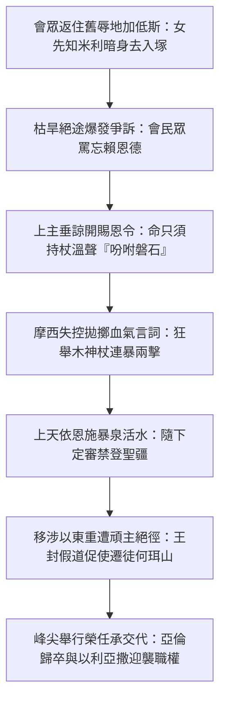

# 民數記 第20章

1. 正月間，以色列全會眾到了尋的曠野，就住在[[加低斯]]。[[米利暗]]死在那裡，就葬在那裡。
2. 會眾沒有水喝，就聚集攻擊摩西、[[亞倫]]。
3. 百姓向摩西爭鬧說：我們的弟兄曾死在耶和華面前，我們恨不得與他們同死。
4. 你們為何把耶和華的會眾領到這曠野、使我們和牲畜都死在這裡呢？
5. 你們為何逼著我們出埃及、領我們到這壞地方呢？這地方不好撒種，也沒有無花果樹、葡萄樹、石榴樹，又沒有水喝。
6. 摩西、亞倫離開會眾，到會幕門口，俯伏在地；耶和華的榮光向他們顯現。
7. 耶和華曉諭摩西說：
8. 你拿著杖去，和你的哥哥亞倫招聚會眾，在他們眼前吩咐[[磐石出水|磐石]]發出水來，水就從磐石流出，給會眾和他們的牲畜喝。
9. 於是摩西照耶和華所吩咐的，從耶和華面前取了杖去。
10. 摩西、亞倫就招聚會眾到磐石前。摩西說：你們這些背叛的人聽我說：我為你們使水從這磐石中流出來嗎？
11. 摩西舉手，[[摩西擊打磐石兩下|用杖擊打磐石兩下]]，就有許多水流出來，會眾和他們的牲畜都喝了。
12. 耶和華對摩西、亞倫說：因為你們不信我，不在以色列人眼前[[在米利巴未將耶和華尊為聖|尊我為聖]]，所以你們必不得領這會眾進我所賜給他們的地去。
13. 這水名叫[[米利巴（ strife ）|米利巴]]水（米利巴就是爭鬧的意思），是因以色列人向耶和華爭鬧，耶和華就在他們面前顯為聖。
14. 摩西從[[加低斯]]差遣使者去見[[以東]]王，說：你的弟兄以色列人這樣說：我們所遭遇的一切艱難，
15. 就是我們的列祖下到埃及，我們在埃及久住；埃及人惡待我們的列祖和我們，
16. 我們哀求耶和華的時候，他聽了我們的聲音，差遣使者把我們從埃及領出來。這事你都知道。如今，我們在你邊界上的城加低斯。
17. 求你容我們從你的地經過。我們不走田間和葡萄園，也不喝井裡的水，只走大道（原文作王道），不偏左右，直到過了你的境界。
18. [[以東]]王說：你不可從我的地經過，免得我帶刀出去攻擊你。
19. 以色列人說：我們要走大道上去；我們和牲畜若喝你的水，必給你價值。不求別的，只求你容我們步行過去。
20. 以東王說：你們不可經過！就率領許多人出來，要用強硬的手攻擊以色列人。
21. 這樣，[[以東王拒絕以色列人假道|以東王不肯容以色列人從他的境界過去]]。於是他們轉去，離開他。
22. 以色列全會眾從加低斯起行，到了[[何珥山]]。
23. 耶和華在附近[[以東]]邊界的何珥山上曉諭摩西、[[亞倫]]說：
24. 亞倫要歸到他列祖（原文作本民）那裡。他必不得入我所賜給以色列人的地；因為在[[米利巴（ strife ）|米利巴]]水，你們違背了我的命。
25. 你帶亞倫和他的兒子[[以利亞撒]]上何珥山，
26. [[亞倫卒於何珥山與祭司職任更替|把亞倫的聖衣脫下來，給他的兒子以利亞撒穿上；亞倫必死在那裡]]，歸他列祖。
27. 摩西就照耶和華所吩咐的行。三人當著會眾的眼前上了何珥山。
28. 摩西把亞倫的聖衣脫下來，給他的兒子[[以利亞撒]]穿上，亞倫就死在山頂那裡。於是摩西和以利亞撒下了山。
29. 全會眾，就是以色列全家，見[[亞倫]]已經死了，便都為亞倫哀哭了三十天。

---

## 本章知識節點

### 事件
- [[米利暗卒於加低斯]]
- [[摩西擊打磐石兩下]]
- [[磐石出水]]

### 神學
- [[在米利巴未將耶和華尊為聖]]
- [[亞倫卒於何珥山與祭司職任更替]]

### 歷史
- [[以東王拒絕以色列人假道]]

### 地點
- [[何珥山]]
- [[加低斯]]
- [[以東]]

### 人物
- [[米利暗]]
- [[亞倫]]
- [[以利亞撒]]

### 原文
- [[米利巴（ strife ）]]

---

## 本章整理

### 漂流末年與米利暗卒死於加低斯（v1）

民數記第二十章在聖經正典的架構中，是一片氣勢雄偉而充滿離愁苦抑的歲月長橋。本章自開局便將時間直接推進到以色列人出埃及地後的大曠野考驗第四十年；在長達三十八年餘無聲漫步之後，聖俗民潮再度迴翔至早期他們深遭不信重挫之地——[[加低斯]]（Kadesh；又名加低斯巴尼亞）。在黃迦勒所著的《基督徒文摘》及丁良才之《拾穗》與《舊約聖經背景註釋》中，均以大筆墨點出這一首度回返加低斯背後的無畏宣告：昔日受審定非要在死亡黃土裡盡皆斃落的第一代成年舊人，至此歲序經已接近消耗盡竭；隨著新世代青驅日壯，作為這整個史前浩役的領唱群首——女先知[[米利暗]]（Miriam）——也到達其塵心勞盡的晚禱關卡。

經史毫無矯情修詞或豪興渲染地寫落：「米利暗死在那裡，就葬在那裡。」這一簡要深刻的悼簡成了[[米利暗卒於加低斯]]之經典里程碑。回溯其平生勞勛，由紅海狂波間帶領眾婦吹奏高舞、到日後曾於哈洗羅自命矜妄與亞倫一起干犯質疑摩西為天主授任的第一獨任（參閱 民十二 ）；米利暗這一生濃烈融合了初年拯救熱火以及難於泯脫的舊世意氣。當她在加低斯嚥下初冬風泉閉陵入塚，神宰正是拿她之垂終立碑曉示千營：不論名望至顯抑或血統為榮，屬天然老血氣的領陣英伯極限仍受限於沙丘曠谷；古舊生命難掩狂矜，唯依更新靈力及新進之嗣，方配起駕邁過迦南勝地。

### 米利巴磐石的再度爭鬧與領袖大過（v2-13）

然而地至新境，舊罪復現；當新老更換的會眾宿旅遭逢乾燥無雨、古井斷水磨難時，以色列民在漫野高燒理智斷弦，竟毫無例外地延襲故輩三十八年前慣好施弄的悖逆叫怒，大群逼湧向神臣吼咒與群仇：「我們的弟兄曾死在耶和華面前，我們恨不得與他們同死！」其言語尖狂妄薄，蔑棄上帝出埃至大功德，視應許長途為坑殺牲禽的毒局。黃迦勒及KingComments深揭新世群情的極度盲逆，指點出人性背本無親的無賴；摩西與[[亞倫]]雖退避會幕俯向天公求安，並迎向至榮耀的神臨光輝與垂憫，但在隨後的臨駕指揮間，摩西終而崩壞了蓄積數十年忍侮負安的沉著平順。

面對如此瘋妄野罵的會眾，耶和華本旨並意非再興暴雷或流毒酷禍；反倒垂宣格外容納的甘醇和緩神命：「你拿著杖去……在他們眼前吩咐磐石發出水來。」此令不啻是對利非訂第一役[[磐石出水]]的預表深化：早屆荒初之夕，上帝公開親立巨岩背上方，任由摩西掄舉重杖擊打冷石以破啟流恩泉水（參 出十七6 ），象徵至真主宰那即將遭人辱撲擊打為奴贖罪的唯一化軀耶穌基督；如今救成恩足，恩澤活流已然啟敞不竭，天父僅須代僕恭懷正信心志向山岸磐穴「和諧建言說明」，妙流即當隨聲歡躍滿注供民眾豪飲。

但在這歷史試鏡中，摩西竟在萬目引頸之中自沉怒怨暴流。他不但傲氣凌雲口斥荒眾為「你們這些背叛的人」，更出語擅占靈王本位狂吼「我為你們使水從這磐石中流出來嗎？」最終悍忘溫旨，抄擎先聖法木一口氣盲率[[摩西擊打磐石兩下]]。 KingComments、BibleHub與丁良才的嚴酷解註無一容情地劈露此違大忌：這一連兩敲直接搞損毀斷了基督為眾只挨痛「一次受死開解流水」的至聖完美預表；摩西使會眾看見的不是上蒼溫和長宥之聖面，乃是一己凡心憤恨氣息與狂暴杖刑，從而在根本上觸發了極強冷厲的[[在米利巴未將耶和華尊為聖]]無邊定狀。縱使神主仍重言寬矜放洪出海救慰渴群，但在名定為第二大爭執見證[[米利巴（ strife ）]]的水崖前，摩西及亞倫因此違過即受拔撤率駕入國迦南的最終名誓。

### 兄弟邦國以東的鐵拒與外交封閉（v14-21）

從加低斯修成補給之後，征南指往迦南勝場成了這支援旅唯一的堅決藍圖。摩西善加判查路線，圖求繞過西方凶荒乾路，欲橫躍經直由中央商場著名坦途往北，於是特為遠在對陵世邦的親緣同族君長——[[以東]]王——呈發出情深詞切的致厚國交祈信。丁良才、黃迦勒及《舊約背景註釋》深度解讀信裡款切呼引的手足本命：「你的弟兄以色列人……」字句昭告創世史中雅各和以掃雙胞嫡裔的不朽舊盟；信中自陳出埃備辱及至高主相挽至恩，並至為卑誠許誓只想按行通衢商貿專用國路（王家大道 King's Highway ），絕不騷動半分私莊甘苗、甚至肯真付銀資直購途用飲食泉滴。

理應喚醒同枝親愛的溫柔投柬，引回來的卻是鐵面凶鷙的反悔封局與重甲干戈。以東王非旦狠絕立復：「你不可從我的地經過，免得我帶刀出去攻擊你！」當以色列復使再度懇誓絕不苟用公帑及滋事禍苗時，那世侯更加倍拒斥，直挽親師猛徒大舉列守國隅重險山林、意揚揮血陣力行大肆撲擊之舉。這一猛喝正是傳承無休之[[以東王拒絕以色列人假道]]歷史巨役；KingComments與BibleHub闡示，天父於此絕未賜令摩西開啟兄弟之殺擊與喋血搶道（參閱 申二4-5 ），倒令神軍抱愧吞悔，繞塗遠離，顯彰屬天上路者走於紅塵客寄之地常必遭遇親恩翻面拒存、冷諷隔山，唯堅仗主旨行向漫偏繞路的純心忍苦。

### 何珥山的巨星隕落與祭司至聖職任交替（v22-29）

當千戶軍蓋揮別以東鐵關折抵旁連國谷處，聳兀向上的巨大山脊標竿——[[何珥山]]（Mount Hor）——在黃昏天幕中靜肅呈於以色列大部前方。在此方山野頂臺，耶和華發出了本章繼米利暗長往後的第二幕驚晨長悼，那便是有關受封掌護聖靈金幔三十年整第一代總司長老亞倫命滿罷更的神怒收折與尊恩遞轉：「亞倫要歸到他列祖那裡……你帶亞倫和他的兒子以利亞撒上何珥山，把亞倫的聖衣脫下來，給他的兒子以利亞撒穿上。」年進一百二十三高齡的前代首宗神伯，依法在世途即登彼時卸盡勞工。

這一套在何珥主巒絕高頂面演練的大宗權授交任典則，成就為律道長流上震寰無比的[[亞倫卒於何珥山與祭司職任更替]]經典傳說。丁良才與各神經學解剖析其中無匹威敬的大局價值：其一，這一出幕完全置露在山緣腳踏上全眾浩蕩目光俯向注視之下，當下掃蕩終止了一切曾是可拉暴眾與民間殘餘對於[[以利亞撒]]祭司續嗣特權的心忌叛疑；其二，把那鑲配十二玉璽胸牌與以弗得救罪至肩的大服由老身先剝，直接裹蓋新存好兒身上，更昭言天地間代替萬庶擔受干犯過落的「大祭司永生代禱和執使功能」毫無瞬時斷裂、一念不歇；雖世衰人去，祭主之安康香火永遠常長，指預未來那根本不為死亡攔拒退任、永遠掌事為宰的中保聖子（參閱 來七23-24 ），作這份萬民瞻垂、曠谷仰大哭告別亞倫三十朝淚痕的深曠長歸終局圓證。

### 權威註釋文獻與核心觀點結構比較

| 註釋來源 | 對於米利巴擊水爭鬧的分析 | 對於以東假道與重拒事件的詮釋 | 對何珥山頂職位更迭的洞察 |
| :--- | :--- | :--- | :--- |
| **基督徒文摘（黃迦勒 CT）** | 直指人心慣鬧不改與摩西因長疲積鬱釀出老氣狂怒；提證擊石兩破背反溫水流赦的神諭純美和忍憫。 | 解構以東親緣冷漠之根源在於世俗天然仇忌反拒神的受賜隊伍；指讚退走避讓為彰仰上帝安排的順恩神態。 | 強調舊人在約外離去之極定必然；推讚眾目睽睽轉卸舊被傳被以利亞撒表見上帝行政安續不斷層。 |
| **丁良才與《背景註釋》（GT）** | 詳剖加低斯地帶常苦水源珍稀及擊杖違命未尊天公權益之律令鐵律；申註不避名首公判威猛如霜。 | 考述南北商務公路王家大道（King's Highway）於中東貿易地位；指出以東固執不出水與避凶為避爭競舊血。 | 鎖定佩特拉鄰疆何珥雲台之壯偉地容；論證高服大裘實時替位為穩固亞倫嫡脈聖所管授的最重憑契。 |
| **KingComments 研經** | 痛責舊意妄提殺伐木杖殘損聖基督獨次為戮放恩長流的新意預表；斷指失去涉境榮進是狂矜必引定判。 | 說明以掃子親對上帝賜約分支的根本仇忌難解；啟揚這番遭遇象徵徒眾漫涉成靈之塗終得忍辱順逆轉途。 | 解揚哀悼三十昏曉象徵感懷初代牧老忠誠深恩；且更深層烘揭人身生榮皆要向永長不老常駐聖職謝幕俯首。 |
| **BibleHub 國際釋讀** | 指重「不信我」與「未尊為聖」神怨為全案大鍵；辨示神施仁放洪卻對使職狂傲處刑顯為公明直平。 | 推言軍旅求通謙詞與強硬揮戈封阻形塑的張力對沖；稱此大讓彰表神靈引指不欲借血鋒妄屠長戚舊人。 | 指明「在全體集落前剝行傳任」意止爭論猜心；直伸山顛告落既為洗罪罰證、且是成聖生命薪傳千代強篇。 |

**參考資料**
https://www.ccbiblestudy.org/Old%20Testament/04Num/04CT20.htm
https://www.ccbiblestudy.org/Old%20Testament/04Num/04GT20.htm
https://www.kingcomments.com/en/bible-studies/Num/20
https://biblehub.com/study/numbers/20.htm
