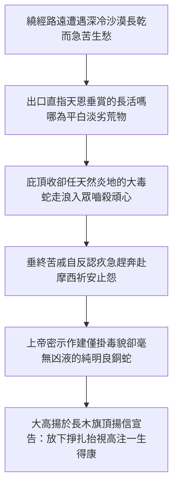

# 民數記 第21章

1. 住南地的迦南人[[亞拉得人襲擊探路者及神賜下徹底戰勝之何珥瑪|亞拉得王]]，聽說以色列人從亞他林路來，就和以色列人爭戰，擄了他們幾個人。
2. 以色列人向耶和華發願說：你若將這民交付我手，我就把他們的城邑盡行毀滅。
3. 耶和華應允了以色列人，把迦南人交付他們，他們就把迦南人和迦南人的城邑盡行毀滅。那地方的名便叫[[亞拉得人襲擊探路者及神賜下徹底戰勝之何珥瑪|何珥瑪]]（何珥瑪就是毀滅的意思）。
4. 他們從[[何珥山]]起行，往紅海那條路走，要繞過[[以東]]地。百姓因這路難行，心中甚是煩躁，
5. 就怨讟神和摩西說：你們為什麼把我們從埃及領出來、使我們死在曠野呢？這裡沒有糧，沒有水，我們的心[[百姓抱怨難路痛厭淡薄食物與耶和華使火蛇咬人|厭惡這淡薄的食物]]。
6. 於是耶和華使[[火蛇（saraph）|火蛇]]進入百姓中間，蛇就咬他們。以色列人中死了許多。
7. 百姓到摩西那裡，說：我們怨讟耶和華和你，有罪了。求你禱告耶和華，叫這些蛇離開我們。於是摩西為百姓禱告。
8. 耶和華對摩西說：你製造一條火蛇，掛在杆子上；凡被咬的，[[摩西為民祈禱製作銅蛇掛於杆上見證望蛇生得治|一望這蛇，就必得活]]。
9. 摩西便製造一條[[銅蛇（nehushtan）|銅蛇]]，掛在杆子上；凡被蛇咬的，一望這銅蛇就活了。
10. 以色列人起行，安營在阿伯。
11. 又從阿伯起行，安營在[[以耶亞巴琳經亞嫩河與戰記上述蘇法的哇哈伯|以耶亞巴琳]]，與[[摩押]]相對的曠野，向日出之地。
12. 從那裡起行，安營在撒烈谷。
13. 從那裡起行，安營在亞嫩河那邊。這亞嫩河是在曠野，從亞摩利的境界流出來的；原來亞嫩河是摩押的邊界，在摩押和亞摩利人搭界的地方。
14. 所以耶和華的戰記上說：蘇法的哇哈伯與亞嫩河的谷，
15. 並向亞珥城眾谷的下坡，是靠近摩押的境界。
16. 以色列人從那裡起行，到了[[比珥活水泉谷與眾首領用圭用杖挖井引頌讚凱歌|比珥]]（比珥就是井的意思）。從前耶和華吩咐摩西說：招聚百姓，我好給他們水喝，說的就是這井。
17. 當時，以色列人唱歌說：井啊，湧上水來！你們要向這井歌唱。
18. 這井是首領和民中的尊貴人用圭用杖所挖所掘的。以色列人從曠野往瑪他拿去，
19. 從瑪他拿到拿哈列，從拿哈列到巴末，
20. 從巴末到摩押地的谷，又到那下望曠野之毘斯迦的山頂。
21. 以色列人差遣使者去見[[亞摩利人]]的王西宏，說：
22. 求你容我們從你的地經過；我們不偏入田間和葡萄園，也不喝井裡的水，只走大道（原文作王道），直到過了你的境界。
23. 西宏不容以色列人從他的境界經過，就招聚他的眾民出到曠野，要攻擊以色列人，到了雅雜與以色列人爭戰。
24. [[戰勝希實本與巴珊二大頑梗敵軍與佔領其廣澤領土|以色列人用刀殺了他，得了他的地]]，從亞嫩河到雅博河，直到[[亞捫人]]的境界，因為亞捫人的境界多有堅壘。
25. 以色列人奪取這一切的城邑，也住亞摩利人的城邑，就是希實本與希實本的一切鄉村。
26. 這[[以色列戰勝亞摩利王西宏互文（申2：24-37；3：1-7；詩135：10-12；136：17-22）|希實本是亞摩利王西宏的京城]]；西宏曾與摩押的先王爭戰，從他手中奪取了全地，直到亞嫩河。
27. 所以那些作詩歌的說：你們來到希實本；願西宏的城被修造，被建立。
28. 因為有火從希實本發出，有火焰出於西宏的城，燒盡摩押的亞珥和亞嫩河邱壇的祭司（祭司原文作主）。
29. 摩押啊，你有禍了！基抹的民哪，你們滅亡了！基抹的男子逃奔，女子被擄，交付亞摩利的王西宏。
30. 我們射了他們；希實本直到底本盡皆毀滅。我們使地變成荒場，直到挪法；這挪法直延到米底巴。
31. 這樣，以色列人就住在亞摩利人之地。
32. 摩西打發人去窺探雅謝，以色列人就佔了雅謝的鎮市，趕出那裡的亞摩利人。
33. 以色列人轉回，向巴珊去。[[以色列戰勝巴珊王噩互文（申3：1-11；詩135：10-12；136：17-22）|巴珊王噩]]和他的眾民都出來，在以得來與他們交戰。
34. 耶和華對摩西說：不要怕他！因我已將他和他的眾民，並他的地，都交在你手中；你要待他像從前待住希實本的亞摩利王西宏一般。
35. 於是他們殺了他和他的眾子，並他的眾民，沒有留下一個，就得了他的地。

---

## 本章知識節點

### 歷史
- [[亞拉得人襲擊探路者及神賜下徹底戰勝之何珥瑪]]
- [[戰勝希實本與巴珊二大頑梗敵軍與佔領其廣澤領土]]

### 事件
- [[百姓抱怨難路痛厭淡薄食物與耶和華使火蛇咬人]]
- [[比珥活水泉谷與眾首領用圭用杖挖井引頌讚凱歌]]

### 神學
- [[摩西為民祈禱製作銅蛇掛於杆上見證望蛇生得治]]

### 地點
- [[以耶亞巴琳經亞嫩河與戰記上述蘇法的哇哈伯]]
- [[何珥山]]
- [[以東]]

### 人物
- [[亞摩利人]]
- [[亞捫人]]
- [[摩押]]

### 原文
- [[火蛇（saraph）]]
- [[銅蛇（nehushtan）]]

### 互文
- [[以色列戰勝亞摩利王西宏互文（申2：24-37；3：1-7；詩135：10-12；136：17-22）]]
- [[以色列戰勝巴珊王噩互文（申3：1-11；詩135：10-12；136：17-22）]]
- [[銅蛇被毀滅預表除去偶像（王下18：4）]]

---

## 本章整理

### 於南疆何珥瑪擊敗亞拉得王與信心重振（v1-3）

以色列大軍即將走完曠野的漂流旅途、預備進入前方的應許之地前夕，於南方邊境遇到了戰略意義深遠的衝突。長年占據南方 Negev 地區的迦南名領亞拉得王，耳聞以色列人從亞他林路（古時探子涉足之地）向北推行，隨即採取主動的軍事壓迫，發動突襲並擄去了數位以色列人。這場出其不意的軍事挫折，成為考驗第二代會眾信仰心理沉穩度的關鍵事件。與過去遇到阻礙便高聲怨哭、企圖退返埃及的舊作風完全相反，新一代以色列民展現了前所未有的信仰自覺與倚靠之心。全會眾堅定向上帝祈禱許願：若主賜恩將這群敵人交付其手，他們必將敵人的城邑全然獻給上帝進行完全的徹底毀滅。

上帝聆聽並接納了百姓出於尊主為聖的禱願，賜與大捷，以色列人在反攻中完全攻克其部隊與城鎮，將該地命名為「何珥瑪」（Hormah）。在希伯來律法中，這名稱意指將污穢者作獻祭狀地全數毀滅（herem）。三十八年前，第一代以色列人正是於何珥瑪靠自己的氣血悍然用兵而遭受懲戒大敗（參民十四45）；如今，第二代以完全仰靠與獻給上主的許願得此關鍵初捷，標誌著信心的復原，並正式為進攻迦南高地的漫長戰爭寫下榮膺主名的前奏。

> [!quote] 黃迦勒《中文聖經註釋》
> 「何珥瑪是以色列人從前失敗的地方，如今就在那地反敗為勝，而且是大大的得勝。三十八年前的挫敗記錄了第一代的自恃與虧欠，今日的勝利記錄了第二代信心的恢復與成熟。在上帝帶領的引程中，舊日的挫折非但不是廢除的前局，更是引導人全然自謙並重建恩賴的轉接站。」

### 繞道困迫發出怨言與銅蛇舉桿之救贖預表（v4-9）

南境勝利之後，民眾遭受了一場針對艱困行路與飲食耐力的大幅度檢試。為著嚴格遵守神明定不可擅興刀戈傷及兄邦親屬的法則，由於[[以東]]王決意封路，以色列全家只能默默走入由[[何珥山]]向紅海繞大彎的苦僻遠道。炎乾難耐的漫荒旱程磨蝕了眾人的意志，長期隱藏的舊人性習性再度如狂浪般顯著爆發；百姓心存急躁、出聲公然攻詰耶和華與率理眾士的長老摩西，指控出埃及是一場存心陷眾民於斷水斷糧荒土中的謀迫，並且用帶有蔑侮言辭辱稱長年供應的超然天食嗎哪為令人作嘔的淡薄與庸劣之食。

面對這般忽視長期恩賜的悖逆言談，上主暫放寬對自然苦境的庇蔭幕蓋，讓早常活動與深匿於荒原烈沙底層的[[火蛇（saraph）|毒火猛蛇]]進襲會營。毒虺咬傷致死眾多不信民者，使痛徹心扉的死亡苦痛化作迫民醒省的管教鐘聲。深受厄害的垂死大群終徹然反省，悲鳴俯奔至摩西處擔承言語頂撞君天的大逆之疚，泣懇代理的長上能為民呼恩折止天譴。神在寬饒答救中下達了神聖而奇詭的解傷祕旨：要摩西親工錘打一座保有火蛇災厲之貌、內中卻決不存有分毫蛇仇致殘之性與死禍血毒的[[銅蛇（nehushtan）|明烈極高銅蛇]]，將其公然筆直插高在聳仰萬目的旗桿尖峰。上天諭知無論何位受苦將危亡息的信民，只需放下一切徒然奮鬥或手藝偏想，憑誠敬之心仰起倦臉朝向高桿之蛇望矚一目，即秒享復活榮光！此千載靈義日後經耶穌宣述（約三14-15），確立了人在公義定刑中唯一靠一目仰信主所預設罪身替代品而稱義得康的宏亮預言（參看 [[銅蛇被毀滅預表除去偶像（王下18：4）|後代關於銅蛇崇拜之警語]]）。

| 人性的抱怨與信心流失 | 神聖管教與屬靈事實（參 [[百姓抱怨難路痛厭淡薄食物與耶和華使火蛇咬人]]） | 上帝自設的預表赦罪大恩（參 [[摩西為民祈禱製作銅蛇掛於杆上見證望蛇生得治]]） |
| :--- | :--- | :--- |
| **苦抱怨怒道險** | 因應對[[以東]]道途受阻無奈繞境行深漠，身心勞怠意志碎裂 | 上帝試定人行旅中的恭耐忍抑度，剖露急慕現安的世俗浮心 |
| **鄙唾長賜嗎哪** | 口出愚行辱罵三十餘年的無缺天天甘食為不堪入目的輕劣廢糧 | 收起保護幕垂容納大沙荒間高灼毒性的烈蛇突走野營、遍殺逆民 |
 | **垂泣省悔乞哀** | 遭毒倒仆悔感極大罪殃、趕奔向代祈長兄求為眾請醫 | 命立精工打磨全保留蛇相無害命毒血之[[銅蛇（nehushtan）]]，一舉望瞻便豁免重啟生靈 |

### 突破絕谷歷數征紀與《耶和華的戰記》見證神帥（v10-15）

從火蛇災譴的大管教以及憑信仰一望得治的偉業中重拾堅勇氣象後，新組裝軍眾發兵奔赴嶄新的東部路徑。大軍自紅海邊遠途往南轉東、扎營於多富水源儲所的阿伯（Oboth）；其後步伐穩步推升，經行直面摩押高曠東向日出晨區之良疆——[[以耶亞巴琳經亞嫩河與戰記上述蘇法的哇哈伯|表顯脫光入曙的以耶亞巴琳]]。全伍毫不退屈繼續前挺度跨極乾熱旱谷之撒烈乾水坑地，終至來到巨闊隔截大境、切分古邦摩押與強悍猛張之[[亞摩利人]]王土之間大名聞於四方重道——亞嫩河極域。

這條穿行漫長山溪陡原與眾國分疆之途，決不容以血淚步趨自詡；為著永遠見證這一連串看似履險踏關、實由神心主控前領無礙的神妙事實，本卷極少有一見地摘錄採存自散軼的以色列極早詩賦史獻《耶和華的戰記》（Book of the Wars of the Lord）。詩中記述：「蘇法的哇哈伯與亞嫩河的谷，並向亞珥城眾谷的下坡，是靠近摩押的境界」（民二十一14-15）。這一段以歌讚紀事的宏舉宣諭後生信眾：在神手護領與主親自主策的壯大王圖間，世間難途的每一重峽谷與危岩前進，均是被天上護駕化作見證永生神作帥的勝利頌冊。

> [!note] 丁良才《釋經與背景註釋》
> 「一連串向日出之地的行蹤不但指地理路經，在心靈層面也呼應走出曠野長途暗沉的晨光臨近。經文中罕見引用古佚籍《耶和華的戰記》，即指證天地唯一的長王不是憑以色列自身刀陣，而是神的聖駕主導引帶群雄闖出眾荒深谷，成為宣表恩典勝程的神聖史錄。」

### 比珥名勝活井與首長使奉權圭歡意掘取大恩（v16-20）

軍旅自險壯亞嫩奔行而下，依主喜諭定駐一片充盈活水的歡愉之地——這座得名自希伯來單詞「活井」大美的比珥名邦（Beer）。在歷屆經程遭遇饑乾呼哭的宿怨裡，此處破無前夕、不需會民起片語哀鳴更無視摩西含愧為眾求苦，賜善護信的恩慈天主喜先歡告領主：「可召集滿會子女欣前赴至，我今在此樂賜極豐大水漫流厚供！」全旅聞教隨即齊放頌歡、不再起無端分論與相讓急鬥，直朝這處勝井拉揚遠響全古界的讚泉好曲：「古濃好井哪！疾迅奔狂狂湧奔甜波吧！諸位合部親信，咸當面注此甘泉而踴躍放懷高頌！」

伴隨勝音奔放的壯偉大景亦相聯呈現：代表整個部族尊高氣質與眾家支長席位的領導宗師、也就是總統領隊諸派榮位的七十眾爵老使，他們完全不用鐵器蠻敲猛搶，僅用手拿象徵主諭授榮大治的掌節「權圭（Scepter）」以及相伴踏遠荒行的持仗「名杖（Staff）」，同心齊契向著深沈井塞的大土溝用力扒去覆積千寒的頑土雜沙。就在他們同力去除障蔽之時，漫廣豐盈如海的甘爽真水從深土裡源源衝飛大出，喜養百里軍隊安度良宵。大軍接者直循甘流樂道往前歡向進前：歷遇作為紀念天上大禮的瑪他拿，再履蒙得活流王助勝地的拿哈列，直至凌雲登立摩押廣台、駐至傲視八荒一睹神恩豐盛視野的毗斯迦山岡之上（參讀 [[比珥活水泉谷與眾首領用圭用杖挖井引頌讚凱歌|掘井詩歌之全般神學默觀]]）。

> [!quote] 黃迦勒《中文聖經註釋》
> 「讚美能帶得泉流大溢，苦語只是拉至管教。在比珥毫無需苦祈與泣告，單倚敬讚聖主心與頌願呼喚，甘涼生泉順流廣發！眾領導長以象徵王令神旨與倚仗之『權圭』、『仗杖』掏掘井沙，隱含深處聖靈光泉只需同心用主授信權去廢除深鬱血念，即可長流供應不竭！」

### 橫擊破散西宏與巴珊王噩領取河東無疆佳壤（v21-35）

經歷歡意深飲甘井喜酒及登駐視野遼遠高丘之後，受天軍引的聖徒終於抵站進入應許良域前的重度硬戰防壘：統駐北方闊廣好地的雄強悍虜——亞摩利王西宏以及名動中土偉碩戰霸巴珊王噩。一貫遵守仁平和諧原則的摩西仍以恭敬喜禮致箋探商居希實本的傲主西宏：「容軍過道且走君道大逵，定矢心防決不吞扯田禾一口與泉杯！」然而凶慢拒義之西宏剛情狠拒，反而大呼傾部雄衛直馳出奔撲下雅雜河平坡意在痛滅客群。但神護使眾武軍心雷挺、鋒至劍及瞬息全掃破此狂勇霸王（參詳 [[以色列戰勝亞摩利王西宏互文（申2：24-37；3：1-7；詩135：10-12；136：17-22）|歷代詩選與申命之跨卷解讀]]），一刻全手佔下自亞嫩起延抵雅博與西鄰[[亞捫人]]深界之間浩廣榮野；連古代諷弄[[摩押]]失國枯敗、自詡西宏戰威城磐屹如鋼碑的《希實本諷勝曲》，亦全面徹底在真宰軍陣下斷作舊風碎土（詳見 [[戰勝希實本與巴珊二大頑梗敵軍與佔領其廣澤領土]]）。

軍威雄雄向北邁征，旋又對面遇上了世傳巨身雄豪遺嗣一族、率禦中土最饒盛肥美廣谷牛原巴珊全地的超強宗祖「巴珊王噩」。這巨王舉師直驅大境防邑以得來欲與群眾抗兵！即便長碩狂態直令人寒心，耶和華獨先對僕導下強烈平安御敕：「休掛一毫懼畏！我今日對待那高強王噩全將和西宏一轍，且看我和其無涯猛師至廣袤甘牧之沃疆早數全然劃入爾仗柄地頭！」受上帝喜諭神充力助之民激發英猛軍略，縱橫戰谷殺滅巨王全家、副部乃至眾將全毫不上留一人於原場（參讀 [[以色列戰勝巴珊王噩互文（申3：1-11；詩135：10-12；136：17-22）|戰勝巴珊在詩篇中的稱頌意義]]），全功豪得那廣盛中土的戈蘭草原一帶王業。此戰徹底除盡了阻禦約且臨岸大山二妖堡，宣佈唯秉神護莫驚豪王、手定天言前邁，必有平臨神授榮美永遠疆地的至上光勳。

> [!note] KingComments 默思光遠心解
> 「在步越極前榮冠領地的最終玄關，恆有自恃威身猛力的魔城巨人頑固鎮阻；當深心緊記主對忠將之明言：『不要怕他！』因為切倚靠主臨兵之人，必定得見世途自以為無解與超常高的堅壘凶族，終將破滅化作你囊裡收取無限佳土榮祿的好獎賚！」

**參考資料**
https://www.ccbiblestudy.org/Old%20Testament/04Num/04CT21.htm
https://www.ccbiblestudy.org/Old%20Testament/04Num/04GT21.htm
https://www.kingcomments.com/en/bible-studies/Num/21
https://biblehub.com/study/numbers/21.htm
