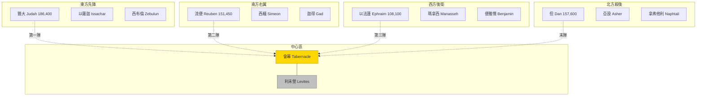

# 民數記 第2章

1. 耶和華曉諭摩西、亞倫說：
2. 以色列人要[[安營與纛|各歸自己的纛下]]，在[[安營與纛|本族的旗號]]那裡，對著[[會幕（帳幕整體）|會幕]]的四圍安營。
3. 在東邊，向日出之地，照著軍隊安營的是[[猶大支派|猶大營的纛]]。有亞米拿達的兒子拿順[[十二族長協助數點|作猶大人的首領]]。
4. 他軍隊被數的，共有七萬四千六百名。
5. 挨著他安營的是以薩迦支派。有蘇押的兒子拿坦業[[十二族長協助數點|作以薩迦人的首領]]。
6. 他軍隊被數的，共有五萬四千四百名。
7. 又有西布倫支派。希倫的兒子以利押作西布倫人的首領。
8. 他軍隊被數的，共有五萬七千四百名。
9. 凡屬猶大營、[[以色列人的軍隊|按著軍隊被數的]]，共有十八萬六千四百名，[[以色列人的軍隊|要作第一隊往前行]]。
10. 在南邊，[[以色列人的軍隊|按著軍隊]]是[[流便|流便營的纛]]。有示丟珥的兒子以利蓿作流便人的首領。
11. 他軍隊被數的，共有四萬六千五百名。
12. 挨著他安營的是西緬支派。蘇利沙代的兒子示路蔑作西緬人的首領。
13. 他軍隊被數的，共有五萬九千三百名。
14. 又有迦得支派。丟珥的兒子以利雅薩作迦得人的首領。
15. 他軍隊被數的，共有四萬五千六百五十名，
16. 凡屬[[流便]]營、[[以色列人的軍隊|按著軍隊被數的]]，共有十五萬一千四百五十名，[[以色列人的軍隊|要作第二隊往前行]]。
17. 隨後，[[會幕（帳幕整體）|會幕要往前行]]，有[[利未支派|利未營在諸營中間]]。他們怎樣安營就怎樣往前行，各按本位，[[安營與纛|各歸本纛]]。
18. 在西邊，[[以色列人的軍隊|按著軍隊]]是[[以法蓮|以法蓮營的纛]]。亞米忽的兒子以利沙瑪作以法蓮人的首領。
19. 他軍隊被數的，共有四萬零五百名。
20. 挨著他的是瑪拿西支派。比大蓿的兒子迦瑪列作瑪拿西人的首領。
21. 他軍隊被數的，共有三萬二千二百名。
22. 又有便雅憫支派。基多尼的兒子亞比但作便雅憫人的首領。
23. 他軍隊被數的，共有三萬五千四百名。
24. 凡屬[[以法蓮]]營、[[以色列人的軍隊|按著軍隊被數的]]，共有十萬零八千一百名，[[以色列人的軍隊|要作第三隊往前行]]。
25. 在北邊，[[以色列人的軍隊|按著軍隊]]是[[但支派|但營的纛]]。亞米沙代的兒子亞希以謝作但人的首領。
26. 他軍隊被數的，共有六萬二千七百名。
27. 挨著他安營的是亞設支派。俄蘭的兒子帕結作亞設人的首領。
28. 他軍隊被數的，共有四萬一千五百名。
29. 又有拿弗他利支派。以南的兒子亞希拉作拿弗他利人的首領。
30. 他軍隊被數的，共有五萬三千四百名。
31. 凡但營被數的，共有十五萬七千六百名，要歸本纛[[以色列人的軍隊|作末隊往前行]]。
32. 這些以色列人，照他們的宗族，按他們的軍隊，在諸營中被數的，共有六十萬零三千五百五十名。
33. 惟獨[[利未支派|利未人沒有數在以色列人中]]，是照耶和華所吩咐摩西的。
34. 以色列人就這樣行，各人照他們的家室、宗族歸於本纛，安營起行，都是照耶和華所吩咐摩西的。

<!-- fhl-map-links:start -->
## 相關地圖

- [[appendix/fhl_maps/maps/019|〈出圖二〉以色列人出埃及到西乃山]]
- [[appendix/fhl_maps/maps/020|〈民圖一〉從西乃山到加低斯]]
<!-- fhl-map-links:end -->

---

## 本章知識節點

### 神學
- [[會幕（帳幕整體）]]
- [[神的同在]]

### 地點
- [[會幕（帳幕整體）]]

### 文化
- [[安營與纛]]
- [[十二支派起源]]
- [[行軍次序]]

### 歷史
- [[以色列人的軍隊]]
- [[十二族長協助數點]]

---

## 本章整理

### 耶和華吩咐安營次序與纛旗意義（v1-2）

本章開篇記載「耶和華曉諭摩西、亞倫」（v1），確立一切編組源於神的主權命令。v2 核心指令有三層：一、各歸自己的纛下（standard），以旗號為識別與號令單位，這就是[[安營與纛|安營與纛]]的基本原則；二、在本族的旗號那裡，強調宗族單位；三、對著[[會幕（帳幕整體）|會幕]]的四圍安營，確立會幕為幾何與屬靈中心。CT 指出「對著會幕的四圍安營」表徵以基督為中心，全軍在基督率領之下；GT《啟導本》補充「對著會幕」亦可譯「與會幕間有相當距離」，《約書亞記》三4 規定約櫃與營邊距二千肘（約一公里），顯示神的聖潔與臨在既親近又超越。KC 強調「纛」是指揮方向、維持秩序的工具，猶太傳統認為四大纛分別繪獅子（猶大）、人首（流便）、牛（以法蓮）、鷹（但）。BH 註釋指出「各人在自己的旗幟下」反映神秩序的神性，也預表教會各肢體在基督身上各有定位（林前12:18）。

### 四面營陣：母系關聯與屬靈方位（v3-31）

經文按東、南、西、北四方依次排列，每方三支派共十二支派，形成十字架隊形。CT 與 GT 同指此結構象徵十字架乃防守禦敵之道。四營母系淵源清晰可見，現整理如下表（表格內不加別名連結，純文字呈現）：

| 方位 | 領頭支派（纛） | 隸屬支派 | 母系來源 | 人數 | 起行次序 |
|------|----------------|----------|----------|------|----------|
| 東（日出） | 猶大支派 | 以薩迦、西布倫 | 利亞所生 | 186,400 | 第一隊 |
| 南（右側） | 流便 | 西緬、迦得 | 利亞與婢女悉帕 | 151,450 | 第二隊 |
| 西（海側） | 以法蓮 | 瑪拿西、便雅憫 | 拉結所生（孫/子） | 108,100 | 第三隊 |
| 北（隱藏） | 但支派 | 亞設、拿弗他利 | 婢女辟拉、悉帕 | 157,600 | 末隊 |

**東邊——猶大營（v3-9）**：會幕門朝東，摩西亞倫營於東側內層（三38），為最尊榮方位。猶大意「讚美」，拿順為亞倫妻兄、大衛先祖（得四21-22），預表基督出自猶大（來7:14）。KC 指出猶大因流便、西緬、利未失位而成為長子領袖（創49:8-10），「讚美的靈是能力的靈」（代下20:22），教會聚會首要目的是讚美敬拜。

**南邊——流便營（v10-16）**：南方意「右側」，象徵尊榮地位（來1:3）。流便雖為長子卻因犯罪失權（創49:3-4），此處由利亞二子西緬、婢女長子迦得陪伴。KC 注意到實際行軍時，革順族與米拉利族抬帳幕在猶大營後、流便營前（十17-20），故流便營實為第三行列。

**中間——會幕與利未營（v17）**：會幕與[[利未支派|利未營]]夾在前二隊與後二隊中間，「他們怎樣安營就怎樣往前行」，KC 強調帳幕聖物佔最中心位置，神要百姓隨時以神為中心。利未人不列作戰名冊（v33），專司搬運會幕器具。

**西邊——以法蓮營（v18-24）**：西方意「海側」，象徵試煉與結果（創1:20-23）。以法蓮意「雙倍果子」，與瑪拿西、便雅憫同為拉結後裔。KC 引詩八十1-2，三支派在約櫃後行走，預表患難中結出果子。

**北邊——但營（v25-31）**：北方意「隱藏」，最遠日光，象徵屬靈黑暗面。但被雅各比為蛇（創49:17），後來最早引入偶像崇拜（士十八30）。但營人數最多（157,600），擔任殿後護衛，KC 指出三支派皆出婢女，地位較低卻負重責。

### 總數點驗與順服記載（v32-34）

v32 總計六十萬零三千五百五十名（與一46 相符），這就是[[以色列人的軍隊|以色列人的軍隊]]總數；v33 重申利未人不在數中；v34 結語「以色列人就這樣行……都是照耶和華所吩咐摩西的」。CT 點出這表示百姓對神絕對順服，「人在神面前最美麗的樣式是謙卑和順服」（撒上15:22）。GT《串珠註釋》感嘆數百萬人曠野四十年秩序井然，全因神起初匠心組織；《精讀本》強調「安營起行」涵蓋三十八年曠野旅程（申2:14）。

> [!note] 來源解讀非經文明言
> - 四大纛圖騰（獅子/人/牛/鷹）源自猶太傳統，經文未記載。
> - 《舊約背景註釋》提出「千」（'lp）可譯「軍事單位」，總數或僅兩萬人，屬學術假說，非經文本意。
> - 十字架隊形屬靈意註解（CT、KC），經文僅記方位編排。

### 跨章脈絡：從西乃山秩序到迦南征戰模型

本章將一章單純點兵轉化為立體軍陣：會幕為心、利未為膽、四營為肢、纛旗為神經。此模型貫穿民數記行軍記載（十11-28）、約書亞記渡河圍城（書三-六），並成新耶路撒冷四面三門（啟21:12-13）的原型。猶大居前、但居後、利未居中，預表基督作先鋒、教會以神為中心的屬靈陣式。十二支派按母系分組（利亞/拉結/婢女），在神主權下化解嫉妒與爭競，成為「曠野教會」（林前12:4-31）合一多元的典範。這套[[行軍次序|行軍次序]]與[[十二支派起源|十二支派起源]]的母系關聯，展現神如何在多樣性中建立秩序。

**參考資料**
https://www.ccbiblestudy.org/Old%20Testament/04Num/04CT02.htm
https://www.ccbiblestudy.org/Old%20Testament/04Num/04GT02.htm
https://www.kingcomments.com/en/bible-studies/Num/2
https://biblehub.com/study/numbers/2.htm
