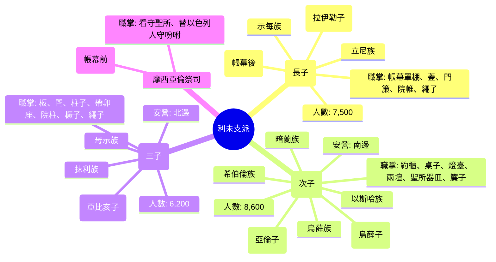
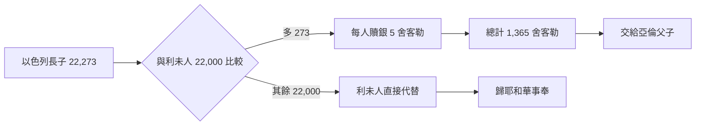

# 民數記 第3章

1. 耶和華在西乃山曉諭摩西的日子，[[亞倫]]和摩西的後代如下：
2. [[亞倫的祭司譜系|亞倫的兒子]]，長子名叫[[拿答]]，還有[[亞比戶]]、[[以利亞撒]]、[[以他瑪]]。
3. 這是[[亞倫]]兒子的名字，都是受膏的祭司，是摩西叫他們承接聖職供祭司職分的。
4. [[拿答]]、[[亞比戶]]在西乃的曠野向耶和華獻[[凡火]]的時候就死在耶和華面前了。他們也沒有兒子。[[以利亞撒]]、[[以他瑪]]在他們的父親[[亞倫]]面前供祭司的職分。
5. 耶和華曉諭摩西說：
6. 你使[[利未支派]]近前來，站在祭司[[亞倫]]面前好服事他，
7. 替他和會眾在[[會幕（帳幕整體）|會幕]]前守所吩咐的，辦理[[會幕（帳幕整體）|帳幕]]的事。
8. 又要看守[[會幕（帳幕整體）|會幕]]的器具，並守所吩咐以色列人的，辦理[[會幕（帳幕整體）|帳幕]]的事。
9. 你要將[[利未支派|利未人]]給[[亞倫]]和他的兒子，因為他們是從以色列人中選出來給他的。
10. 你要囑咐[[亞倫]]和他的兒子謹守自己祭司的職任。近前來的外人必被治死。
11. 耶和華曉諭摩西說：
12. 我從以色列人中揀選了[[利未支派|利未人]]，代替以色列人一切頭生的；利未人要歸我。
13. 因為凡頭生的是我的；我在埃及地擊殺一切頭生的那日就把以色列中一切頭生的，連人帶牲畜都分別為聖歸我；他們定要屬我。我是耶和華。
14. 耶和華在西乃的曠野曉諭摩西說：
15. 你要照[[利未支派|利未人]]的宗族、家室數點他們。凡一個月以外的男子都要數點。
16. 於是摩西照耶和華所吩咐的數點他們。
17. 利未眾子的名字是革順、哥轄、米拉利。
18. 革順的兒子，按著家室，是立尼、示每。
19. 哥轄的兒子，按著家室，是暗蘭、以斯哈、希伯倫、烏薛。
20. 米拉利的兒子，按著家室，是抹利、母示。這些按著宗族是[[利未支派|利未人]]的家室。
21. 屬革順的，有立尼族、示每族。這是革順的二族。
22. 其中被數、從一個月以外所有的男子共有七千五百名。
23. 這革順的二族要在[[會幕（帳幕整體）|帳幕]]後西邊安營。
24. 拉伊勒的兒子以利雅薩作革順人宗族的首領。
25. 革順的子孫在[[會幕（帳幕整體）|會幕]]中所要看守的，就是[[會幕（帳幕整體）|帳幕]]和罩棚，並罩棚的蓋與會幕的門簾，
26. 院子的帷子和門簾（院子是圍[[會幕（帳幕整體）|帳幕]]和壇的），並一切使用的繩子。
27. 屬哥轄的，有暗蘭族、以斯哈族、希伯倫族、烏薛族。這是哥轄的諸族。
28. 按所有男子的數目，從一個月以外看守聖所的，共有八千六百名。
29. 哥轄兒子的諸族要在[[會幕（帳幕整體）|帳幕]]的南邊安營。
30. 烏薛的兒子以利撒反作哥轄宗族家室的首領。
31. 他們所要看守的是約櫃、桌子、燈臺、兩座壇與聖所內使用的器皿，並簾子和一切使用之物。
32. 祭司[[亞倫的祭司譜系|亞倫的兒子]][[以利亞撒]]作[[利未支派|利未人]]眾首領的領袖，要監察那些看守聖所的人。
33. 屬米拉利的，有抹利族、母示族。這是米拉利的二族。
34. 他們被數的，按所有男子的數目，從一個月以外的，共有六千二百名。
35. 亞比亥的兒子蘇列作米拉利二宗族的首領。他們要在[[會幕（帳幕整體）|帳幕]]的北邊安營。
36. 米拉利子孫的職分是看守[[會幕（帳幕整體）|帳幕]]的板、閂、柱子、帶卯的座，和帳幕一切所使用的器具，
37. 院子四圍的柱子、帶卯的座、橛子，和繩子。
38. 在[[會幕（帳幕整體）|帳幕]]前東邊，向日出之地安營的是摩西、[[亞倫]]，和[[亞倫的祭司譜系|亞倫的兒子]]。他們看守聖所，替以色列人守耶和華所吩咐的。近前來的外人必被治死。
39. 凡被數的[[利未支派|利未人]]，就是摩西、[[亞倫]]照耶和華吩咐所數的，按著家室，從一個月以外的男子，共有二萬二千名。
40. 耶和華對摩西說：你要從以色列人中數點一個月以外、凡頭生的男子，把他們的名字記下。
41. 我是耶和華。你要揀選[[利未支派|利未人]]歸我，代替以色列人所有頭生的，也取利未人的牲畜代替以色列所有頭生的牲畜。
42. 摩西就照耶和華所吩咐的把以色列人頭生的都數點了。
43. 按人名的數目，從一個月以外、凡頭生的男子，共有二萬二千二百七十三名。
44. 耶和華曉諭摩西說：
45. 你揀選[[利未支派|利未人]]代替以色列人所有頭生的，也取利未人的牲畜代替以色列人的牲畜。利未人要歸我；我是耶和華。
46. 以色列人中頭生的男子比[[利未支派|利未人]]多二百七十三個，必當將他們贖出來。
47. 你要按人丁，照聖所的平，每人取[[贖銀五舍客勒]]（一舍客勒是二十季拉），
48. 把那多餘之人的[[贖銀五舍客勒|贖銀]]交給[[亞倫]]和他的兒子。
49. 於是摩西從那被[[利未支派|利未人]]所贖以外的人取了[[贖銀五舍客勒|贖銀]]。
50. 從以色列人頭生的所取之銀，按聖所的平，有一千三百六十[[贖銀五舍客勒|五舍客勒]]。
51. 摩西照耶和華的話把這[[贖銀五舍客勒|贖銀]]給[[亞倫]]和他的兒子，正如耶和華所吩咐的。

<!-- fhl-map-links:start -->
## 相關地圖

- [[appendix/fhl_maps/maps/019|〈出圖二〉以色列人出埃及到西乃山]]
- [[appendix/fhl_maps/maps/038|〈書圖十一〉利未人的城和十二個支派的地業]]
<!-- fhl-map-links:end -->

---

## 本章知識節點

### 主題
- [[利未支派]]
- [[亞倫的祭司譜系]]
- [[利未三族分工]]
- [[利未人代替長子]]
- [[贖銀五舍客勒]]

### 人物
- [[亞倫]]
- [[拿答]]
- [[亞比戶]]
- [[以利亞撒]]
- [[以他瑪]]
- [[摩西]]

### 神學
- [[會幕（帳幕整體）]]
- [[外人近前來必被治死]]
- [[十二支派起源]]

### 原文
- [[凡火]]
- [[贖銀五舍客勒]]

### 地點
- [[西乃山]]
- [[會幕（帳幕整體）]]

### 文化
- [[舍客勒]]

### 互文
- [[出13：2,15|出13：2 分別為聖頭生的]]
- [[彼前2：9|彼前2：9 信徒作祭司]]

---

## 本章整理

### 亞倫祭司家系與利未人分派（v1-10）

本章開篇點明「耶和華在西乃山曉諭摩西的日子」（v1），即出埃及第二年二月初一日（參民1:1），確立了時間錨點。經文先記[[亞倫|亞倫]]四子——[[拿答|拿答]]、[[亞比戶|亞比戶]]、[[以利亞撒|以利亞撒]]、[[以他瑪|以他瑪]]（v2-3），皆為「受膏的祭司」，屬於[[亞倫的祭司譜系|亞倫的祭司譜系]]，卻隨即記載拿答、亞比戶因「獻[[凡火|凡火]]」死在耶和華面前，且無子嗣（v4），只剩以利亞撒、以他瑪在父親面前供職。CT註解指出：凡火指「祭壇以外任何地方取來的火」，祭壇聖火來自神自己（利9:24），不可熄滅（利6:12）；兩人之死顯示事奉不可憑人意熱心，必須按神心意（CT）。GT《精讀本》補充：無子暗示受神咒詛（詩127:3），而以利亞撒、以他瑪堅守職分，預表神制度的延續性與人祭司的不完全，終指向基督這完全永遠的大祭司（來10:10-12）。

神隨即吩咐摩西「使[[利未支派|利未支派]]近前來，站在祭司亞倫面前好服事他」（v6）。利未人非獨立事奉，乃歸給亞倫及其子孫作幫手（v9），替祭司與會眾「守所吩咐的，辦理帳幕的事」（v7-8），看守[[會幕（帳幕整體）|會幕]]器具。KC註解強調：利未人是「賜給祭司的禮物」，預表教會中恩賜人被賜給基督（弗4:11），服事目的是使眾信徒成為更好的祭司。v10嚴令「[[外人近前來必被治死|近前來的外人必被治死]]」，「外人」指非亞倫子孫者（利22:10），凸顯聖所聖潔與職分界線不可逾越。

### 利未三族點數、安營與職掌（v11-39）

神宣告：「我從以色列人中揀選了利未人，代替以色列人一切頭生的；利未人要歸我」（v12），確立了[[利未人代替長子|利未人代替長子]]的神學基礎。依據逾越節夜擊殺埃及長子、以色列長子得保全之事（v13，參出12-13），神主張對長子的主權，現以利未人代替。摩西遵命按宗族、家室數點一個月以上男子（v15-16），利未三子革順、哥轄、米拉利（v17）下分八族（v18-20），人數與安營方位、職掌如下，展現了[[利未三族分工|利未三族分工]]的秩序：

| 族系 | 人數(一月以上) | 安營方位 | 首領 | 主要職掌 |
|------|----------------|----------|------|----------|
| 革順 | 7,500 | 西 | 以利雅薩 | 軟性結構：罩棚、蓋、簾、帷、繩 |
| 哥轄 | 8,600 | 南 | 以利撒反 | 聖物：約櫃、桌、燈、壇、器皿、簾 |
| 米拉利 | 6,200 | 北 | 蘇列 | 硬性結構：板、閂、柱、座、橛、繩 |
| 摩西亞倫 | — | 東 | — | 祭司職分、把守聖所入口 |

三族總數相加為 22,300，但 v39 記「二萬二千名」，差 300。CT、GT《啟導本》均認為 v28 哥轄族「八千六百」或為「八千三百」抄寫誤差（希伯來文 三/六 形近）；猶太拉比則解釋 300 為利未人長子，不可代替別支派長子（GT《精讀本》）。

### 長子贖價與利未人代替（v40-51）

神命摩西數點以色列一個月以上頭生男子，得 22,273 名（v43），比利未人 22,000 多 273 名（v46）。超額者須按「聖所平」每人贖銀五舍客勒（一舍客勒二十季拉，約 11.4 公克；v47），共 1,365 舍客勒（v50），交給亞倫父子（v48,51），這就是[[贖銀五舍客勒|贖銀五舍客勒]]的制度。KC 指出：贖價十倍於出30:13 半舍客勒贖銀，強調「被贖代價」的責任感（五表責任）。GT《精讀本》補充：贖銀歸祭司，預表救贖榮耀歸基督（腓2:6-8）。

《舊約背景註釋》指出：古近東（巴比倫、烏加列）亦有贖價習俗，但此處獨特在於「以利未人整體對換長子」，而非單純金錢交易，凸顯神主權揀選與代贖神學。

### 跨章神學脈絡：預表基督的大祭司與信徒事奉

1. **祭司與利未人雙重預表**  
   - 亞倫祭司系預表基督這「慈悲忠信的大祭司」（來3:1），以利亞撒繼任大祭司（民20:25-28）預表基督永遠祭司職分。  
   - 利未人預表「在基督裡被揀選的信徒」（彼前2:9；啟1:6），不再是單一支派，乃全體聖徒皆為「屬靈利未人」，各按恩賜事奉（羅12:4-8；林前12:7-11）。

2. **代替神學：從長子到利未人，再到基督**  
   - 出13 長子屬神 → 民3 利未人代替長子 → 來12:23 「長子的教會」名錄在天 → 基督代替眾人。  
   - 贖銀五舍客勒指向基督以寶血贖我們，銀子歸祭司，榮耀歸神。

3. **會幕空間神學：四面環繞的守望**  
   - 東：摩西亞倫（領袖/祭司）—權柄與代求  
   - 南：哥轄（聖物）—神榮耀與真理  
   - 西：革順（罩棚）—見證與遮蓋  
   - 北：米拉利（結構）—穩固與防禦  
   四方圍繞會幕，預表教會各肢體彼此配搭、在愛中建立自己。

4. **事奉原則：生命根基、神主權、配搭秩序**  
   - 一個月以上即被數（v15），CT「話中之光」強調：事奉不受年齡經歷限制，根基是「神的生命管理人去作神所要作的」。  
   - 各族職掌分明、不相混淆（v25-26,31,36-37），KC 指出：神不是紛亂的神，教會事奉當有秩序、分工合作，非爭權利。

> [!quote] 關鍵引文彙編
> - **CT（民3:4）**：「事奉神是一件非常嚴肅的是，不能憑著人意，也不能單憑著人的熱心，事奉必須要根據神的心意去供應神的所要。」
> - **KC（民3:6）**：「利未人被賜給亞倫，正如信徒被賜給基督（約17:6；6:37），服事目的是使眾信徒成為更好的祭司。」
> - **GT《精讀本》（民3:12）**：「利未人因對神的奉獻（出32:26-29），被神呼召代替以色列長子成了事奉神的人……暗示必須在神主權性的呼召之下才能做事奉神的工作。」
> - **《舊約背景註釋》（民3:12-13）**：「把長子身分轉授給利未人，暗示以色列當有的，不是由長子負責保持的家庭式先祖崇拜，而是由祭司維持管制的全國性宗教活動。」

> [!note] 經文未明言但來源討論的議題
> - 利未人總數 22,000 與分族數 22,300 差異：抄寫誤差 vs. 利未長子不可代替說，兩說並存。
> - 贖銀收取方式：向 273 人各收 5 舍客勒，還是向全體長子平均攤派？《啟導本》傾向前者，但經文未明確說明。
> - 哥轄族抬聖物不可用車（民7:9），烏薩伸手扶約櫃被擊殺（撒下6:6-7）印證此規條嚴肅性。

> [!important] 本章樞紐
> **利未人代替長子** 是全章神學核心：神以主權揀選一群人（利未人/信徒）完全歸給祂，替代原本屬神卻因悖逆失去資格的人（長子/全人類），並建立「贖價」機制預表基督終極代贖。事奉的起點不是人的自願，乃是神的呼召與主權分派。

**參考資料**
https://www.ccbiblestudy.org/Old%20Testament/04Num/04CT03.htm
https://www.ccbiblestudy.org/Old%20Testament/04Num/04GT03.htm
https://www.kingcomments.com/en/bible-studies/Num/3
https://biblehub.com/study/numbers/3.htm
