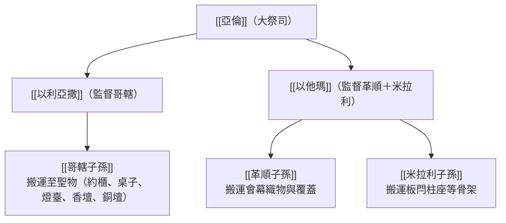

# 民數記 第4章

1. 耶和華曉諭[[摩西]]、[[亞倫]]說：
2. 你從利未人中，將[[哥轄子孫]]的總數，照他們的家室、宗族，
3. 從[[三十歲直到五十歲（利未人任職年齡）|三十歲直到五十歲]]，凡前來任職、在[[會幕（帳幕整體）|會幕]]裡[[辦事（melakah）|辦事]]的，全都計算。
4. [[哥轄子孫]]在[[會幕（帳幕整體）|會幕]]搬運至聖之物，所辦的事乃是這樣：
5. 起營的時候，[[亞倫]]和他兒子要進去摘下[[內幔（隔聖所至聖所的幔子）|遮掩櫃的幔子]]，用以蒙蓋[[約櫃|法櫃]]，
6. 又用[[海狗皮頂蓋|海狗皮]]蓋在上頭，再蒙上[[藍色、紫色、朱紅色線（tekhelet, argaman, tola'at shani）|純藍色的毯子]]，把槓穿上。
7. 又用[[藍色、紫色、朱紅色線（tekhelet, argaman, tola'at shani）|藍色毯子]]鋪在[[陳設餅桌子|陳設餅的桌子]]上，將盤子、調羹、奠酒的爵，和杯擺在上頭。桌子上也必有常設的餅。
8. 在其上又要蒙[[藍色、紫色、朱紅色線（tekhelet, argaman, tola'at shani）|朱紅色的毯子]]，再蒙上[[海狗皮頂蓋|海狗皮]]，把槓穿上。
9. 要拿[[藍色、紫色、朱紅色線（tekhelet, argaman, tola'at shani）|藍色毯子]]，把[[金燈臺|燈臺]]和燈臺上所用的燈盞、剪子、蠟花盤，並一切盛油的器皿，全都遮蓋。
10. 又要把[[金燈臺|燈臺]]和燈臺的一切器具包在[[海狗皮頂蓋|海狗皮]]裡，放在[[抬架（會幕器具搬運）|抬架]]上。
11. 在[[金香壇（香壇）|金壇]]上要鋪[[藍色、紫色、朱紅色線（tekhelet, argaman, tola'at shani）|藍色毯子]]，蒙上[[海狗皮頂蓋|海狗皮]]，把槓穿上。
12. 又要把聖所用的一切器具包在[[藍色、紫色、朱紅色線（tekhelet, argaman, tola'at shani）|藍色毯子]]裡，用[[海狗皮頂蓋|海狗皮]]蒙上，放在[[抬架（會幕器具搬運）|抬架]]上。
13. 要收去壇上的灰，把[[藍色、紫色、朱紅色線（tekhelet, argaman, tola'at shani）|紫色毯子]]鋪在壇上；
14. 又要把所用的一切器具，就是火鼎、肉鍤子、鏟子、盤子，一切屬壇的器具都擺在壇上，又蒙上[[海狗皮頂蓋|海狗皮]]，把槓穿上。
15. 將要起營的時候，[[亞倫]]和他兒子把聖所和聖所的一切器具遮蓋完了，哥轄的子孫就要來抬，只是[[不可摸聖物]]，免得他們死亡。[[會幕（帳幕整體）|會幕]]裡這些物件是[[哥轄子孫]]所當抬的。
16. 祭司[[亞倫]]的兒子[[以利亞撒]]所要看守的是點燈的油與香料，並當獻的素祭和膏油，也要看守全[[會幕（帳幕整體）|帳幕]]與其中所有的，並聖所和聖所的器具。
17. 耶和華曉諭[[摩西]]、[[亞倫]]說：
18. 你們不可將哥轄人的支派從利未人中剪除。
19. 他們挨近至聖物的時候，[[亞倫]]和他兒子要進去派他們各人所當辦的，所當抬的。這樣待他們，好使他們活著，不致死亡。
20. 只是他們連片時不可進去觀看聖所，免得他們死亡。
21. 耶和華曉諭[[摩西]]說：
22. 你要將[[革順子孫]]的總數，照著宗族、家室，
23. 從[[三十歲直到五十歲（利未人任職年齡）|三十歲直到五十歲]]，凡前來任職、在[[會幕（帳幕整體）|會幕]]裡[[辦事（melakah）|辦事]]的，全都數點。
24. 革順人各族所辦的事、所抬的物乃是這樣：
25. 他們要抬[[會幕（帳幕整體）|帳幕]]的[[內幔（隔聖所至聖所的幔子）|幔子]]和[[會幕（帳幕整體）|會幕]]，並會幕的蓋與其上的[[海狗皮頂蓋|海狗皮]]，和會幕的門簾，
26. 院子的帷子和門簾（院子是圍[[會幕（帳幕整體）|帳幕]]和壇的）、繩子，並所用的器具，不論是做什麼用的，他們都要經理。
27. 革順的子孫在一切抬物[[辦事（melakah）|辦事]]之上都要憑[[亞倫]]和他兒子的吩咐；他們所當抬的，要派他們看守。
28. 這是[[革順子孫]]的各族在[[會幕（帳幕整體）|會幕]]裡所辦的事；他們所看守的，必在祭司[[亞倫]]兒子[[以他瑪]]的手下。
29. 至於米拉利的子孫，你要照著家室、宗族把他們數點。
30. 從[[三十歲直到五十歲（利未人任職年齡）|三十歲直到五十歲]]，凡前來任職、在[[會幕（帳幕整體）|會幕]]裡[[辦事（melakah）|辦事]]的，你都要數點。
31. 他們辦理[[會幕（帳幕整體）|會幕]]的事，就是抬[[會幕（帳幕整體）|帳幕]]的板、閂、柱子，和帶卯的座，
32. 院子四圍的柱子和其上帶卯的座、橛子、繩子，並一切使用的器具。他們所抬的器具，你們要[[按名指定]]。
33. 這是[[米拉利子孫]]各族在[[會幕（帳幕整體）|會幕]]裡所辦的事，都在祭司[[亞倫]]兒子[[以他瑪]]的手下。
34. [[摩西]]、[[亞倫]]與會眾的諸首領將哥轄的子孫，照著家室、宗族，
35. 從[[三十歲直到五十歲（利未人任職年齡）|三十歲直到五十歲]]，凡前來任職、在[[會幕（帳幕整體）|會幕]]裡[[辦事（melakah）|辦事]]的，都數點了。
36. 被數的共有二千七百五十名。
37. 這是哥轄各族中被數的，是在[[會幕（帳幕整體）|會幕]]裡[[辦事（melakah）|辦事]]的，就是[[摩西]]、[[亞倫]]照耶和華藉摩西所吩咐數點的。
38. [[革順子孫]]被數的，照著家室、宗族，
39. 從[[三十歲直到五十歲（利未人任職年齡）|三十歲直到五十歲]]，凡前來任職、在[[會幕（帳幕整體）|會幕]]裡[[辦事（melakah）|辦事]]的，共有二千六百三十名。
40. 併於上節。
41. 這是[[革順子孫]]各族中被數的，是在[[會幕（帳幕整體）|會幕]]裡[[辦事（melakah）|辦事]]的，就是[[摩西]]、[[亞倫]]照耶和華藉摩西所吩咐數點的。
42. [[米拉利子孫]]中各族被數的，照著家室、宗族，
43. 從[[三十歲直到五十歲（利未人任職年齡）|三十歲直到五十歲]]，凡前來任職、在[[會幕（帳幕整體）|會幕]]裡[[辦事（melakah）|辦事]]的，共有三千二百名。
44. 併於上節。
45. 這是[[米拉利子孫]]各族中被數的，就是[[摩西]]、[[亞倫]]照耶和華藉摩西所吩咐數點的。
46. 凡被數的利未人，就是[[摩西]]、[[亞倫]]並以色列眾首領，照著家室、宗族所數點的，
47. 從[[三十歲直到五十歲（利未人任職年齡）|三十歲直到五十歲]]，凡前來任職、在[[會幕（帳幕整體）|會幕]]裡做抬物之工的，共有八千五百八十名。
48. 併於上節。
49. [[摩西]]按他們所辦的事、所抬的物，憑耶和華的吩咐數點他們；他們這樣被摩西數點，正如耶和華所吩咐他的。

<!-- fhl-map-links:start -->
## 相關地圖

- [[appendix/fhl_maps/maps/019|〈出圖二〉以色列人出埃及到西乃山]]
- [[appendix/fhl_maps/maps/038|〈書圖十一〉利未人的城和十二個支派的地業]]
<!-- fhl-map-links:end -->

---

## 本章知識節點

### 人物
- [[摩西]]
- [[亞倫]]
- [[以利亞撒]]
- [[以他瑪]]
- [[哥轄子孫]]
- [[革順子孫]]
- [[米拉利子孫]]

### 事件
- [[利未三族分工]]
- [[數點利未任職男子]]

### 主題
- [[會幕（帳幕整體）]]
- [[約櫃]]
- [[陳設餅桌子]]
- [[金燈臺]]
- [[金香壇（香壇）]]
- [[銅壇（燔祭壇）]]
- [[海狗皮頂蓋]]
- [[內幔（隔聖所至聖所的幔子）]]
- [[藍色、紫色、朱紅色線（tekhelet, argaman, tola'at shani）]]
- [[三十歲直到五十歲（利未人任職年齡）]]
- [[按名指定]]
- [[抬架（會幕器具搬運）]]

### 神學
- [[不可摸聖物]]
- [[不可觀看聖所]]
- [[祭司統轄事奉]]

### 解經爭議
- [[利未人任職年齡的差異]]
- [[抬約櫃的槓是否可抽出來]]

### 原文
- [[辦事（melakah）]]
- [[工作（baabodath）]]

### 互文
- [[不可摸約櫃（撒下6：6-7）]]

---

## 本章整理

### 哥轄子孫的職責與至聖物的包紮抬運（v1-20）

耶和華在曠野西乃山的會幕中曉諭[[摩西]]和[[亞倫]]，指令對利未次子哥轄的後代進行獨立的任職普查與職責分派（v1-2）。逐節註解（CT）強調，[[哥轄子孫]]在利未三大家族中地位最為崇高，原因在於摩西與亞倫本人即出自哥轄家族，且哥轄子孫被指派承擔[[會幕（帳幕整體）|會幕]]中最神聖的重任——搬運「至聖之物」（v4）。

神規定在會幕裡做搬運事工的利未人，年齡門檻為「[[三十歲直到五十歲（利未人任職年齡）|從三十歲直到五十歲]]」（v3）。CT與拾穗（GT）均指出，三十歲象徵生命成熟剛強——主耶穌亦在三十歲左右出來傳道（路3:23），正符合此屬靈原型。GT難解經文欄更辨析v3的希伯來文「[[辦事（melakah）|辦事]]」（melakah）與民數記8:24的「[[工作（baabodath）|工作]]」（baabodath）之別：前者指三十歲後正式獨立承擔的聖職重任，後者指二十五歲起5年學徒見習期的輔助勞作，兩者構成利未人事奉的完整「階梯制度」。至於大衛和被擄歸回時期調降至二十歲（代上23:24、拉3:8），則與[[利未人任職年齡的差異]]的歷史背景有關——聖殿建成後無需搬運會幕，且歸回人數稀少（僅74名利未人），故降低門檻以應事奉急需（GT）。

起營移動時，至聖物的包紮完全是祭司的專責（v5-14）。KingComments（KC）指出，神不把這道程序交給利未人，正是強調「祭司獨有」的聖潔屏障。包紮程序如下：

| 聖物 | 包紮材料（由內至外） | 搬運方式 |
|------|---------------------|----------|
| [[約櫃]] | [[內幔（隔聖所至聖所的幔子）]] → [[海狗皮頂蓋]] → 純藍色（[[藍色、紫色、朱紅色線（tekhelet, argaman, tola'at shani）]]）毯子 | 把槓穿上肩抬 |
| [[陳設餅桌子]] | 藍色毯子（擺盤器具與常設的餅）→ 朱紅色毯子 → 海狗皮 | 把槓穿上肩抬 |
| [[金燈臺]] | 藍色毯子 → 海狗皮 | 放在[[抬架（會幕器具搬運）]]上肩抬 |
| [[金香壇（香壇）]] | 藍色毯子 → 海狗皮 | 把槓穿上肩抬 |
| [[銅壇（燔祭壇）]] | 收去灰 → 紫色毯子（擺屬壇器具）→ 海狗皮 | 把槓穿上肩抬 |

KC注意到顏色的神學意涵：[[約櫃]]外裹純藍色毯子（象徵天與至聖神聖本質），[[陳設餅桌子]]的最外層是朱紅色（象徵血與救贖），[[銅壇（燔祭壇）|祭壇]]用紫色（象徵君王尊貴）。GT解釋，[[金燈臺]]和諸聖所器具無法穿槓，故需先包裹後放在[[抬架（會幕器具搬運）|抬架]]上由哥轄子孫肩抬，確保聖物不觸地面。

關於[[抬約櫃的槓是否可抽出來]]，GT（艾基斯、賈斯樂）指出出埃及記25:15說「槓不可抽出來」，而民4:6卻說「把槓穿上」，兩者的調和在於：希伯來文「穿上」（sim）含「調整緊實」（adjust and fasten）之義，祭司在遮蓋時需暫時調整槓的位置以便蒙蓋覆蓋物，隨後重新固定，並未真正抽出——兩指令完全一致，實是操作細節的精確描述。

包紮完畢後，[[哥轄子孫]]才得進入抬運，但神立下兩道鐵律：其一，[[不可摸聖物]]（v15）——「他們不可摸聖物，免得他們死亡」；其二，[[不可觀看聖所]]（v20）——「連片時不可進去觀看聖所，免得他們死亡」。GT比較兩道禁令：「摸」是主動碰觸，「觀看」是擅自窺視；兩者都涉及越過祭司設立的屬靈邊界，踏入神保留的聖潔領域。KC指出，神設立這些禁令不是殘酷，而是愛的保護——墮落罪人無法承受神直接的聖潔榮耀，祭司的包紮遮蓋正是神在人與榮耀之間建立的安全屏障。BibleHub研經（BH）也列舉大衛時代烏撒的例子（撒下6:6-7）——[[不可摸約櫃（撒下6：6-7）|烏撒因伸手扶約櫃而被擊殺]]——正是違背此禁令的歷史教訓。亞倫之子[[以利亞撒]]則親自看守聖所的點燈油、香料、常獻素祭與膏油，並監督[[哥轄子孫]]的整個搬運流程（v16；CT、GT）。

### 革順子孫與米拉利子孫的分派職掌（v21-33）

神接著吩咐數點[[革順子孫]]（v21-23），年齡亦為三十歲至五十歲。GT說明，[[革順子孫]]的職責是「可見的覆蓋」：他們負責帳幕所有的織物結構，包括會幕十幅細麻幔子、罩棚（公羊皮蓋與[[海狗皮頂蓋|海狗皮]]）、會幕門簾、院子四圍帷子與院門簾，以及相關的繩子、橛子（v24-26）。CT特別指出，革順族抬的都是「外層可見」的器物——這些正是初進會幕院子時首先映入眼簾的壯麗覆蓋，美麗而費工，但神視之與至聖物搬運同等重要。革順子孫的所有事工，均在祭司[[亞倫]]之子[[以他瑪]]的手下分派督理（v28；[[祭司統轄事奉]]原則）。

神隨後吩咐數點[[米拉利子孫]]（v29-30），年齡同樣為三十歲至五十歲。米拉利子孫承擔最重的硬體骨架搬運：帳幕的豎板、閂、柱子、帶卯的座，以及院子四圍的柱子、基座、橛子、繩子等（v31-32）。這些器具體積龐大且由金、銀、銅和重木製成，因此米拉利族在分配運輸工具時獲得最多——四輛牛車與八隻牛（民7:8；GT）。針對米拉利族所負責的零散器件，摩西與亞倫特別實施[[按名指定]]（v32）：祭司對每一組件與承責工人的姓名逐一核對，防止遺失與責任不清（GT、BH）。BH援引此原則指出，神的事工管理精確到個人，預表新約教會中每位肢體按恩賜各盡其職（林前12:7-11）。[[米拉利子孫]]的事工亦受[[以他瑪]]督理（v33；[[祭司統轄事奉]]）。

CT概括三族分工的神學意涵：

### 三族任職男子的精確數點與總結（v34-49）

摩西、亞倫與以色列會眾的諸首領遵照耶和華命令，正式執行[[數點利未任職男子]]事宜（v34-46）。[[利未三族分工]]的數點結果如下：

| 族群 | 任職男子 | 佔比（約） |
|------|---------|-----------|
| [[哥轄子孫]] | 2,750 名（v36） | 32% |
| [[革順子孫]] | 2,630 名（v40） | 31% |
| [[米拉利子孫]] | 3,200 名（v44） | 37% |
| **合計** | **8,580 名（v47-48）** | 100% |

GT分析，米拉利族30-50歲適任比例在三族中最高，這與其所承擔最粗重的板閂柱座搬運任務完全吻合——神的分配精確地使每族的人數與負擔相稱。CT指出，8,580名壯丁分工合作，使每人所承擔的分量既輕省又具體，體現了神管理神百姓的周密計畫與智慧秩序。KC則從跨章視角看到：第3章先按月齡登記利未人的身份（一月以上22,000名），第4章再按年齡與體力登記任職人員（30-50歲8,580名）——兩道清點並用，從「是利未人」進入到「能負責任的利未人」，彰顯神的選召必伴隨具體裝備與責任分配。

本章以「摩西憑耶和華的命令，在西乃曠野數點了他們」（v49）作結，這不是枯燥的人口統計，而是[[利未三族分工]]在神的命令下完整落地的記錄——從人物到職責，從知識到秩序，一切精確反映神對聖所事工的聖潔要求與周密安排（CT、GT、KC、BH）。[[祭司統轄事奉]]的原則貫穿全章，確保利未人的每一個崗位都在神授權的秩序之下運作。

**參考資料**
https://www.ccbiblestudy.org/Old%20Testament/04Num/04CT04.htm
https://www.ccbiblestudy.org/Old%20Testament/04Num/04GT04.htm
https://www.kingcomments.com/en/bible-studies/Num/4
https://biblehub.com/study/numbers/4.htm
