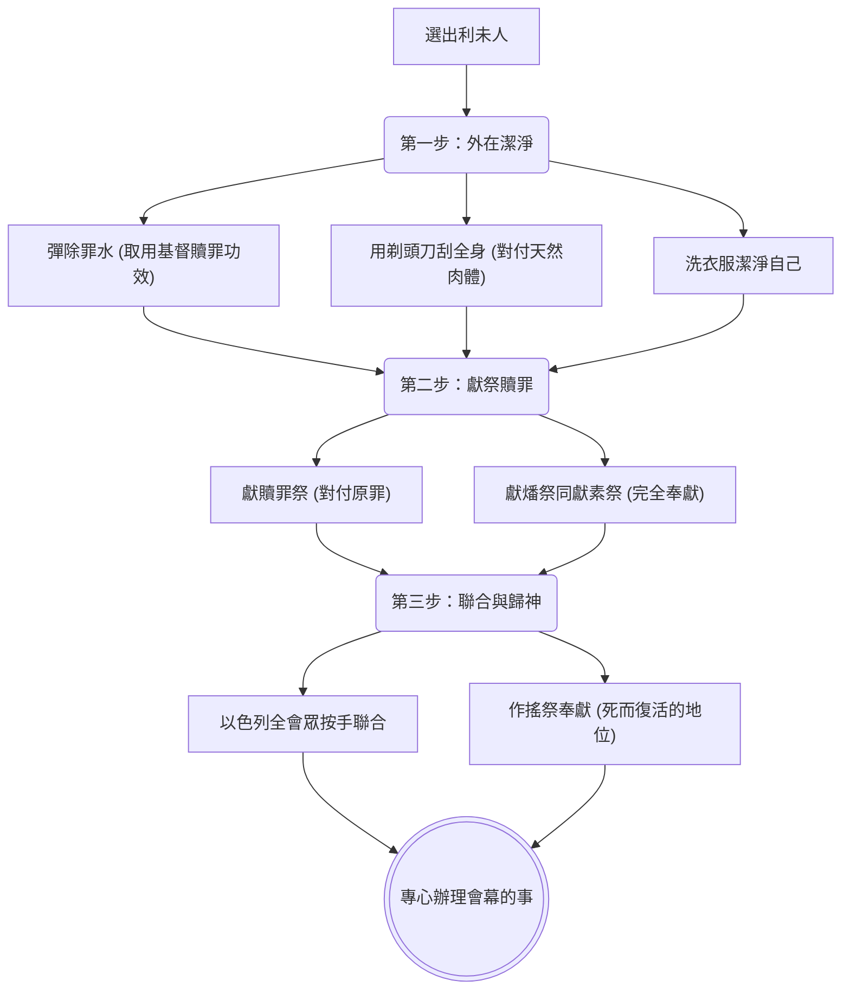

# 民數記 第8章

1. 耶和華曉諭[[摩西]]說：
2. 你告訴[[亞倫]]說：點燈的時候，七盞燈都要向[[金燈臺|燈臺]]前面發光。
3. [[亞倫]]便這樣行。他點[[金燈臺|燈臺]]上的燈，使燈向前發光，是照耶和華所吩咐[[摩西]]的。
4. 這[[金燈臺|燈臺]]的做法是用金子錘出來的，連座帶花都是錘出來的。[[摩西]]製造燈臺，是照耶和華所指示的樣式。
5. 耶和華曉諭[[摩西]]說：
6. 你從[[以色列|以色列人]]中選出[[利未支派|利未人]]來，[[潔淨(maqom tahor)|潔淨]]他們。
7. [[潔淨(maqom tahor)|潔淨]]他們當這樣行：用[[除罪水]]彈在他們身上，又叫他們用[[剃頭刀]]刮全身，洗衣服，[[潔淨(maqom tahor)|潔淨自己]]。
8. 然後叫他們取一隻公牛犢，並同獻的[[素祭（minchah）|素祭]]，就是調油的細麵；你要另取一隻公牛犢作[[贖罪祭]]。
9. 將[[利未支派|利未人]]奉到會幕前，招聚[[以色列]]全會眾。
10. 將[[利未支派|利未人]]奉到耶和華面前，[[以色列|以色列人]]要按手在他們頭上。
11. [[亞倫]]也將他們奉到耶和華面前，為[[以色列|以色列人]]當作[[搖祭（tenufah）|搖祭]]，使他們好辦耶和華的事。
12. [[利未支派|利未人]]要按手在那兩隻牛的頭上；你要將一隻作[[贖罪祭]]，一隻作[[燔祭（olah）|燔祭]]，獻給耶和華，為利未人贖罪。
13. 你也要使[[利未支派|利未人]]站在[[亞倫]]和他兒子面前，將他們當作[[搖祭（tenufah）|搖祭]]奉給耶和華。
14. 這樣，你從[[以色列|以色列人]]中將[[利未支派|利未人]]分別出來，利未人便要歸我。
15. 此後[[利未支派|利未人]]要進去辦會幕的事，你要[[潔淨(maqom tahor)|潔淨]]他們，將他們當作[[搖祭（tenufah）|搖祭]]奉上；
16. 因為他們是從[[以色列|以色列人]]中全然給我的，我揀選他們歸我，是代替以色列人中一切頭生的。
17. [[以色列|以色列人]]中一切頭生的，連人帶牲畜，都是我的。我在[[埃及地]]擊殺一切頭生的那天，將他們分別為聖歸我。
18. 我揀選[[利未支派|利未人]]代替[[以色列|以色列人]]中一切頭生的。
19. 我從[[以色列|以色列人]]中將[[利未支派|利未人]]當作賞賜給[[亞倫]]和他的兒子，在會幕中辦以色列人的事，又為以色列人贖罪，免得他們挨近[[聖所]]，有災殃臨到他們中間。
20. [[摩西]]、[[亞倫]]，並[[以色列]]全會眾便向[[利未支派|利未人]]如此行。凡耶和華指著利未人所吩咐摩西的，[[以色列|以色列人]]就向他們這樣行。
21. 於是[[利未支派|利未人]][[潔淨(maqom tahor)|潔淨自己]]，除了罪，洗了衣服；[[亞倫]]將他們當作[[搖祭（tenufah）|搖祭]]奉到耶和華面前，又為他們贖罪，潔淨他們。
22. 然後[[利未支派|利未人]]進去，在[[亞倫]]和他兒子面前，在會幕中辦事。耶和華指著利未人怎樣吩咐[[摩西]]，[[以色列|以色列人]]就怎樣向他們行了。
23. 耶和華曉諭[[摩西]]說：
24. [[利未支派|利未人]]是這樣：從二十五歲以外，他們要前來任職，辦會幕的事。
25. 到了五十歲要停工退任，不再辦事，
26. 只要在會幕裡，和他們的弟兄一同伺候，謹守所吩咐的，不再辦事了。至於所吩咐[[利未支派|利未人]]的，你要這樣向他們行。

---

## 本章知識節點

### 人物
- [[摩西]]
- [[亞倫]]
- [[以色列]]
- [[利未支派]]

### 地點
- [[埃及地]]
- [[聖所]]

### 主題
- [[金燈臺]]
- [[剃頭刀]]
- [[除罪水]]

### 神學
- [[贖罪祭]]
- [[潔淨(maqom tahor)]]

### 原文
- [[素祭（minchah）]]
- [[燔祭（olah）]]
- [[搖祭（tenufah）]]

---

## 本章整理

### 點燈的法則與燈臺的啟示（v1-4）

> [!info] 基督與教會的光照
> 燈檯是用一塊精金連座帶花錘出來的，在屬靈上預表基督與教會全然帶著神性，並經歷十字架的煉製（錘打）。

耶和華在會幕中曉諭[[摩西]]，指示他告訴大祭司[[亞倫]]關於點燈的法則（v1-2）。神吩咐：「點燈的時候，七盞燈都要向燈臺前面發光。」（v2）。這[[金燈臺|燈檯]]是用精金錘出來的，完全是照著耶和華在西奈山上所指示的樣式製造的（v4）。

[[亞倫]]完全遵照耶和華的吩咐行事，點燃了燈檯上的燈（v3）。這七盞燈代表了聖靈完全的工作與光照（啟4:5）。燈光向前照射，不僅照亮了聖所，更光照了對面的陳設餅桌子。陳設餅代表以色列十二支派，因此燈光照著陳設餅，象徵神生命的光不斷地照耀著屬神的子民，使他們永遠活在神的光中。事奉神的人，也必須在基督全備生命的光中事奉。

### 潔淨與奉獻利未人歸神（v5-15）

> [!note] 徹底的潔淨與對付
> 事奉神的首要條件是潔淨。利未人必須經過除罪水與剃頭刀的雙重對付，才能真正在神面前事奉。

接著，耶和華指示摩西，要從[[以色列|以色列人]]中選出[[利未支派|利未人]]，並將他們[[潔淨(maqom tahor)|潔淨]]（v5-6）。潔淨的儀式極其嚴格：

首先，用[[除罪水]]彈在他們身上，預表取用基督流血贖罪的功效與聖靈的洗淨；其次，用[[剃頭刀]]刮全身的細毛，象徵徹底對付人天然的肉體與舊有的驕傲；最後，洗淨衣服，使自己完全聖潔（v7）。

完成潔淨後，要獻上祭物。利未人要取一隻公牛犢作[[燔祭（olah）|燔祭]]，並同獻調油的細麵作[[素祭（minchah）|素祭]]；另取一隻公牛犢作[[贖罪祭]]（v8）。以色列全會眾將利未人奉到耶和華面前，由首領代表在利未人頭上按手（v9-10），表徵以色列人與利未人的完全聯合，利未人是代表全體事奉神。

隨後，利未人也要按手在那兩隻牛的頭上，使祭牲代替他們，獻上贖罪祭與燔祭（v12）。這表明事奉是建立在「贖罪」（解決罪性）與「奉獻」（討神喜悅）的基礎上。亞倫將利未人當作[[搖祭（tenufah）|搖祭]]奉獻給神，使他們站在死而復活的地位上，專心辦理耶和華的事（v11, 13）。

### 利未人的替代、職責與年齡限制（v16-26）

> [!quote] 退而不休的生命服事
> 到了五十歲，利未人從事務的崗位上退下來，但不是退休，而是轉入生命與守望的服事，在會幕裡與弟兄一同伺候。

神宣告，利未人是從以色列人中全然歸祂的，為要代替以色列人中一切頭生的（v16）。神回顧了逾越節的歷史：「我在[[埃及地]]擊殺一切頭生的那天，將他們分別為聖歸我。」（v17）。因此，所有頭生的都屬乎神，而神以利未人來替代他們（v18）。

神將利未人當作賞賜給亞倫和他的兒子，在會幕中辦理以色列人的事，免得百姓違規挨近[[聖所]]而遭遇災殃（v19）。摩西、亞倫與全會眾完全遵行神的吩咐，利未人潔淨自己，除了罪，便進入會幕辦事（v20-22）。

最後，神定規了利未人服事的年限。從二十五歲以外，他們要前來見習並任職（v24）；到了五十歲，則要停工退任，不再做粗重的勞力事務（v25）。退任後，他們只需在會幕裡與弟兄一同伺候，謹守所吩咐的（v26）。這象徵著屬靈生命需要長進成熟才能獨立事奉，而到了晚年則轉入生命與守望的服事，以經驗成全後進，這是神所看重的生命事奉。

**參考資料**
https://www.ccbiblestudy.org/Old%20Testament/04Num/04CT08.htm
https://www.ccbiblestudy.org/Old%20Testament/04Num/04GT08.htm
https://www.kingcomments.com/en/bible-studies/Num/8
https://biblehub.com/study/numbers/8.htm
