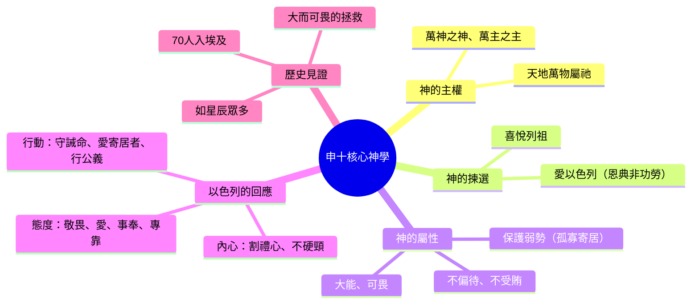

# 申命記 第10章

1. 那時，耶和華吩咐我說：你要鑿出[[兩塊石版（約版）|兩塊石版]]，和先前的一樣，上山到我這裡來，又要做一木櫃。
2. 你先前摔碎的那版，其上的字我要寫在這版上；你要將這版放在櫃中。
3. 於是我用皂莢木做了一櫃，又鑿出[[兩塊石版（約版）|兩塊石版]]，和先前的一樣，手裡拿這兩塊版上山去了。
4. 耶和華將那大會之日、在山上從火中所傳與你們的[[兩塊石版（約版）|十條誡]]，照先前所寫的，寫在這版上，將版交給我了。
5. 我轉身下山，將這版放在我所做的櫃中，現今還在那裡，正如耶和華所吩咐我的。
6. （以色列人從比羅比尼亞干（或作：亞干井）起行，到了[[亞倫之死與以利亞撒繼任|摩西拉]]。[[亞倫之死與以利亞撒繼任|亞倫死]]在那裡，就葬在那裡。他兒子[[亞倫之死與以利亞撒繼任|以利亞撒接續他供祭司的職分]]。
7. 他們從那裡起行，到了谷歌大，又從谷歌大到了有溪水之地的約巴他。
8. 那時，耶和華將[[利未人分別為聖侍立|利未支派分別出來]]，[[利未人分別為聖侍立|抬耶和華的約櫃]]，又[[利未人分別為聖侍立|侍立在耶和華面前事奉他]]，奉他的名祝福，直到今日。
9. 所以利未人在他弟兄中無分無業，耶和華是他的產業，正如耶和華─你神所應許他的。）
10. 我又像從前[[摩西第二次在山上四十晝夜|在山上住了四十晝夜]]。那次[[摩西第二次在山上四十晝夜|耶和華也應允我]]，不忍將你滅絕。
11. 耶和華吩咐我說：你[[神吩咐摩西率領百姓進地|起來引導這百姓]]，使他們進去得我向他們列祖起誓應許所賜之地。
12. 以色列啊，現在耶和華─你神向你所要的是什麼呢？只要你敬畏耶和華─你的神，[[敬畏神、愛神、事奉神|遵行他的道]]，[[敬畏神、愛神、事奉神|愛他]]，[[敬畏神、愛神、事奉神|盡心盡性事奉他]]，
13. [[敬畏神、愛神、事奉神|遵守他的誡命律例]]，就是我今日所吩咐你的，為要叫你得福。
14. 看哪，[[天地萬物屬神|天和天上的天]]，[[天地萬物屬神|地和地上所有的]]，都屬耶和華─你的神。
15. 耶和華但[[神揀選以色列（揀選恩典）|喜悅你的列祖]]，愛他們，[[神揀選以色列（揀選恩典）|從萬民中揀選]]他們的後裔，就是你們，像今日一樣。
16. 所以你們要[[除掉心裡的污穢、不可硬著頸項|將心裡的污穢除掉]]，[[除掉心裡的污穢、不可硬著頸項|不可再硬著頸項]]。
17. 因為耶和華─你們的神─他是[[神的屬性（萬神之神、萬主之主、大有能力、大而可畏、不以貌取人、不受賄賂）|萬神之神]]，[[神的屬性（萬神之神、萬主之主、大有能力、大而可畏、不以貌取人、不受賄賂）|萬主之主]]，[[神的屬性（萬神之神、萬主之主、大有能力、大而可畏、不以貌取人、不受賄賂）|至大的神]]，[[神的屬性（萬神之神、萬主之主、大有能力、大而可畏、不以貌取人、不受賄賂）|大有能力]]，[[神的屬性（萬神之神、萬主之主、大有能力、大而可畏、不以貌取人、不受賄賂）|大而可畏]]，[[神的屬性（萬神之神、萬主之主、大有能力、大而可畏、不以貌取人、不受賄賂）|不以貌取人]]，也[[神的屬性（萬神之神、萬主之主、大有能力、大而可畏、不以貌取人、不受賄賂）|不受賄賂]]。
18. 他[[神為孤兒寡婦伸冤、憐愛寄居者|為孤兒寡婦伸冤]]，又憐愛寄居的，[[神為孤兒寡婦伸冤、憐愛寄居者|賜給他衣食]]。
19. 所以你們要憐愛寄居的，因為[[當憐愛寄居者（因你們在埃及也作過寄居的）|你們在埃及地也作過寄居的]]。
20. 你要敬畏耶和華─你的神，[[敬畏耶和華、事奉祂、專靠祂、指著祂的名起誓|事奉他]]，[[敬畏耶和華、事奉祂、專靠祂、指著祂的名起誓|專靠他]]，也要[[敬畏耶和華、事奉祂、專靠祂、指著祂的名起誓|指著他的名起誓]]。
21. [[神是你所讚美的、為你做了大而可畏的事|他是你所讚美的]]，是你的神，[[神是你所讚美的、為你做了大而可畏的事|為你做了那大而可畏的事]]，是你[[神是你所讚美的、為你做了大而可畏的事|親眼所看見]]的。
22. 你的[[列祖七十人下埃及、神使你如天上星那樣多|列祖七十人下埃及]]；現在耶和華─你的神使你[[列祖七十人下埃及、神使你如天上星那樣多|如同天上的星那樣多]]。

<!-- fhl-map-links:start -->
## 相關地圖

- [[appendix/fhl_maps/maps/024|〈民圖五〉出埃及和進迦南的旅程]]
- [[appendix/fhl_maps/maps/025|〈申圖一〉應許之地全圖]]
- [[appendix/fhl_maps/maps/026|〈申圖二〉征服東岸及分地給兩個半支派]]
- [[appendix/fhl_maps/maps/038|〈書圖十一〉利未人的城和十二個支派的地業]]
<!-- fhl-map-links:end -->

---

## 本章知識節點

### 歷史事件
- [[亞倫之死與以利亞撒繼任]]
- [[摩西第二次在山上四十晝夜]]
- [[神吩咐摩西率領百姓進地]]
- [[列祖七十人下埃及、神使你如天上星那樣多]]

### 制度與職分
- [[利未人分別為聖侍立]]

### 神學核心
- [[天地萬物屬神]]
- [[神揀選以色列（揀選恩典）]]
- [[神的屬性（萬神之神、萬主之主、大有能力、大而可畏、不以貌取人、不受賄賂）]]
- [[神為孤兒寡婦伸冤、憐愛寄居者]]

### 回應與倫理
- [[除掉心裡的污穢、不可硬著頸項]]
- [[當憐愛寄居者（因你們在埃及也作過寄居的）]]
- [[敬畏耶和華、事奉祂、專靠祂、指著祂的名起誓]]
- [[神是你所讚美的、為你做了大而可畏的事]]
- [[敬畏神、愛神、事奉神]]

### 典章物件
- [[兩塊石版（約版）]]

---

## 本章整理

### 重立約版與約櫃（v1-5）
耶和華吩咐摩西鑿出[[兩塊石版（約版）|兩塊石版]]，並做一木櫃（皂莢木），將寫有十誡的石版放入其中。這標誌著西乃之約在金牛犢事件後的正式重立，約櫃成為神同在與約法的載體，由摩西親自保管安放。

### 利未支派分別與亞倫之死（v6-9）
經文插入歷史註記：以色列從比羅比尼亞干行至摩西拉，[[亞倫之死與以利亞撒繼任|亞倫死在那裡，兒子以利亞撒接續祭司職分]]。隨後記載[[利未人分別為聖侍立|耶和華將利未支派分別出來]]，專職抬約櫃、侍立事奉、奉神名祝福，且不在百姓中得地業，因「耶和華是他們的產業」。這確立了利未人獨特的聖職身分與供應方式。

### 摩西再次代求與領導委託（v10-11）
摩西回顧[[摩西第二次在山上四十晝夜|在山上住了四十晝夜]]，神垂聽代求，不滅絕百姓，並吩咐摩西[[神吩咐摩西率領百姓進地|起來引導百姓進去得地]]。這段敘事將約的重立與進地使命緊密連結：赦免是為了使命，約法是為了在應許地活出聖潔。

### 神對以色列的核心要求：敬畏、愛、順服（v12-13）
摩西總結神的要求：「只要你[[敬畏神、愛神、事奉神|敬畏耶和華你的神，遵行他的道，愛他，盡心盡性事奉他]]，遵守他的誡命律例……為要叫你得福」。這將律法的動機從外在遵行提升至內心全人委身，[[敬畏耶和華、事奉祂、專靠祂、指著祂的名起誓|敬畏、事奉、專靠、指名起誓]]成為信仰生活的四大支柱。

### 神的主權、揀選與屬性（v14-17）
經文以「看哪」引出神學高峰：[[天地萬物屬神|天和天上的天，地和地上所有的，都屬耶和華]]。然而這位全能主卻[[神揀選以色列（揀選恩典）|喜悅列祖，愛他們，從萬民中揀選他們的後裔]]。基於此恩典，百姓當[[除掉心裡的污穢、不可硬著頸項|除掉心裡的污穢，不可硬著頸項]]。神的屬性被詳細陳述：[[神的屬性（萬神之神、萬主之主、大有能力、大而可畏、不以貌取人、不受賄賂）|萬神之神、萬主之主，大有能力、大而可畏，不以貌取人、不受賄賂]]，這成為公義審判與倫理要求的神學基礎。

### 社會公義與愛寄居者（v18-19）
神的公義具體顯於[[神為孤兒寡婦伸冤、憐愛寄居者|為孤兒寡婦伸冤，憐愛寄居者，賜給衣食]]。以色列當[[當憐愛寄居者（因你們在埃及也作過寄居的）|憐愛寄居者，因你們在埃及地也作過寄居的]]。救贖歷史經驗（出埃及）轉化為社會倫理動力：蒙恩者當施恩。

### 獨一敬拜對象與見證見證（v20-22）
章末以呼召收尾：[[敬畏耶和華、事奉祂、專靠祂、指著祂的名起誓|要敬畏耶和華、事奉祂、專靠祂、指著祂的名起誓]]。因[[神是你所讚美的、為你做了大而可畏的事|祂是你所讚美的，是你的神，為你做了大而可畏的事]]。從[[列祖七十人下埃及、神使你如天上星那樣多|列祖七十人下埃及]]到如今如天上星眾多，人口增長見證神信實應許亞伯拉罕之約（創15:5）。

> [!important] 本章樞紐
> 申命記10章將**約的重立**（v1-5）、**職分的建立**（v6-9）、**使命的重申**（v10-11）與**神學倫理的總綱**（v12-22）結合。核心張力在於：全能、無私、保護弱勢的神，揀選了微小、硬頸的百姓；因此，百姓的「割禮心」與「愛寄居者」不僅是道德要求，更是活出神形象、回應揀選恩典的必然邏輯。

**參考資料**
https://biblehub.com/study/deuteronomy/10.htm
https://www.ccbiblestudy.org/Old%20Testament/05Deut/05CT10.htm
https://www.ccbiblestudy.org/Old%20Testament/05Deut/05GT10.htm
https://www.kingcomments.com/en/bible-studies/Deu/10
