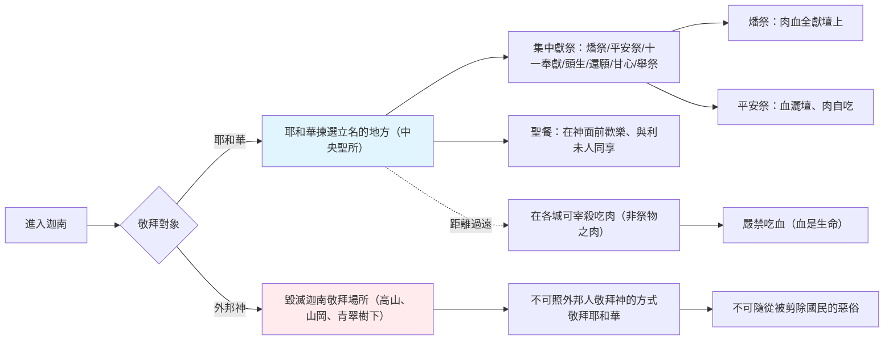

# 申命記 第12章

1. 你們存活於世的日子，在耶和華─你們列祖的神所賜你們為業的地上，要謹守遵行的[[律例典章]]乃是這些：
2. 你們要將所趕出的國民事奉神的各地方，無論是在高山，在小山，在各青翠樹下，都毀壞了；
3. 也要拆毀他們的祭壇，[[毀滅迦南敬拜場所（高山、山岡、青翠樹下）|打碎他們的柱像]]，用火焚燒他們的木偶，砍下他們雕刻的神像，並將其名從那地方除滅。
4. 你們不可照他們那樣事奉耶和華─你們的神。
5. 但耶和華─你們的神從你們各支派中選擇何處為立他名的居所，你們就當往那裡去求問，
6. 將你們的燔祭、平安祭、十分取一之物，和手中的舉祭，並還願祭、甘心祭，以及[[獻祭只能在神揀選的地方（集中敬拜）|牛群羊群中頭生的]]，都奉到那裡。
7. 在那裡，耶和華─你們神的面前，你們和你們的家屬都可以吃，並且因你手所辦的一切事蒙耶和華─你的神賜福，就都歡樂。
8. 我們今日在這裡所行的是各人行自己眼中看為正的事，你們將來不可這樣行；
9. 因為你們還沒有到耶和華─你神所賜你的安息地，所給你的產業。
10. 但你們過了約但河，得以住在耶和華─你們神使你們承受為業之地，又使你們太平，不被四圍的一切仇敵擾亂，安然居住。
11. 那時要將我所吩咐你們的燔祭、平安祭、十分取一之物，和手中的舉祭，並向耶和華許願獻的一切美祭，都奉到耶和華─你們神所選擇要[[耶和華揀選立名的地方（中央聖所）|立為他名的居所]]。
12. 你們和兒女、僕婢，並住在你們城裡無分無業的利未人，都要在耶和華─你們的神面前歡樂。
13. 你要謹慎，不可在你所看中的各處獻燔祭。
14. 惟獨耶和華從你那一支派中所選擇的地方，你就要在那裡獻燔祭，行我一切所吩咐你的。
15. 然而，在你各城裡都可以照耶和華─你神所賜你的福分，隨心所欲宰牲吃肉；無論潔淨人不潔淨人都可以吃，就如吃羚羊與鹿一般。
16. 只是不可吃血，要倒在地上，如同倒水一樣。
17. 你的五穀、新酒，和油的十分之一，或是[[獻祭只能在神揀選的地方（集中敬拜）|牛群羊群中頭生的]]，或是你許願獻的，甘心獻的，或是手中的舉祭，都不可在你城裡吃。
18. 但要在耶和華─你的神面前吃，在耶和華─你神所要選擇的地方，你和兒女、僕婢，並住在你城裡的利未人，都可以吃；也要因你手所辦的，在耶和華─你神面前歡樂。
19. 你要謹慎，在你所住的地方永不可丟棄利未人。
20. 耶和華─你的神照他所應許擴張你境界的時候，你心裡想要吃肉，說：我要吃肉，就可以隨心所欲地吃肉。
21. 耶和華─你神所選擇要立他名的地方若離你太遠，就可以照我所吩咐的，將耶和華賜給你的牛羊取些宰了，可以隨心所欲在你城裡吃。
22. 你吃那肉，要像吃羚羊與鹿一般；無論潔淨人不潔淨人都可以吃。
23. 只是你要心意堅定，不可吃血，因為血是生命；不可將血（原文作生命）與肉同吃。
24. 不可吃血，要倒在地上，如同倒水一樣。
25. 不可吃血。這樣，你行耶和華眼中看為正的事，你和你的子孫就可以得福。
26. 只是你[[聖物、還願祭、甘心祭、頭生牛羊必帶到神揀選的地方|分別為聖的物]]和你的[[聖物、還願祭、甘心祭、頭生牛羊必帶到神揀選的地方|還願祭]]要奉到耶和華所選擇的地方去。
27. 你的燔祭，連肉帶血，都要獻在耶和華─你神的壇上。平安祭的血要倒在耶和華─你神的壇上；平安祭的肉，你自己可以吃。
28. 你要謹守聽從我所吩咐的一切話，行耶和華─你神眼中看為善，看為正的事。這樣，你和你的子孫就可以永遠享福。
29. 耶和華─你神將你要去趕出的國民從你面前剪除，你得了他們的地居住，
30. 那時就要謹慎，[[不可隨從被剪除國民的惡俗（不可事奉他們的神）|不可在他們除滅之後隨從他們的惡俗]]，[[不可隨從被剪除國民的惡俗（不可事奉他們的神）|陷入網羅]]，也不可訪問他們的神說：這些國民怎樣事奉他們的神，[[不可照外邦人敬拜神的方式敬拜耶和華|我也要照樣行]]。
31. 你不可向耶和華─你的神這樣行，因為他們向他們的神行了耶和華所憎嫌所恨惡的一切事，甚至[[不可隨從被剪除國民的惡俗（不可事奉他們的神）|將自己的兒女用火焚燒]]，獻與他們的神。
32. [[凡我所吩咐的都要謹守遵行、不可加添也不可刪減|凡我所吩咐的，你們都要謹守遵行]]，[[凡我所吩咐的都要謹守遵行、不可加添也不可刪減|不可加添，也不可刪減]]。

---

## 本章知識節點

### 敬拜制度
- [[毀滅迦南敬拜場所（高山、山岡、青翠樹下）]]
- [[耶和華揀選立名的地方（中央聖所）]]
- [[獻祭只能在神揀選的地方（集中敬拜）]]
- [[聖物、還願祭、甘心祭、頭生牛羊必帶到神揀選的地方]]

### 神學
- [[不可照外邦人敬拜神的方式敬拜耶和華]]
- [[不可隨從被剪除國民的惡俗（不可事奉他們的神）]]

### 生活倫理
- [[在各城可宰殺吃肉（非祭物之肉）]]
- [[利未人不可被忽略（利未人無分無業）]]

### 解經原則
- [[凡我所吩咐的都要謹守遵行、不可加添也不可刪減]]

---

## 本章整理

### 律例典章序言與毀滅異教敬拜（v1-4）
本章開啟申命記「律例典章」單元（12:1–26:15），核心在於以色列進入迦南後如何正確敬拜耶和華。經文首先命令[[毀滅迦南敬拜場所（高山、山岡、青翠樹下）|徹底毀滅]]原住民的敬拜設施：高山、山岡、青翠樹下的祭壇、柱像、木偶與雕刻神像，並將其名從那地除滅（v2-3）。這不僅是軍事清理，更是屬靈斷絕，防止以色列人[[不可照外邦人敬拜神的方式敬拜耶和華|效法外邦敬拜模式]]（v4）。摩西強調敬拜方式不可由人自定（「各人行自己眼中看為正的事」，v8），而必須遵循神的揀選。

### 耶和華揀選之地：集中敬拜與歡慶（v5-12）
與四散的異教高台形成強烈對比，神要求以色列人尋求[[耶和華揀選立名的地方（中央聖所）|祂揀選立名的居所]]（v5）。一切[[獻祭只能在神揀選的地方（集中敬拜）|燔祭、平安祭、十分取一之物、舉祭、還願祭、甘心祭、頭生牛羊]]皆須奉到該處（v6, 11）。這確立了「集中敬拜」原則，將敬拜的合法性錨定在神的主權揀選，而非人的便利或偏好。在神面前，全家連同[[利未人不可被忽略（利未人無分無業）|無分無業的利未人]]一同吃喝歡樂，享受蒙福的果效（v7, 12）。

### 獻祭地點的嚴格限制與非祭物之肉（v13-16）
為防止百姓任意在「所看中的各處」獻燔祭（v13），經文重申「惟獨耶和華……所選擇的地方」才可獻祭（v14）。然而，考慮到應許之地廣闊，神恩典性地允許百姓在各城[[在各城可宰殺吃肉（非祭物之肉）|隨心所欲宰牲吃肉]]，如同吃羚羊、鹿一般，潔淨不潔淨人皆可同食（v15, 22）。唯一絕對禁令是不可吃血，因「血是生命」，必須倒在地上如水（v16, 23-24）。這區分了「祭物」（必須帶到中央聖所）與「俗物肉」（可在本地食用）的界線。

### 聖物、利未人與地境擴張的規定（v17-25）
經文細列不可在城裡食用的聖物：五穀新酒油的十一奉獻、頭生牛羊、還願祭、甘心祭、舉祭（v17），這些[[聖物、還願祭、甘心祭、頭生牛羊必帶到神揀選的地方|必須帶到神揀選的地方]]，在耶和華面前與利未人同享（v18）。並特別囑咐「不可丟棄利未人」（v19）。當神擴張境界、中央聖所距離過遠時，許可在本城宰殺牛羊食用（v20-21），但重申禁血令（v23-25），強調順服帶來福祉。

### 祭物處理細節與誡命封存（v26-32）
末段總結祭物處理：分別為聖的物與還願祭必奉往揀選之地（v26）；燔祭肉血全獻於壇上，平安祭血灑壇、肉自吃（v27）。摩西以「謹守聽從……行耶和華眼中看為善、看為正的事」作結（v28），並預警進入迦南後[[不可隨從被剪除國民的惡俗（不可事奉他們的神）|不可隨從被剪除國民的惡俗]]，甚至訪問他們的神、效法將兒女用火焚燒的可憎惡行（v29-31）。全章以[[凡我所吩咐的都要謹守遵行、不可加添也不可刪減|誡命封存條款]]收尾（v32），確立啟示的封閉性與權威性。

> [!important] 本章樞紐：集中敬拜與生活化聖潔的張力
申命記 12 章建立「一地、一壇、一民」的敬拜架構，同時為分散居住的現實預留「非祭物之肉」的空間。這張力貫穿以色列歷史（參士師記 17-18 米迦家私設祭壇；列王記上 12 耶羅波安設立丹、伯特利金牛犢），也預表新約時代「在靈裡真理裡拜父」不再限於耶路撒冷或基利心山（約 4:21-24），卻同樣要求敬拜方式由神定義、生命聖潔與敬拜一致。

**參考資料**
https://biblehub.com/study/deuteronomy/12.htm
https://www.ccbiblestudy.org/Old%20Testament/05Deut/05CT12.htm
https://www.ccbiblestudy.org/Old%20Testament/05Deut/05GT12.htm
https://www.kingcomments.com/en/bible-studies/Deu/12
