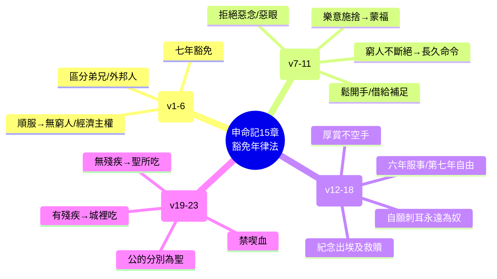

# 申命記 第15章

1. [[豁免年（七年豁免債務）|每逢七年末一年]]，你要[[豁免年（七年豁免債務）|施行豁免]]。
2. [[豁免年（七年豁免債務）|豁免的定例]]乃是這樣：凡債主要把所借給鄰舍的豁免了；[[不可向弟兄追討債務（豁免年規定）|不可向鄰舍和弟兄追討]]，因為耶和華的[[豁免年（七年豁免債務）|豁免年已經宣告了]]。
3. [[不可向弟兄追討債務（豁免年規定）|若借給外邦人，你可以向他追討]]；但借給你[[不可向弟兄追討債務（豁免年規定）|弟兄]]，無論是什麼，你要鬆手豁免了。
4. 你若留意聽從耶和華─你神的話，謹守遵行我今日所吩咐你這一切的命令，就必[[在你們中間沒有窮人（順服帶來福分）|在你們中間沒有窮人了]]（在耶和華─你神所賜你為業的地上，[[在你們中間沒有窮人（順服帶來福分）|耶和華必大大賜福與你]]。）
5. 併於上節。
6. 因為耶和華─你的神必照他所應許你的賜福與你。[[借給許多國民、不向他們借貸（經濟主權）|你必借給許多國民]]，卻[[借給許多國民、不向他們借貸（經濟主權）|不致向他們借貸]]；你必[[借給許多國民、不向他們借貸（經濟主權）|管轄許多國民]]，他們卻不能管轄你。
7. 在耶和華─你神所賜你的地上，無論哪一座城裡，你弟兄中若有一個窮人，你[[不可忍心、揝手不幫補窮乏弟兄|不可忍著心、揝著手不幫補]]你[[不可忍心、揝手不幫補窮乏弟兄|窮乏的弟兄]]。
8. [[不可忍心、揝手不幫補窮乏弟兄|總要向他鬆開手]]，照他所缺乏的借給他，補他的不足。
9. 你要謹慎，[[不可起惡念、惡眼看窮乏弟兄（第七年將近）|不可心裡起惡念]]，說：[[不可起惡念、惡眼看窮乏弟兄（第七年將近）|第七年的豁免年快到了]]，你便[[不可起惡念、惡眼看窮乏弟兄（第七年將近）|惡眼看你窮乏的弟兄]]，什麼都不給他，以致他因你求告耶和華，罪便歸於你了。
10. 你總要給他，[[給窮人時心裡不可愁煩（樂意施捨）|給他的時候心裡不可愁煩]]；因耶和華─你的神必在你這一切所行的，並你手裡所辦的事上，賜福與你。
11. 原來那[[地上的窮人永不斷絕（社會現實）|地上的窮人永不斷絕]]；所以我吩咐你說：[[地上的窮人永不斷絕（社會現實）|總要向你地上困苦窮乏的弟兄鬆開手]]。
12. 你弟兄中，若有一個[[希伯來奴僕第七年得自由（豁免年釋放奴僕）|希伯來男人或希伯來女人被賣給你]]，[[希伯來奴僕第七年得自由（豁免年釋放奴僕）|服事你六年，到第七年就要任他自由出去]]。
13. 你任他自由的時候，[[希伯來奴僕第七年得自由（豁免年釋放奴僕）|不可使他空手而去]]，
14. [[希伯來奴僕第七年得自由（豁免年釋放奴僕）|要從你羊群、禾場、酒醡之中多多地給他]]；耶和華─你的神怎樣賜福與你，你也要照樣給他。
15. 要記念你在埃及地作過奴僕，耶和華─你的神將你救贖；因此，我今日吩咐你這件事。
16. 他若對你說：[[奴僕不願意離開、刺耳歸主（自願永遠為奴）|我不願意離開你]]，是因他愛你和你的家，且因在你那裡很好，
17. 你就要[[奴僕不願意離開、刺耳歸主（自願永遠為奴）|拿錐子將他的耳朵在門上刺透]]，他便[[奴僕不願意離開、刺耳歸主（自願永遠為奴）|永為你的奴僕了]]。你待婢女也要這樣。
18. 你任他自由的時候，[[希伯來奴僕服事六年、工價多加一倍（公平待遇）|不可以為難事]]，因他[[希伯來奴僕服事六年、工價多加一倍（公平待遇）|服事你六年，較比雇工的工價多加一倍了]]。耶和華─你的神就必在你所做的一切事上賜福與你。
19. 你[[牛羊群中頭生的公的分別為聖歸耶和華|牛群羊群中頭生的，凡是公的]]，都要分別為聖，歸耶和華─你的神。[[牛羊群中頭生的公的分別為聖歸耶和華|牛群中頭生的，不可用他耕地]]；[[牛羊群中頭生的公的分別為聖歸耶和華|羊群中頭生的，不可剪毛]]。
20. 這頭生的，你和你的家屬，每年要在耶和華所選擇的地方，在耶和華─你神面前吃。
21. [[頭生的若有殘疾不可獻給耶和華（可在城裡吃）|這頭生的若有什麼殘疾]]，就如[[頭生的若有殘疾不可獻給耶和華（可在城裡吃）|瘸腿的、瞎眼的]]，無論有什麼惡殘疾，都不可獻給耶和華─你的神；
22. [[頭生的若有殘疾不可獻給耶和華（可在城裡吃）|可以在你城裡吃]]；潔淨人與不潔淨人都可以吃，就如吃羚羊與鹿一般。
23. 只是不可吃他的血；要倒在地上，如同倒水一樣。

---

## 本章知識節點

### 神學
- [[豁免年（七年豁免債務）]]
- [[在你們中間沒有窮人（順服帶來福分）]]
- [[地上的窮人永不斷絕（社會現實）]]

### 律法典範
- [[不可向弟兄追討債務（豁免年規定）]]
- [[借給許多國民、不向他們借貸（經濟主權）]]
- [[希伯來奴僕第七年得自由（豁免年釋放奴僕）]]
- [[奴僕不願意離開、刺耳歸主（自願永遠為奴）]]
- [[希伯來奴僕服事六年、工價多加一倍（公平待遇）]]

### 社會倫理
- [[不可忍心、揝手不幫補窮乏弟兄]]
- [[不可起惡念、惡眼看窮乏弟兄（第七年將近）]]
- [[給窮人時心裡不可愁煩（樂意施捨）]]

### 禮儀規定
- [[牛羊群中頭生的公的分別為聖歸耶和華]]
- [[頭生的若有殘疾不可獻給耶和華（可在城裡吃）]]

---

## 本章整理

### 豁免年與債務豁免（v1-6）
本段確立 **[[豁免年（七年豁免債務）]]** 的核心制度：每逢七年末一年，債主必須 [[不可向弟兄追討債務（豁免年規定）|鬆手豁免]] 向以色列弟兄所借的債，唯獨向外邦人仍可追討（v1-3）。這不僅是經濟重置，更是神學宣示——若百姓聽從耶和華的話，祂必賜福使 **[[在你們中間沒有窮人（順服帶來福分）]]** 成為可能（v4-5），並實現 **[[借給許多國民、不向他們借貸（經濟主權）]]** 的國度願景（v6）。經文將「豁免」一詞重複使用，強調這是耶和華主動宣告的恩典年份（v2），而非單純的人類慈善行為。

### 照顧窮乏弟兄的誡命（v7-11）
緊接著豁免年規定，摩西轉向具體的仁慈實踐。在應許之地任何城裡，面對窮乏弟兄，**[[不可忍心、揝手不幫補窮乏弟兄]]**，總要鬆開手借給他補足所缺（v7-8）。特別警告 **[[不可起惡念、惡眼看窮乏弟兄（第七年將近）]]**，利用豁免年臨近為由拒絕借貸，這會招致罪愆（v9）。施捨的態度至關重要：**[[給窮人時心裡不可愁煩（樂意施捨）]]**，因耶和華必在一切所行的事上賜福（v10）。經文誠實面對社會現實：**[[地上的窮人永不斷絕（社會現實）]]**，因此鬆開手的命令是長久有效的（v11）。

### 希伯來奴僕的釋放與待遇（v12-18）
豁免年原則延伸至人身自由領域。希伯來男僕女僕服事六年，第七年必 **[[希伯來奴僕第七年得自由（豁免年釋放奴僕）|任他自由出去]]**（v12）。釋放時 **[[希伯來奴僕服事六年、工價多加一倍（公平待遇）|不可使他空手而去]]**，要從羊群、禾場、酒醡厚賞（v13-14），根基在於記念出埃及的救贖經驗（v15）。若奴僕因愛主家而自願永留，則以 **[[奴僕不願意離開、刺耳歸主（自願永遠為奴）|錐子刺耳在門上]]** 為永遠為奴的儀式（v16-17）。釋放不被視為虧損，因其服事價值超過雇工雙倍，順服此命必蒙福（v18）。

### 頭生牲畜分別為聖（v19-23）
本章以獻祭律例收尾。牛羊群中 **[[牛羊群中頭生的公的分別為聖歸耶和華]]**，不可作工也不可剪毛，要全家在耶和華選擇的地方、在祂面前吃（v19-20）。**[[頭生的若有殘疾不可獻給耶和華（可在城裡吃）]]**，有殘疾者可在城裡由潔淨不潔淨人同吃，如同吃羚羊鹿一般，但嚴禁喫血，要倒在地上如水（v21-23）。這規定將頭生權的神聖性與祭物潔淨標準結合，並照顧祭司與百姓的食用需要。

### 跨章脈絡：豁免年、禧年與基督的釋放
申命記15章的豁免年（Shemitah）與利未記25章的禧年（Yovel）構成「釋放」神學的雙重見證：前者聚焦債務與奴僕的七年週期，後者擴展至土地歸還與五十年大釋放。兩者核心皆在於 **「耶和華的豁免年已經宣告了」**（v2）——釋放的主權屬於神，人只能順服回應。新約中耶穌在拿撒勒會堂引用以賽亞書61章宣告「釋放被擄的……宣告耶和華的恩年」（路4:18-19），將豁免年/禧年的終極應驗指向祂自己：祂是真正的豁免主，不僅鬆開債務之手，更以生命贖價鬆開罪債之手（西2:13-14）。希伯來奴僕「刺耳歸主」的自願永奴意象，預表信徒因愛甘心作基督的奴僕（羅1:1；腓1:1），在自由中選擇順服。本章「窮人永不斷絕」的現實張力，也呼應主耶穌「常有窮人和你們同在」（可14:7）的宣告，提醒教會在已然/未然之間持續活出鬆開手的國度倫理。

**參考資料**
https://biblehub.com/study/deuteronomy/15.htm
https://www.ccbiblestudy.org/Old%20Testament/05Deut/05CT15.htm
https://www.ccbiblestudy.org/Old%20Testament/05Deut/05GT15.htm
https://www.kingcomments.com/en/bible-studies/Deu/15
