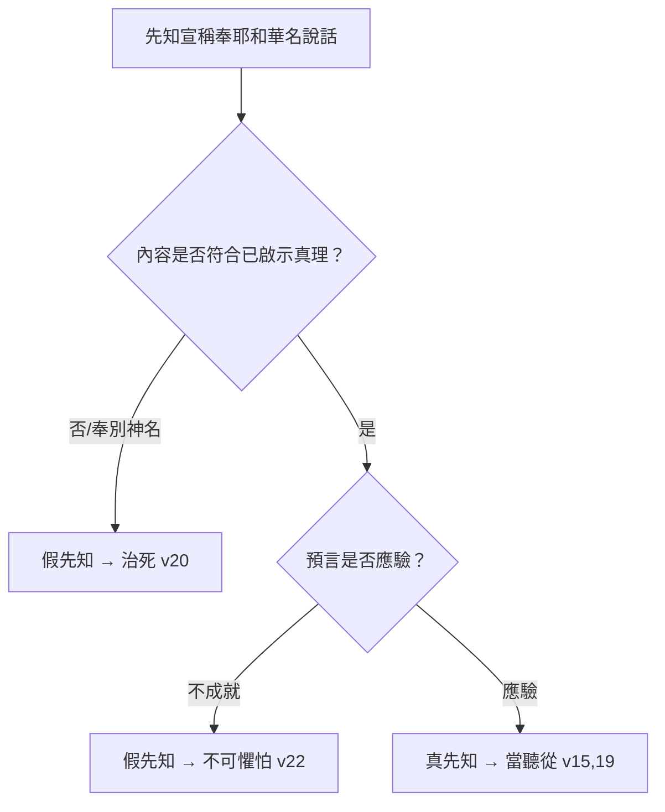

# 申命記 第18章

1. [[利未祭司無分無業、耶和華是他們的產業|祭司利未人和利未全支派]]必[[利未祭司無分無業、耶和華是他們的產業|在以色列中無分無業]]；他們所吃用的就是獻給耶和華的火祭和一切所捐的。
2. 他們在弟兄中必沒有產業；[[利未祭司無分無業、耶和華是他們的產業|耶和華是他們的產業]]，正如耶和華所應許他們的。
3. 祭司從百姓所當得的分乃是這樣：凡獻牛或羊為祭的，要把[[祭司應得的分（前腿、兩腮、胃）|前腿和兩腮並脾胃]][[祭司應得的分（前腿、兩腮、胃）|給祭司]]。
4. [[初熟之物歸祭司（五穀、新酒、油、羊毛）|初收的五穀、新酒和油]]，並[[初熟之物歸祭司（五穀、新酒、油、羊毛）|初剪的羊毛]]，[[初熟之物歸祭司（五穀、新酒、油、羊毛）|也要給他]]；
5. 因為耶和華─你的神從你各支派中將他揀選出來，[[耶和華揀選利未人永遠奉祂名侍立事奉|使他和他子孫永遠奉耶和華的名侍立事奉]]。
6. [[利未人可來到耶和華揀選的地方事奉（同工得同酬）|利未人無論寄居在以色列中的哪一座城]]，若從那裡出來，一心願意到耶和華所選擇的地方，
7. 就要[[利未人可來到耶和華揀選的地方事奉（同工得同酬）|奉耶和華─他神的名事奉]]，像他眾弟兄利未人侍立在耶和華面前事奉一樣。
8. [[利未人可來到耶和華揀選的地方事奉（同工得同酬）|除了他賣祖父產業所得的以外，還要得一分祭物與他們同吃]]。
9. 你到了耶和華─你神所賜之地，[[不可學習列國可憎惡的事（占卜、巫術等）|那些國民所行可憎惡的事，你不可學著行]]。
10. 你們中間[[不可學習列國可憎惡的事（占卜、巫術等）|不可有人使兒女經火]]，也不可有[[不可學習列國可憎惡的事（占卜、巫術等）|占卜的、觀兆的、用法術的、行邪術的]]、
11. [[不可學習列國可憎惡的事（占卜、巫術等）|用迷術的、交鬼的、行巫術的、過陰的]]。
12. [[不可學習列國可憎惡的事（占卜、巫術等）|凡行這些事的都為耶和華所憎惡]]；因那些國民行這可憎惡的事，所以耶和華─你的神將他們從你面前趕出。
13. [[不可學習列國可憎惡的事（占卜、巫術等）|你要在耶和華─你的神面前作完全人]]。
14. 因你所要趕出的那些國民都聽信觀兆的和占卜的，至於你，耶和華─你的神從來不許你這樣行。
15. [[耶和華要興起一位先知像摩西（彌賽亞預言）|耶和華─你的神要從你們弟兄中間給你興起一位先知像我]]，[[耶和華要興起一位先知像摩西（彌賽亞預言）|你們要聽從他]]。
16. 正如你在何烈山大會的日子求耶和華─你神一切的話，說：求你不再叫我聽見耶和華─我神的聲音，也不再叫我看見這大火，免得我死亡。
17. 耶和華就對我說：他們所說的是。
18. [[耶和華要興起一位先知像摩西（彌賽亞預言）|我必在他們弟兄中間給他們興起一位先知像你]]。[[耶和華要興起一位先知像摩西（彌賽亞預言）|我要將當說的話傳給他]]；他要將我一切所吩咐的都傳給他們。
19. [[耶和華要興起一位先知像摩西（彌賽亞預言）|誰不聽他奉我名所說的話，我必討誰的罪]]。
20. [[假先知的審判（擅自說話、奉別神名說話）|若有先知擅敢託我的名說我所未曾吩咐他說的話]]，[[假先知的審判（擅自說話、奉別神名說話）|或是奉別神的名說話]]，[[假先知的審判（擅自說話、奉別神名說話）|那先知就必治死]]。
21. 你心裡若說：耶和華所未曾吩咐的話，我們怎能知道呢？
22. [[假先知的審判（擅自說話、奉別神名說話）|先知託耶和華的名說話，所說的若不成就，也無效驗]]，[[假先知的審判（擅自說話、奉別神名說話）|這就是耶和華所未曾吩咐的，是那先知擅自說的]]，你不要怕他。

<!-- fhl-map-links:start -->
## 相關地圖

- [[appendix/fhl_maps/maps/025|〈申圖一〉應許之地全圖]]
- [[appendix/fhl_maps/maps/038|〈書圖十一〉利未人的城和十二個支派的地業]]
<!-- fhl-map-links:end -->

---

## 本章知識節點

### 神學
- [[利未祭司無分無業、耶和華是他們的產業]]
- [[耶和華揀選利未人永遠奉祂名侍立事奉]]
- [[耶和華要興起一位先知像摩西（彌賽亞預言）]]
- [[不可學習列國可憎惡的事（占卜、巫術等）]]

### 制度
- [[祭司應得的分（前腿、兩腮、胃）]]
- [[初熟之物歸祭司（五穀、新酒、油、羊毛）]]
- [[利未人可來到耶和華揀選的地方事奉（同工得同酬）]]
- [[假先知的審判（擅自說話、奉別神名說話）]]

### 基督論
- [[耶和華要興起一位先知像摩西（彌賽亞預言）]]

### 倫理
- [[不可學習列國可憎惡的事（占卜、巫術等）]]
- [[假先知的審判（擅自說話、奉別神名說話）]]

---

## 本章整理

### 祭司利未人的產業與供養（v1-8）
本段確立[[利未祭司無分無業、耶和華是他們的產業|利未支派無地業]]的神學基礎：耶和華自己就是他們的產業（v2）。這不僅是經濟安排，更是關係性的宣告——祭司的生存完全倚靠神。經文隨即細列[[祭司應得的分（前腿、兩腮、胃）|具體供養條目]]：獻祭時的前腿、兩腮、胃（v3），以及[[初熟之物歸祭司（五穀、新酒、油、羊毛）|初熟之物]]（v4），這些「火祭」與「初熟」代表百姓將最好的先歸給神，神再轉賜給侍立事奉者。v5 強調這是基於[[耶和華揀選利未人永遠奉祂名侍立事奉|神的揀選]]，而非人謀人算。v6-8 進一步規定[[利未人可來到耶和華揀選的地方事奉（同工得同酬）|利未人若遷徙至中央聖所]]，享有同工同酬的權利，除非他有祖產收入（v8），顯見神關顧事奉者的基本生計，也保障敬拜中心的人力需求。

### 禁絕列國可憎惡的占卜巫術（v9-14）
進入迦南前，神嚴禁以色列學習列國的「可憎惡之事」（v9）。經文列出九項禁令（v10-11），涵蓋[[不可學習列國可憎惡的事（占卜、巫術等）|兒女經火、占卜、觀兆、法術、邪術、迷術、交鬼、巫術、過陰]]，這些行為試圖操控屬靈領域、繞過神的啟示來掌握未來或權勢。v12 指出這些正是神趕出迦南人的原因；v13-14 以「在耶和華面前作完全人」為正面呼召，與周圍民族「聽信觀兆占卜」形成鮮明對比。這段經文劃清了「尋求神旨意」與「操控超自然」的界線：前者建立在順服啟示上，後者屬於屬靈奸淫。

### 像摩西的先知應許與假先知審判（v15-22）
神應許[[耶和華要興起一位先知像摩西（彌賽亞預言）|興起一位先知像摩西]]（v15,18），這是舊約最核心的彌賽亞預言之一。背景是何烈山大會百姓懼怕直接聽神聲音（v16），神肯定他們的請求（v17），並設立中保機制：先知口傳神語（v18），百姓聽從即聽從神（v19），不聽者神親自追討。為防濫用，經文設立雙重鑑別標準（v20-22）：
1. **內容測試**：擅自說神未吩咐的話、或奉別神名說話 → [[假先知的審判（擅自說話、奉別神名說話）|必被治死]]（v20）。
2. **應驗測試**：託耶和華名說話卻不成就、無效驗 → 乃擅自說的，不可懼怕（v22）。
這雙重保障既維護神話語的純淨，也保護百姓免受欺騙。

### 跨章脈絡：從摩西到基督的中保職分
本章「先知像摩西」的應許在新約得到終極成就：彼得在徒3:22-23 引用 v15,19 指向基督；希伯來書3:1-6 對比摩西作僕人、基督作兒子掌管神的家。申18 的三重職分輪廓至此浮現：祭司（v1-8）代表百姓親近神、先知（v15-22）代表神對百姓說話、君王（申17:14-20）代表神治理百姓，三者在基督裡合一。舊約祭司制度的「無分無業」預表基督捨己成全；假先知審判的嚴厲預警教會須以聖經為唯一標準試驗諸靈（約壹4:1）。

**參考資料**
https://biblehub.com/study/deuteronomy/18.htm
https://www.ccbiblestudy.org/Old%20Testament/05Deut/05CT18.htm
https://www.ccbiblestudy.org/Old%20Testament/05Deut/05GT18.htm
https://www.kingcomments.com/en/bible-studies/Deu/18
