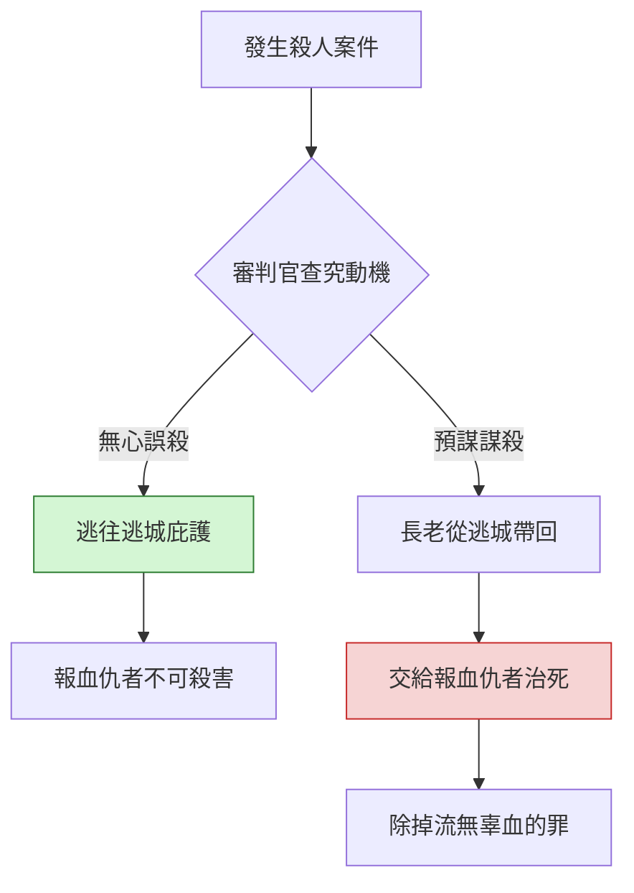

# 申命記 第19章

1. 耶和華─你神將列國之民剪除的時候，耶和華─你神也將他們的地賜給你，你接著住他們的城邑並他們的房屋，
2. 就要在耶和華─你神所賜你為業的地上分定三座城。
3. 要將耶和華─你神使你承受為業的地分為三段；又要預備道路，使誤殺人的，都可以逃到那裡去。
4. 誤殺人的逃到那裡可以存活，定例乃是這樣：凡[[誤殺與謀殺的區別（無心殺人 vs 恨人謀殺）|素無仇恨，無心殺了人的]]，
5. 就如人與鄰舍同入樹林砍伐樹木，手拿斧子一砍，本想砍下樹木，不料，[[誤殺與謀殺的區別（無心殺人 vs 恨人謀殺）|斧頭脫了把，飛落在鄰舍身上]]，以致於死，這人逃到那些城的一座城，就可以存活，
6. 免得報血仇的，心中火熱追趕他，因路遠就追上，將他殺死；其實他不該死，因為他與被殺的素無仇恨。
7. 所以我吩咐你說，要分定三座城。
8. 耶和華─你神若照他向你列祖所起的誓擴張你的境界，將所應許賜你列祖的地全然給你，
9. 你若謹守遵行我今日所吩咐的這一切誡命，愛耶和華─你的神，常常遵行他的道，就要在這三座城之外，[[若耶和華擴張境界、再添三座逃城|再添三座城]]，
10. 免得無辜之人的血流在耶和華─你神所賜你為業的地上，流血的罪就歸於你。
11. 若有人恨他的鄰舍，埋伏著起來擊殺他，以致於死，便逃到這些城的一座城，
12. [[謀殺者不可在逃城存活（須交給報血仇者治死）|本城的長老就要打發人去，從那裡帶出他來]]，[[謀殺者不可在逃城存活（須交給報血仇者治死）|交在報血仇的手中，將他治死]]。
13. [[謀殺者不可在逃城存活（須交給報血仇者治死）|你眼不可顧惜他，卻要從以色列中除掉流無辜血的罪]]，使你可以得福。
14. 在耶和華─你神所賜你承受為業之地，[[不可挪移鄰舍的地界（產業界石不可動）|不可挪移你鄰舍的地界]]，[[不可挪移鄰舍的地界（產業界石不可動）|那是先人所定的]]。
15. 人無論犯什麼罪，作什麼惡，[[見證人須兩三個口（不可憑一個人定案）|不可憑一個人的口作見證]]，[[見證人須兩三個口（不可憑一個人定案）|總要憑兩三個人的口作見證才可定案]]。
16. [[惡見證人以其謀害弟兄的方式被待（以命償命、以眼還眼）|若有凶惡的見證人起來，見證某人作惡]]，
17. 這兩個爭訟的人就要站在耶和華面前，和當時的祭司，並審判官面前，
18. 審判官要細細地查究，若見證人果然是作假見證的，以假見證陷害弟兄，
19. [[惡見證人以其謀害弟兄的方式被待（以命償命、以眼還眼）|你們就要待他如同他想要待的弟兄]]。這樣，就把那惡從你們中間除掉。
20. 別人聽見都要害怕，就不敢在你們中間再行這樣的惡了。
21. 你眼不可顧惜，要[[惡見證人以其謀害弟兄的方式被待（以命償命、以眼還眼）|以命償命，以眼還眼，以牙還牙，以手還手，以腳還腳]]。

---

## 本章知識節點

### 律法典範
- [[誤殺與謀殺的區別（無心殺人 vs 恨人謀殺）]]
- [[謀殺者不可在逃城存活（須交給報血仇者治死）]]
- [[若耶和華擴張境界、再添三座逃城]]

### 社會倫理
- [[不可挪移鄰舍的地界（產業界石不可動）]]
- [[見證人須兩三個口（不可憑一個人定案）]]
- [[惡見證人以其謀害弟兄的方式被待（以命償命、以眼還眼）]]

---

## 本章整理

### 逃城的設立與誤殺人的庇護（v1-7）
本章開啟逃城制度，耶和華吩咐以色列人在承受為業的地上分定三座城，並預備道路，使[[誤殺與謀殺的區別（無心殺人 vs 恨人謀殺）|誤殺人者]]可逃往那裡存活。經文以斧頭脫把擊中鄰舍為例，具體界定「誤殺」：行兇者素無仇恨、無心殺人，非出於惡意。此制度保護無辜性命，免得報血仇者心中火熱追趕，因路遠追上將他殺死，導致無辜血流在境內。逃城的設立彰顯神對生命的憐憫，也為公義審判預留空間。

### 擴張境界時增設逃城（v8-10）
神應許若照向列祖起誓擴張境界，將所應許之地全然賜下，百姓若謹守誡命、愛神遵行其道，就要在原三座城之外[[若耶和華擴張境界、再添三座逃城|再添三座城]]。這顯示逃城制度隨著應許地的拓展而擴大，目的是免得無辜之人的血流在耶和華賜為業的地上，流血的罪就歸於百姓。地理上的擴張對應著司法保護的延伸，強調「無辜血不流於地」是立國根基。

### 謀殺者不可得庇護（v11-13）
與誤殺形成強烈對比，若有人恨鄰舍、埋伏謀殺，便逃到逃城，本城長老須打發人帶出他來，交在報血仇者手中治死。[[謀殺者不可在逃城存活（須交給報血仇者治死）|謀殺者不可在逃城存活]]，眼不可顧惜，務要從以色列中除掉流無辜血的罪，使以色列可以得福。這段經文劃定逃城庇護的界限：逃城非作惡者的避難所，而是保護無辜者的機制，公義必須執行到底。

### 產業界石與見證制度（v14-15）
經文轉向產業與司法根基：不可挪移鄰舍的地界，那是先人所定的（[[不可挪移鄰舍的地界（產業界石不可動）|產業界石不可動]]），維護產業公義；定案不可憑一個人的口，總要憑[[見證人須兩三個口（不可憑一個人定案）|兩三個見證人]]才可定案。這兩項規定分別保障產業權與司法程序公正，是社會穩定的基石。

### 惡見證人的懲治與以眼還眼原則（v16-21）
若有凶惡見證人起來作假見證，審判官要細細查究。若證實是假見證，就要[[惡見證人以其謀害弟兄的方式被待（以命償命、以眼還眼）|以其謀害弟兄的方式待他]]：以命償命、以眼還眼、以牙還牙、以手還手、以腳還腳。這「以眼還眼」原則（Lex Talionis）在此非鼓勵私人報復，乃是法庭判決的上限與公義標準——懲罰與罪行相稱，且必須經由審判官查實執行。如此把惡從中間除掉，其餘人聽見都要害怕，不敢再行這樣的惡。

| 情況 | 主觀意圖 | 典型例子 | 逃城庇護 | 處理方式 |
| --- | --- | --- | --- | --- |
| 誤殺 | 無仇恨、無心 | 砍樹斧頭脫把擊中人 | **可** 逃往逃城存活 | 留在逃城至大祭司死 |
| 謀殺 | 有仇恨、預謀 | 埋伏起來擊殺 | **不可** 留在逃城 | 長老交給報血仇者治死 |

### 跨章脈絡：逃城制度的神學意涵
申19章的逃城制度在約書亞記20章落實執行，新約希伯來書6:18將其預表為「逃避罪刑、抓住指望」的信徒。逃城預表基督是終極的避難所：誤殺者（罪人）若奔入基督（逃城），便得庇護免受審判（報血仇者）；但頑梗不悔的謀殺者（拒絕基督者）無分於此庇護。經文中「除掉流無辜血的罪」與「以眼還眼」的公義原則，最終在十字架上由基督替罪人擔當，成就憐憫與公義的親嘴。

**參考資料**
https://biblehub.com/study/deuteronomy/19.htm
https://www.ccbiblestudy.org/Old%20Testament/05Deut/05CT19.htm
https://www.ccbiblestudy.org/Old%20Testament/05Deut/05GT19.htm
https://www.kingcomments.com/en/bible-studies/Deu/19
