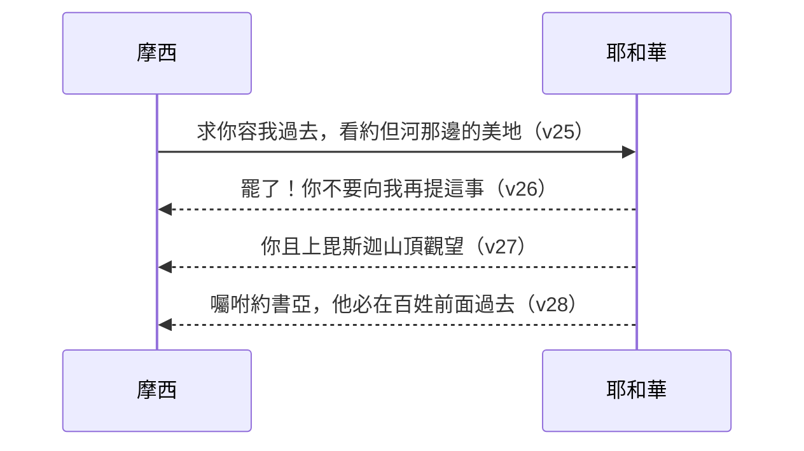

# 申命記 第3章

1. 以後，我們轉回，向[[巴珊]]去。[[巴珊王噩]]和他的眾民都出來，在以得來與我們交戰。
2. 耶和華對我說：不要怕他！因我已將他和他的眾民，並他的地，都交在你手中；你要待他像從前待住希實本的[[亞摩利王西宏]]一樣。
3. 於是耶和華─我們的神也將[[巴珊王噩]]和他的眾民都交在我們手中；我們殺了他們，沒有留下一個。
4. 那時，我們奪了他所有的城，共有六十座，沒有一座城不被我們所奪。這為[[亞珥歌伯（Argob）|亞珥歌伯]]的全境，就是[[巴珊]]地[[巴珊王噩|噩]]王的國。
5. 這些城都有堅固的高牆，有門有閂。此外還有許多無城牆的鄉村。
6. 我們將這些都毀滅了，像從前待希實本王[[亞摩利王西宏|西宏]]一樣，把有人煙的各城，連女人帶孩子，盡都毀滅；
7. 惟有一切牲畜和城中的財物都取為自己的掠物。
8. 那時，我們從約但河東兩個亞摩利王的手將[[亞嫩河|亞嫩谷]]直到[[黑門山（Hermon）|黑門山]]之地奪過來
9. （這[[黑門山（Hermon）|黑門山]]，西頓人稱為西連，亞摩利人稱為示尼珥），
10. 就是奪了平原的各城、[[基列地（Gil'ad）|基列]]全地、[[巴珊]]全地，直到[[撒迦（Salecah）|撒迦]]和以得來，都是[[巴珊王噩]]國內的城邑。
11. （[[利乏音人]]所剩下的只有[[巴珊王噩]]。他的床是鐵的，長九肘，寬四肘，都是以人肘為度。現今豈不是在[[拉巴（Rabbah）|亞捫人的拉巴]]嗎？）
12. 那時，我們得了這地。從[[亞嫩河|亞嫩谷]]邊的[[亞羅珥（Aroer）|亞羅珥]]起，我將[[基列地（Gil'ad）|基列]]山地的一半，並其中的城邑，都給了[[流便支派|流便人]]和[[迦得支派|迦得人]]。
13. 其餘的[[基列地（Gil'ad）|基列地]]和[[巴珊]]全地，就是[[巴珊王噩|噩]]王的國，我給了[[瑪拿西支派|瑪拿西半支派]]。[[亞珥歌伯（Argob）|亞珥歌伯]]全地乃是巴珊全地；這叫做[[亞珥歌伯（Argob）|利乏音人之地]]。
14. 瑪拿西的子孫[[睚珥（瑪拿西的子孫）|睚珥]]佔了[[亞珥歌伯（Argob）|亞珥歌伯]]全境，直到[[基述人（Geshurites）|基述人]]和[[瑪迦人（Maacathites）|瑪迦人]]的交界，就按自己的名稱這[[巴珊]]地為[[亞珥歌伯（Argob）|哈倭特睚珥]]，直到今日。
15. 我又將[[基列地（Gil'ad）|基列]]給了[[瑪吉（Machir）|瑪吉]]。
16. 從[[基列地（Gil'ad）|基列]]到[[亞嫩河|亞嫩谷]]，以谷中為界，直到[[亞捫人]]交界的[[雅博|雅博河]]，我給了[[流便支派|流便人]]和[[迦得支派|迦得人]]，
17. 又將[[亞拉巴（Aravah）|亞拉巴]]和靠近約但河之地，從基尼烈直到[[鹽海|亞拉巴海]]，就是[[鹽海]]，並[[毘斯迦山]]根東邊之地，都給了他們。
18. 那時，我吩咐你們說：耶和華─你們的神已將這地賜給你們為業；你們所有的勇士都要帶著兵器，在你們的弟兄以色列人前面過去。
19. 但你們的妻子、孩子、牲畜（我知道你們有許多的牲畜）可以住在我所賜給你們的各城裡。
20. 等到你們弟兄在約但河那邊，也得耶和華─你們神所賜給他們的地，又使他們得享平安，與你們一樣，你們才可以回到我所賜給你們為業之地。
21. 那時我吩咐[[約書亞]]說：你親眼看見了耶和華─你神向這二王所行的；耶和華也必向你所要去的各國照樣行。
22. 你不要怕他們，因那為你爭戰的是耶和華─你的神。
23. 那時，我懇求耶和華說：
24. [[主耶和華（Adonai YHWH）|主耶和華]]啊，你已將你的大力大能顯給僕人看。在天上，在地下，有什麼神能像你行事、像你有大能的作為呢？
25. 求你容我過去，看約但河那邊的美地，就是那佳美的山地和利巴嫩。
26. 但耶和華因你們的緣故向我發怒，不應允我，對我說：罷了！你不要向我再提這事。
27. 你且上[[毘斯迦山]]頂去，向東、西、南、北舉目觀望，因為你必不能過這約但河。
28. 你卻要囑咐[[約書亞]]，勉勵他，使他膽壯；因為他必在這百姓前面過去，使他們承受你所要觀看之地。
29. 於是我們住在[[伯毘珥（Beth-peor）|伯毘珥]]對面的谷中。

---

## 本章知識節點

### 人物
- [[摩西]]
- [[巴珊王噩]]
- [[亞摩利王西宏]]
- [[亞捫人]]
- [[利乏音人]]
- [[約書亞]]
- [[約書亞被立為繼任者]]
- [[流便支派]]
- [[迦得支派]]
- [[瑪拿西支派]]
- [[睚珥（瑪拿西的子孫）]]
- [[瑪吉（Machir）]]
- [[基述人（Geshurites）]]
- [[瑪迦人（Maacathites）]]

### 地點
- [[巴珊]]
- [[基列地（Gil'ad）]]
- [[亞嫩河]]
- [[亞羅珥（Aroer）]]
- [[雅博]]
- [[鹽海]]
- [[亞拉巴（Aravah）]]
- [[毘斯迦山]]
- [[黑門山（Hermon）]]
- [[亞珥歌伯（Argob）]]
- [[撒迦（Salecah）]]
- [[拉巴（Rabbah）]]
- [[伯毘珥（Beth-peor）]]

### 事件
- [[以色列戰勝巴珊王噩]]
- [[流便迦得瑪拿西半支派得地]]

### 互文
- [[以色列戰勝巴珊王噩互文（申3：1-11；詩135：10-12；136：17-22）]]

### 主題
- [[聖戰毀滅原則]]

### 神學
- [[耶和華的爭戰]]

### 解經爭議
- [[摩西是否進過迦南地]]

### 原文
- [[主耶和華（Adonai YHWH）]]

---

## 本章整理

### 殲滅巴珊王噩，盡佔六十城（v1-7）

以色列轉回向[[巴珊]]去，[[巴珊王噩]]率領眾民出來在以得來與以色列交戰（v1）。耶和華對摩西說：「不要怕他！因我已將他和他的眾民，並他的地，都交在你手中；你要待他像從前待住希實本的[[亞摩利王西宏]]一樣」（v2）。CT（黃迦勒）指出這句應許背後的層遞意義：「神第一次引動黃蜂去打敗亞摩利王西宏的軍隊，人可以說是幸運，神再一次用黃蜂去瓦解巴珊王噩的戰鬥力（參書二十四12），就沒有人可以說那是幸運……只發生過一次的事件，人都可以看它為偶然的，但事情接連的發生，就沒有人可以說它是偶然的。」重複的得勝不是巧合，而是神刻意要百姓建立「神就是他們得勝」的確據。

KC 則從敵王的性格切入，將西宏與噩並列對照：「噩沒有從西宏的敗亡得到警惕，仗着自己的力量狂妄地出來迎戰以色列……在西宏身上，我們看見一個驕傲、心地剛硬的人，強調的是人的靈與才智——他看自己的產業為己有，神被排除在他的思想之外。」「噩則更多在於魂、在於慾望的層面。他有一張大床——這正是噩享受所擁有之物的方式：在懶惰與放鬆中享受。」這一組對照把兩場戰役的屬靈意義區分開來：西宏代表理性的自恃，噩代表感官的耽溺，而兩者都在神面前同樣站立不住。

以色列奪了噩所有的城，共六十座，「沒有一座城不被我們所奪」（v4），連同許多無城牆的鄉村（v5）。以色列將這些城「都毀滅了，像從前待希實本王西宏一樣，把有人煙的各城，連女人帶孩子，盡都毀滅」（v6），唯獨牲畜和財物取為掠物（v7），這是[[聖戰毀滅原則]]的第二次具體執行。BH（BibleHub Study）將此舉放在「herem」的框架下理解：「這反映古代近東『herem』的習俗——把仇敵完全獻上毀滅，這常是神的吩咐，為要防止異教習俗滲透影響以色列（申7:2）。」BH 又補充一層屬靈引申：「攻破的『有門有閂』的城牆，在聖經象徵中，城門常代表權柄與能力（太16:18『陰間的權柄』）；以色列攻破這些城門，可視為預表基督終極勝過黑暗權勢的圖畫。」CT 的〔話中之光〕則從百姓一方著眼：「要完全除滅亞摩利人，在人的感覺上真的很難下手，但他們還是把那地的居民『盡都毀滅』，因為他們領會，不能給罪和撒但留下地步。」

### 約但河東疆界與利乏音人餘裔（v8-11）

這場戰役的果效被摩西總結為地理疆界：「那時，我們從約但河東兩個亞摩利王的手將亞嫩谷直到[[黑門山]]之地奪過來」（v8）。經文特別插入一句地名對照：「這黑門山，西頓人稱為西連，亞摩利人稱為示尼珥」（v9）。GT（拾穗）引《舊約聖經問題總解》李道生詳述此山的背景：「黑門山——高峰之意，其峰高聳利巴嫩之南，高出海面九千多尺……以色列人未得迦南以先，黑門山為敬拜巴力之聖山，至今最高峰頂，尚有巴力廟之基址遺留……主耶穌基督曾在這山頂上變了形像，臉面明亮如日頭，衣裳潔白如光（太十七1－8）。所以這山雖曾是拜偶像的所在，後來卻變成了信徒與主相聚的地方。」精讀本另指出黑門山「今日阿拉伯人稱此山為『Jebel el-Thalj』（雪山）」，是這座山三個名字之外的第四種稱呼（連同申四48的西雲）。

以色列奪了平原的各城、[[基列地（Gil'ad）|基列]]全地、巴珊全地，直到撒迦和以得來（v10）。經文在此插入一段括號式的補記：「利乏音人所剩下的只有巴珊王噩。他的床是鐵的，長九肘，寬四肘，都是以人肘為度。現今豈不是在亞捫人的[[拉巴（Rabbah）|拉巴]]嗎？」（v11）。啟導本解此句：「這種傳奇性的巨人原只剩下巴珊王噩，可是連他也死了。『床』可指『棺槨』，乃一個人最後安息的地方。」BH 則把重點放在尺寸的見證意義上：「一肘約合18吋，故此床約長13.5呎、寬6呎，這誇張的尺寸見證噩的體格與力量之非凡，鐵在當時是貴重耐用的材料，暗示噩的財富與地位，也讓巨人一族的存在成為可稽考的歷史事實。」CT 的〔話中之光〕從這段記述看見神學要點：「亞摩利人的文化與人的體格都大大超越神的百姓，再占上地利優越的條件，一般說來，以色列人是不能與他們抗拒的……但事實不是這樣，失敗的不是以色列人，而是處處佔優勢的亞摩利人。」[[利乏音人]]作為巨人族的代表，本章與申二10-11、20-21的以米人、散送冥記載相呼應，共同見證「神使巨人也不能站立」的主題。

### 二支派半分地：流便、迦得、瑪拿西（v12-17）

攻取約但河東之地後，摩西按支派分地：「從亞嫩谷邊的[[亞羅珥（Aroer）|亞羅珥]]起，我將基列山地的一半，並其中的城邑，都給了[[流便支派|流便人]]和[[迦得支派|迦得人]]」（v12）；「其餘的基列地和巴珊全地，就是噩王的國，我給了[[瑪拿西支派|瑪拿西半支派]]。[[亞珥歌伯]]全地乃是巴珊全地；這叫做利乏音人之地」（v13）。CT 解釋「亞珥歌伯」一詞的雙重用法：「亞珥歌伯本是巴珊境內東北部多石的一區，此句代表全巴珊。」

經文接著點名兩位承受人：「瑪拿西的子孫[[睚珥（瑪拿西的子孫）|睚珥]]佔了亞珥歌伯全境，直到[[基述人]]和[[瑪迦人]]的交界，就按自己的名稱這巴珊地為哈倭特睚珥，直到今日」（v14）；「我又將基列給了[[瑪吉]]」（v15）。精讀本對睚珥的家系提出一個值得並陳的觀察：「瑪拿西的子孫睚珥，字面意義是『瑪拿西的後裔睚珥』。若從父系就是猶大的五代子孫，在這裡則從了母系（代上二3-24）。此處之所以特意提到其名，似乎是因為他是一個軍事領袖或英勇的壯士，在征服亞珥歌伯時立下了赫赫戰功。」這提醒讀者：「瑪拿西的子孫」在此不是單純血統宣告，而是母系歸屬與軍功並存的身分認定。GT 另補充瑪吉的家系：「瑪吉是瑪拿西唯一的兒子，瑪吉又僅有一個兒子基列，本句指的是瑪吉族和基列族。」[[基述人]]與[[瑪迦人]]則是巴珊北部、加利利海東岸的兩個小邦，啟導本指出「到大衛王時代仍為一個獨立國（撒下三3；十6）」——這兩個民族並未被以色列征服吞併，成為[[流便迦得瑪拿西半支派得地]]疆界之外，日後仍與以色列並存的鄰邦。

| 承受支派／個人 | 所得範圍 | 依據 |
|---|---|---|
| [[流便支派]]、[[迦得支派]] | 亞羅珥起，基列山地之半，及其城邑 | v12,16 |
| [[瑪拿西支派]]（半支派） | 其餘基列地＋巴珊全地（亞珥歌伯） | v13 |
| [[睚珥（瑪拿西的子孫）]] | 亞珥歌伯全境（改名哈倭特睚珥） | v14 |
| [[瑪吉]] | 基列 | v15 |

地界進一步細述：「從基列到亞嫩谷，以谷中為界，直到亞捫人交界的[[雅博]]河，我給了流便人和迦得人」（v16）；「又將[[亞拉巴（Aravah）|亞拉巴]]和靠近約但河之地，從基尼烈直到亞拉巴海，就是[[鹽海]]，並[[毘斯迦山]]根東邊之地，都給了他們」（v17）。啟導本將這兩節與12節連讀：「12～17節合起來是流便迦得瑪拿西半支派得地的進一步說明」，構成南界亞嫩谷、東北界雅博河、西界約但河與死海的完整輪廓。

### 動員令與交棒約書亞（v18-22）

地業分定之後，摩西向二支派半重申條件：「耶和華你們的神已將這地賜給你們為業；你們所有的勇士都要帶著兵器，在你們的弟兄以色列人前面過去」（v18），妻子孩子牲畜可暫留原地（v19），「等到你們弟兄……也得耶和華你們神所賜給他們的地，又使他們得享平安……你們才可以回到我所賜給你們為業之地」（v20）。精讀本指出這安排的雙重目的：「①為了以色列共同體的團結；②並且為了其它支派的士氣，先得產業的支派參與迦南征服戰的問題是重大問題。」得地在先不代表責任了結，[[流便迦得瑪拿西半支派得地]]是有條件的恩典，而非無條件的私產。

摩西隨即轉向交棒：「那時我吩咐[[約書亞]]說：你親眼看見了耶和華你神向這二王所行的；耶和華也必向你所要去的各國照樣行」（v21）；「你不要怕他們，因那為你爭戰的是[[耶和華的爭戰|耶和華你的神]]」（v22）。KC 將這番勉勵放進整卷書的中保圖像裡：「摩西這位年長的信徒，鼓勵約書亞這位年輕的信徒。他讓約書亞看見神所做過的事、神所應許的事。親眼見證使神向祂百姓所行的拯救之事，對每一世代都成為真實……在摩西身上，我們也看見主耶穌的圖畫——那位為我們死而復活的一位；約書亞則是主耶穌的圖畫，那從死裡復活、得著榮耀的主，帶領祂的百姓進入那地，使他們分享那地的福分。」這是本章第三次提到摩西向約書亞交棒（另見申一38、三21-22），構成[[約書亞被立為繼任者]]累積脈絡中的關鍵一環。

> [!note] 「親眼看見」的重複用法
> CT 指出：「摩西用打敗西宏和噩的經歷，來勉勵約書亞。可見，要鼓勵下一代信靠神，首先，是自己先信靠神，又一再經歷神的帶領。」BH 補充「你親眼看見」在申命記中反覆出現（申4:3,9；7:19；9:17；10:21；11:12；34:4），是摩西一貫的勸勉手法——見證的重量勝過單純的教訓。

### 摩西懇求進迦南被拒（v23-29）

摩西回顧自己在此時的祈求：「那時，我懇求耶和華說：主耶和華啊，你已將你的大力大能顯給僕人看。在天上，在地下，有什麼神能像你行事、像你有大能的作為呢？求你容我過去，看約但河那邊的美地，就是那佳美的山地和利巴嫩」（v23-25）。這是「[[主耶和華（Adonai YHWH）|主耶和華]]」一詞在本章的用法。串珠聖經註釋特別標出這個稱呼的稀有性：「『主耶和華』一詞在申命記中只出現兩次（另一處在9:26），都是摩西祈禱時對神的稱呼，與亞伯拉罕對神的稱呼相同（見創15:2, 8），顯示他們與神關係密切。」

神的回應斬釘截鐵：「但耶和華因你們的緣故向我發怒，不應允我，對我說：罷了！你不要向我再提這事」（v26）；「你且上[[毘斯迦山]]頂去，向東、西、南、北舉目觀望，因為你必不能過這約但河」（v27）；「你卻要囑咐約書亞，勉勵他，使他膽壯；因為他必在這百姓前面過去，使他們承受你所要觀看之地」（v28）。這段禱告與拒絕，是[[摩西是否進過迦南地]]這一解經爭議的正文所在。KC 把摩西此刻的處境與保羅相比：「保羅也曾三次求主叫那攪擾他的撒但差役離開他……他所得的答案與摩西所受的相似：『我的恩典夠你用的。』」精讀本則從神學角度提出三層意義並陳：「①得以進入迦南地所憑藉的並不是人的功勞；②摩西只有一次因輕舉妄動的行為未能完全彰顯神的聖潔，神使摩西不得進入迦南，生動地教訓新世代違背神之聖潔的罪何等巨大；③通過象徵為『律法』的摩西被排除在外的事實，明確表明了律法在藉著基督而來的福音面前的局限性。」這三點分屬不同進路——懲戒的公義性、聖潔的嚴肅性、律法與恩典的預表對照——並非彼此排斥，而是同一件事在不同焦距下的解讀。

最終，「於是我們住在[[伯毘珥]]對面的谷中」（v29）作結。啟導本指出這地點的雙重意義：「伯毘珥的意思是『毘珥的居所』，可能就是以色列人曾拜過巴力毘珥的地方（參民二十三28；二十五3）……現在，伯毘珥『對面的谷中』成了以民走向光明新生活的起點。」這谷中不僅是本章的落幕地，也是申命記四46摩西發表最後囑咐的地點，以及三十四6摩西安葬之處——一個曾經跌倒之地，如今成了新世代重新出發的起點。

### 跨章脈絡與神學整理

申命記第三章是「回顧曠野飄流史」系列的第三段（承接申一、二），完成了約但河東全境的征服敘事：以得來一役是[[以色列戰勝巴珊王噩]]的正文所在，與申二24-37擊敗西宏並列構成[[以色列戰勝巴珊王噩互文（申3：1-11；詩135：10-12；136：17-22）|雙王互文]]，詩篇一三五10-12、一三六17-22將兩役並列詠唱，是舊約敬拜傳統反覆稱頌的歷史錨點。本章也是三個「那時」段落的合體：12-17節分地、18-22節動員與交棒、23-29節摩西的祈求與被拒——三段共同指向一個焦點：約但河東的產業雖已到手，但真正的應許之地與真正的交棒，都還在河的那一邊等候。

KC 為本章下了一句總結，適合作為申二、三兩章的合讀提要：「讀完申命記二、三章，一句簡潔的總結是：神過去的作為，是對未來的鼓勵。」睚珥、瑪吉承受土地並以自己的名字為地命名（「哈倭特睚珥……直到今日」），與摩西被神命名的「罷了，不要再提」形成對照——前者是地上功業被記念，後者是屬天心願被擱置；但兩者都服在同一位神的主權之下。約書亞在本章第三次被交棒勉勵，預備他要在下一步真正帶領百姓過河，而摩西的角色轉向單單觀看與祝福，這正是全書「一代將盡、一代將起」的樞紐時刻。

> [!question] 留待後續探討
> 1. 申三14「直到今日」與申二12「就如以色列所行」同屬編輯層用語的疑問句：兩處是否出於同一位後人補述之手，抑或摩西本人已預見「哈倭特睚珥」這名稱將延續？
> 2. 摩西「三次」向約書亞交棒（申一38；三21-22；三28）與神「三次」拒絕摩西過河的祈求，兩條三重複沓的敘事線在文學結構上是否彼此呼應？

**參考資料**
https://www.ccbiblestudy.org/Old%20Testament/05Deut/05CT03.htm
https://www.ccbiblestudy.org/Old%20Testament/05Deut/05GT03.htm
https://www.kingcomments.com/en/bible-studies/Deu/3
https://biblehub.com/study/deuteronomy/3.htm
