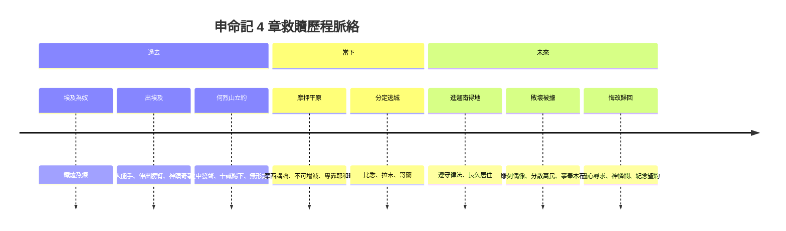
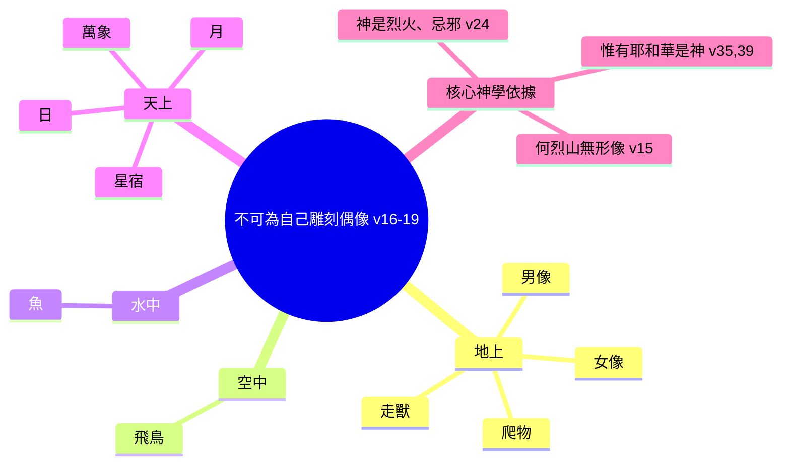

# 申命記 第4章

1. 以色列人哪，現在我所教訓你們的律例典章，你們要聽從遵行，好叫你們存活，得以進入耶和華─你們列祖之神所賜給你們的地，承受為業。
2. 所吩咐你們的話，你們不可加添，也不可刪減，好叫你們遵守我所吩咐的，就是耶和華─你們神的命令。
3. 耶和華因[[巴力毘珥]]的事所行的，你們親眼看見了。凡隨從巴力毘珥的人，耶和華─你們的神都從你們中間除滅了。
4. 惟有你們專靠耶和華─你們神的人，今日全都存活。
5. 我照著耶和華─我神所吩咐的將律例典章教訓你們，使你們在所要進去得為業的地上遵行。
6. 所以你們要謹守遵行；這就是你們在萬民眼前的智慧、聰明。他們聽見這一切律例，必說：這大國的人真是有智慧，有聰明！
7. 哪一大國的人有神與他們相近，像耶和華─我們的神、在我們求告他的時候與我們相近呢？
8. 又哪一大國有這樣公義的律例典章、像我今日在你們面前所陳明的這一切律法呢？
9. 你只要謹慎，殷勤保守你的心靈，免得忘記你親眼所看見的事，又免得你一生這事離開你的心；總要傳給你的子子孫孫。
10. 你在[[何烈山]]站在耶和華─你神面前的那日，耶和華對我說：你為我招聚百姓，我要叫他們聽見我的話，使他們存活在世的日子，可以學習敬畏我，又可以教訓兒女這樣行。
11. 那時你們近前來，站在山下；山上有火焰沖天，並有昏黑、密雲、幽暗。
12. 耶和華從火焰中對你們說話，你們只聽見聲音，卻沒有看見形像。
13. 他將所吩咐你們當守的約指示你們，就是十條誡，並將這誡寫在兩塊石版上。
14. 那時耶和華又吩咐我將律例典章教訓你們，使你們在所要過去得為業的地上遵行。
15. 所以，你們要分外謹慎；因為耶和華在[[何烈山]]、從火中對你們說話的那日，你們沒有看見什麼形像。
16. 惟恐你們敗壞自己，雕刻偶像，彷彿什麼男像女像，
17. 或地上走獸的像，或空中飛鳥的像，
18. 或地上爬物的像，或地底下水中魚的像。
19. 又恐怕你向天舉目觀看，見耶和華─你的神為天下萬民所擺列的日月星，就是天上的萬象，自己便被勾引敬拜事奉他。
20. 耶和華將你們從埃及領出來，脫離[[鐵爐（埃及為奴的比喻）|鐵爐]]，要特作自己產業的子民，像今日一樣。
21. 耶和華又因你們的緣故向我發怒，起誓必不容我過約但河，也不容我進入耶和華─你神所賜你為業的那美地。
22. 我只得死在這地，不能過約但河；但你們必過去得那美地。
23. 你們要謹慎，免得忘記耶和華─你們神與你們所立的約，為自己雕刻偶像，就是耶和華─你神所禁止你做的偶像；
24. 因為耶和華─你的神乃是烈火，是[[忌邪的神]]。
25. 你們在那地住久了，生子生孫，就雕刻偶像，彷彿什麼形像，敗壞自己，行耶和華─你神眼中看為惡的事，惹他發怒。
26. 我今日呼天喚地向你們作見證，你們必在過約但河得為業的地上速速滅盡！你們不能在那地上長久，必盡行除滅。
27. 耶和華必使你們分散在萬民中；在他所領你們到的萬國裡，你們剩下的人數稀少。
28. 在那裡，你們必事奉人手所造的神，就是用木石造成、不能看、不能聽、不能吃、不能聞的神。
29. 但你們在那裡必尋求耶和華─你的神。你盡心盡性尋求他的時候，就必尋見。
30. 日後你遭遇一切患難的時候，你必歸回耶和華─你的神，聽從他的話。
31. 耶和華─你神原是有憐憫的神；他總不撇下你，不滅絕你，也不忘記他起誓與你列祖所立的約。
32. 你且考察在你以前的世代，自神造人在世以來，從天這邊到天那邊，曾有何民聽見神在火中說話的聲音，像你聽見還能存活呢？
33. 這樣的大事何曾有、何曾聽見呢？
34. 神何曾從別的國中將一國的人民領出來，用試驗、神蹟、奇事、爭戰、大能的手，和伸出來的膀臂，並大可畏的事，像耶和華─你們的神在埃及，在你們眼前為你們所行的一切事呢？
35. 這是顯給你看，要使你知道，惟有耶和華─他是神，除他以外，再無別神。
36. 他從天上使你聽見他的聲音，為要教訓你，又在地上使你看見他的烈火，並且聽見他從火中所說的話。
37. 因他愛你的列祖，所以揀選他們的後裔，用大能親自領你出了埃及，
38. 要將比你強大的國民從你面前趕出，領你進去，將他們的地賜你為業，像今日一樣。
39. 所以，今日你要知道，也要記在心上，天上地下惟有耶和華他是神，除他以外，再無別神。
40. 我今日將他的律例誡命曉諭你，你要遵守，使你和你的子孫可以得福，並使你的日子在耶和華─你神所賜的地上得以長久。
41. 那時，[[摩西]]在約但河東，向日出之地，分定三座城，
42. 使那素無仇恨、無心殺了人的，可以逃到這三城之中的一座城，就得存活：
43. 為[[流便支派|流便人]]分定曠野平原的[[比悉（Bezer）|比悉]]；為[[迦得支派|迦得人]]分定[[拉末基列|基列的拉末]]；為[[瑪拿西支派|瑪拿西人]]分定巴珊的[[哥蘭]]。
44. [[摩西]]在以色列人面前所陳明的律法─
45. 就是[[摩西]]在以色列人出埃及後所傳給他們的法度、律例、典章；
46. 在約但河東[[伯毘珥（Beth-peor）|伯毘珥]]對面的谷中，在住[[希實本]]、[[亞摩利王西宏]]之地；這西宏是[[摩西]]和以色列人出埃及後所擊殺的。
47. 他們得了他的地，又得了[[巴珊王噩]]的地，就是兩個亞摩利王，在約但河東向日出之地。
48. 從[[亞嫩河|亞嫩谷]]邊的[[亞羅珥（Aroer）|亞羅珥]]，直到[[黑門山（Hermon）|西雲山]]，就是[[黑門山（Hermon）|黑門山]]。
49. 還有約但河東的全[[亞拉巴（Aravah）|亞拉巴]]，直到亞拉巴海，靠近[[毘斯迦山]]根。

<!-- fhl-map-links:start -->
## 相關地圖

- [[appendix/fhl_maps/maps/025|〈申圖一〉應許之地全圖]]
- [[appendix/fhl_maps/maps/026|〈申圖二〉征服東岸及分地給兩個半支派]]
- [[appendix/fhl_maps/maps/038|〈書圖十一〉利未人的城和十二個支派的地業]]
<!-- fhl-map-links:end -->

---

## 本章知識節點

### 神學
- [[不可加添也不可刪減]]
- [[不可為自己雕刻偶像]]
- [[忌邪的神]]
- [[除了我以外你不可有別的神]]
- [[被擄分散與悔改歸回的預言]]
- [[神頒布十誡]]
- [[十誡]]

### 地理
- [[何烈山]]
- [[巴力毘珥]]
- [[希實本]]
- [[伯毘珥（Beth-peor）]]
- [[黑門山（Hermon）]]
- [[亞嫩河]]
- [[亞羅珥（Aroer）]]
- [[亞拉巴（Aravah）]]
- [[毘斯迦山]]
- [[拉末基列]]
- [[哥蘭]]
- [[比悉（Bezer）]]

### 人物
- [[摩西]]
- [[亞摩利王西宏]]
- [[巴珊王噩]]
- [[流便支派]]
- [[迦得支派]]
- [[瑪拿西支派]]

### 事件/主題
- [[以色列與巴力毘珥連合]]
- [[逃城六座]]
- [[摩西是否進過迦南地]]
- [[鐵爐（埃及為奴的比喻）]]

---

## 本章整理

### 聽從律例、不可增減與列國見證（v1-8）

申命記第 4 章是摩西在約但河東、摩押平原向第二代以色列人發出的首輪核心勸勉，屬於「第一篇講論：歷史回顧與律法序言」的高潮段落。經文一開篇即確立「聽從─遵行─存活─得地」的因果鏈（v1），並嚴令「不可加添、也不可刪減」（v2）。BH指出，在古代近東的處境中，盟約與法典普遍被視為不可侵犯，任何更動都可能招致嚴重後果——這正是古近東條約文獻常見的慣例，申命記將此慣例套用在耶和華與百姓所立的約上，凸顯律法不是人類可隨意修剪的草稿，而是神所頒布的不可變更詔令。摩西隨即引用 [[以色列與巴力毘珥連合|巴力毘珥]] 的慘痛教訓（v3-4）：凡隨從巴力毘珥者被耶和華從中除滅，惟有「專靠耶和華」的人今日全都存活。這不僅是歷史回顧，更是對當下聽眾的生存警示：順服與生命掛鉤，妥協與死亡連結。

v5-8 將視野從負面警告轉向正面見證：以色列若謹守遵行，這律法在萬民眼中就是「智慧、聰明」（v6）。摩西提出兩個反問句（v7-8），將以色列的獨特性錨定在兩大支柱：一是神的「相近」——耶和華在呼求時與他們相近，不同於列國神明的遙遠冷漠；二是律法的「公義」——這套典章超越人類立法的極限。BH指出，這段經文預示了新約「作世上的光」（太五14-16）的呼召——以色列活出律法本身就是向列國發出的見證，這見證不靠辯論，而在於群體實際遵行律法時散發的智慧與聰明。

### 何烈山立約、無形之神與嚴禁偶像（v9-24）

v9-14 將焦點拉回 [[何烈山|何烈山]]（西乃山）的立約現場。摩西命令百姓「謹慎、殷勤保守心靈」，免得忘記親眼所見之事，並要「傳給子子孫孫」（v9）。這揭示傳承的雙重機制：個人記憶的固守與跨代教導的責任。v10-13 重述立約細節：百姓站在山下，山上火焰沖天、昏黑密雲幽暗；耶和華從火中說話，「只聽見聲音，卻沒有看見形像」（v12）。這「有聲無形」的神學事實，直接支撐 v15-19 對偶像崇拜的全方位封殺：不可雕刻男像女像、走獸飛鳥、爬物魚類，也不可向天敬拜日月星辰。摩西將被造秩序（天上地下水中）一一列舉，堵死一切將神視覺化、物質化的企圖。

v20 引入關鍵比喻——「鐵爐」：耶和華將以色列從埃及領出來，脫離鐵爐，要特作自己產業的子民。[[鐵爐（埃及為奴的比喻）|鐵爐]]隱喻埃及為奴的熬煉過程，也預示神的救贖帶有冶煉純淨的屬性。v21-22 摩西再次提及自己因百姓緣故被禁止過約但河（參 [[摩西是否進過迦南地]]），這個個人悲劇在講論中反覆出現，既是領袖順服代價的活見證，也強化「神不偏待人」的公義。v23-24 以「烈火、忌邪的神」作結，雙重意象：烈火指向何烈山顯現的榮耀與審判，忌邪則揭示約關係的排他性——神不容分享祂的榮耀與敬拜。

### 被擄預言、悔改應許與獨一真神論（v25-40）

v25-28 進入預言模式：摩西預見以色列在迦南「住久了、生子生孫」後必敗壞雕刻偶像，惹神發怒，導致「速速滅盡」、「分散萬民」、「事奉木石偶像」。這段預言極具歷史實現感，精確對應後來北國被亞述擄走（主前 722）與南國被巴比倫擄走（主前 586）的軌跡。v29-31 隨即轉向福音核心：在分散之地，「盡心盡性尋求耶和華，就必尋見」；「日後遭遇患難，必歸回聽從」。神的屬性成為盼望錨點：祂是「有憐憫的神」，「總不撇下、不滅絕、不忘記與列祖所立的約」。這「審判─悔改─復興」的循環，構成申命記神學乃至整本舊約歷史書的骨架。

v32-39 以史無前例的獨一真神論達到高潮。摩西邀請百姓「考察在你以前的世代，自神造人在世以來，從天這邊到天那邊」（v32），發出三連問：何曾有民聽神從火中說話仍存活？（v33）何曾有神從別國領出一國，用試驗、神蹟、奇事、爭戰、大能手、伸出膀臂、大可畏的事？（v34）這一切「顯給你看，要使你知道，惟有耶和華─他是神，除他以外，再無別神」（v35）。v36-38 總結救贖歷程：從天上聽聲音教訓，在地上看烈火並聽話語；因愛列祖，揀選後裔，用大能親自領出埃及，趕出強大國民，賜地為業。v39-40 以雙重命令收尾：「今日要知道、記在心上，天上地下惟有耶和華他是神」（v39）；「遵守律例誡命，使你和子孫得福，日子在耶和華所賜地上得以長久」（v40）。知識（認識神）與行為（遵守律法）在此不可分割。

### 約但河東三座逃城與地理總結（v41-49）

本章以歷史敘事尾聲收束：摩西在約但河東、向日出之地，分定三座逃城（v41-43），為 [[流便支派]] 分定曠野平原的 [[比悉（Bezer）]]，為 [[迦得支派]] 分定基列的 [[拉末基列]]，為 [[瑪拿西支派]] 分定巴珊的 [[哥蘭]]。這三城專為「素無仇恨、無心殺了人」者提供庇護，體現律法對生命的保護與公義的細膩平衡（參 [[逃城六座]]）。v44-49 隨後給出本書律法段落的地理與歷史定位：在約但河東、伯毘珥對面的谷中、[[希實本]]、[[亞摩利王西宏]]之地；西宏與 [[巴珊王噩]] 兩亞摩利王被擊殺，以色列得其地，從 [[亞嫩河]] 邊的 [[亞羅珥（Aroer）]] 直到 [[黑門山（Hermon）|西雲山]]，並 [[亞拉巴（Aravah）]] 全境直到亞拉巴海、[[毘斯迦山]] 根。這段地理描述不僅是歷史註腳，更見證神應許的具體兌現——應許之地已在眼前，律法頒布的時機與地點都經過精確安排。

---

#### 結構對照：本章三大運動

| 經文段落 | 核心動詞 | 神學主題 | 關鍵對象 |
| :--- | :--- | :--- | :--- |
| v1-8 | 聽從、遵行、不可加減 | 律法權威、列國見證 | 以色列全會眾 |
| v9-24 | 記念、謹慎、不可雕刻 | 立約回顧、禁制偶像、神的忌邪 | 何烈山一代與二代 |
| v25-31 | 敗壞、分散、尋求、歸回 | 被擄預言、悔改應許、神的憐憫 | 未來世代 |
| v32-40 | 考察、知道、記在心上、遵守 | 獨一真神論、救贖歷史、順服得福 | 全體以色列 |
| v41-49 | 分定、擊殺、得地 | 逃城制度、地理實現 | 二又半支派 |

#### 救贖歷程時間軸

#### 禁制偶像的分類邏輯

#### 關鍵詞句高亮

- **「不可加添，也不可刪減」**（v2）==> 律法的封閉性與絕對權威
- **「只聽見聲音，卻沒有看見形像」**（v12）==> 反偶像神學的經驗基礎
- **「鐵爐」**（v20）==> 救贖隱喻：熬煉、純淨、屬神產業
- **「烈火、忌邪的神」**（v24）==> 約關係的排他性與審判嚴肅性
- **「惟有耶和華─他是神，除他以外，再無別神」**（v35,39）==> 獨一真神論的信條式宣告
- **「盡心盡性尋求……就必尋見」**（v29）==> 悔改歸回的條件與應許

> [!important] 本章樞紐
> 申命記 4 章以「聽從律法」為入口，經由「何烈山無形之神」確立反偶像核心，展開「被擄─悔改─復興」的歷史神學預視，最終收斂於「惟有耶和華是神」的獨一真神論與「遵守誡命得福長久」的約式結語。全章結構呈現 **過去（出埃及/西乃）→ 當下（摩押講論/逃城）→ 未來（被擄/歸回/永恆約）** 的三維時間張力，是整卷書神學骨架的縮影。

> [!note] 經文與傳統的區別
> - v41-43 記載摩西「分定」三座逃城，民數記 35 與約書亞 20 則記載「分派」六座逃城（含約但河西三座）。本章僅處理約但河東二又半支派的產業內部安排，屬行政執行層面，非與後文矛盾。
> - v25-28 的被擄預言在猶太傳統中常被視為「托拉預言的精確性」證據；基督教釋經則多關注其「約式詛咒與福音應許」的雙重結構。

> [!question] 待探討議題
> - v2 「不可加添、不可刪減」在正典發展史中如何界定？後來先知書、聖寫作是否屬「加添」？
> - v24 「忌邪的神」與新約「神就是愛」在系統神學上如何綜合？
> - v41-49 的地理邊界（亞嫩河至黑門山、亞拉巴至毘斯迦）與創世記 15:18、民數記 34 的應許之地邊界有何重疊與差異？

**參考資料**
https://www.ccbiblestudy.org/Old%20Testament/05Deut/05CT04.htm
https://www.ccbiblestudy.org/Old%20Testament/05Deut/05GT04.htm
https://www.kingcomments.com/en/bible-studies/Deu/4
https://biblehub.com/study/deuteronomy/4.htm
