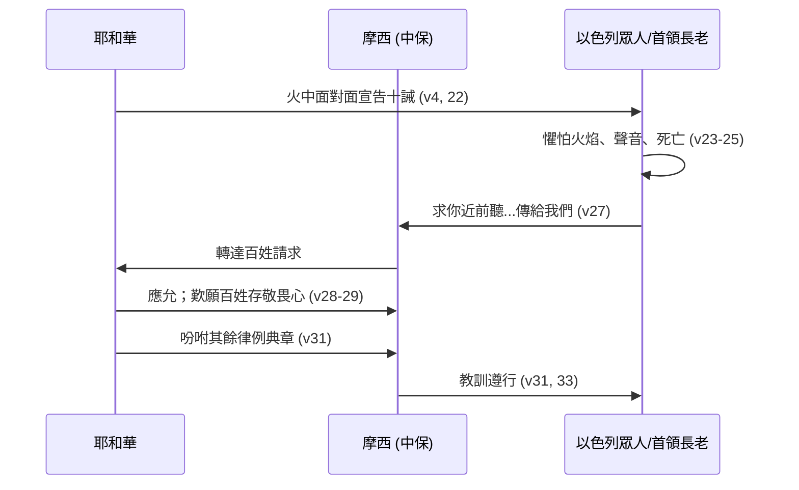

# 申命記 第5章

1. [[摩西]]將以色列眾人召了來，對他們說：以色列人哪，我今日曉諭你們的律例典章，你們要聽，可以學習，謹守遵行。
2. 耶和華─我們的神在[[何烈山]]與我們立約。
3. 這約不是與我們列祖立的，乃是與我們今日在這裡存活之人立的。
4. 耶和華在山上，從火中，[[面對面見神|面對面]]與你們說話─
5. 那時我站在耶和華和你們中間，要將耶和華的話傳給你們；因為你們懼怕那火，沒有上山─說：
6. 我是耶和華─你的神，曾將你從埃及地為奴之家領出來。
7. 除了我以外，你[[除了我以外你不可有別的神|不可有別的神]]。
8. [[不可為自己雕刻偶像]]，也不可做什麼形像，彷彿上天、下地和地底下、水中的百物。
9. 不可跪拜那些像，也不可事奉他，因為我耶和華─你的神是[[忌邪的神]]。恨我的，我必追討他的罪，自父及子，直到三、四代；
10. 愛我、守我誡命的，我必向他們發慈愛，直到千代。
11. 不可妄稱耶和華─你神的名；因為妄稱耶和華名的，耶和華必不以他為無罪。
12. 當照耶和華─你神所吩咐的[[當記念安息日守為聖日|守安息日為聖日]]。
13. 六日要勞碌做你一切的工，
14. 但第七日是向耶和華─你神當守的安息日。這一日，你和你的兒女、僕婢、牛、驢、牲畜，並在你城裡寄居的客旅，無論何工都不可做，使你的僕婢可以和你一樣安息。
15. 你也要記念你在埃及地作過奴僕；耶和華─你神用大能的手和伸出來的膀臂將你從那裡領出來。因此，耶和華─你的神吩咐你[[當記念安息日守為聖日|守安息日]]。
16. 當照耶和華─你神所吩咐的[[當孝敬父母|孝敬父母]]，使你得福，並使你的日子在耶和華─你神所賜你的地上得以長久。
17. [[不可殺人]]。
18. [[不可姦淫]]。
19. [[不可偷盜]]。
20. [[不可作假見證陷害人]]。
21. [[不可貪戀]]人的妻子；也不可貪圖人的房屋、田地、僕婢、牛、驢，並他一切所有的。
22. 這些話是耶和華在山上，從火中、雲中、幽暗中，大聲曉諭你們全會眾的；此外並沒有添別的話。他就把這話寫在兩塊石版上，交給我了。
23. 那時，火焰燒山，你們聽見從黑暗中出來的聲音；你們支派中所有的首領和長老都來就近我，
24. 說：看哪，耶和華─我們神將他的榮光和他的大能顯給我們看，我們又聽見他的聲音從火中出來。今日我們得見神與人說話，人還存活。
25. 現在這大火將要燒滅我們，我們何必冒死呢？若再聽見耶和華─我們神的聲音就必死亡。
26. 凡屬血氣的，曾有何人聽見永生神的聲音從火中出來，像我們聽見還能存活呢？
27. 求你近前去，聽耶和華─我們神所要說的一切話，將他對你說的話都傳給我們，我們就聽從遵行。
28. 你們對我說的話，耶和華都聽見了。耶和華對我說：這百姓的話，我聽見了；他們所說的都是。
29. [[惟願他們存這樣的心敬畏我]]，常遵守我的一切誡命，使他們和他們的子孫永遠得福。
30. 你去對他們說：你們回帳棚去吧！
31. 至於你，可以站在我這裡，我要將一切誡命、律例、典章傳給你；你要教訓他們，使他們在我賜他們為業的地上遵行。
32. 所以，你們要照耶和華─你們神所吩咐的謹守遵行，[[不可偏離左右]]。
33. 耶和華─你們神所吩咐你們行的，你們都要去行，使你們可以存活得福，並使你們的日子在所要承受的地上得以長久。

<!-- fhl-map-links:start -->
## 相關地圖

- [[appendix/fhl_maps/maps/025|〈申圖一〉應許之地全圖]]
<!-- fhl-map-links:end -->

---

## 本章知識節點

### 神學
- [[西乃之約]]
- [[十誡]]
- [[十誡的條分法]]
- [[中保]]
- [[面對面見神]]
- [[百姓懼怕神的顯現]]
- [[忌邪的神]]
- [[追討罪自父及子直到三四代]]
- [[發慈愛直到千代]]
- [[惟願他們存這樣的心敬畏我]]

### 原文
- [[何烈山]]

### 倫理
- [[除了我以外你不可有別的神]]
- [[不可為自己雕刻偶像]]
- [[不可妄稱耶和華你神的名]]
- [[當記念安息日守為聖日]]
- [[當孝敬父母]]
- [[不可殺人]]
- [[不可姦淫]]
- [[不可偷盜]]
- [[不可作假見證陷害人]]
- [[不可貪戀]]
- [[不可偏離左右]]

---

## 本章整理

### 緒論：約的更新與中保的職分（v1-5）

申命記第五章是全書法律核心的序幕，[[摩西]] 召集「以色列眾人」（v1），宣告律例典章的聽受、學習與遵行三重責任。經文強調這約非與列祖（亞伯拉罕、以撒、雅各）立的，乃是與「今日在這裡存活之人」立的（v3），凸顯[[西乃之約]]的**當代性**與**代際責任**——每一代都必親自回應神的呼召。[[何烈山]]（即西乃山）的顯現場景被重述：神從火中「面對面」說話（v4），百姓因懼怕火焰不敢上山（v5），[[摩西]] 站在神與百姓中間作[[中保]]，傳遞神的話語。這「面對面」的描述（[[面對面見神]]）並非指看見神的形像（申4:12, 15），而是指無遮攔、直接的話語啟示，奠定了律法權威的神聖來源。[[百姓懼怕神的顯現]] 成為後文請求摩西代為聽受的動因，也預表新約中基督作為更美中保的職分（來12:18-24）。

### 核心：十誡的重申與神學深意（v6-21）

本段詳錄[[申5：6-21]]，即[[十誡]]的第二次頒佈。雖內容與出埃及記二十章大同小異，卻在動機與措辭上顯露申命記獨特的神學重心。[[十誡的條分法]] 通常分為「對神的責任」（v7-15）與「對人的責任」（v16-21）兩版。

**第一版（v7-15）確立獨一真神的專屬主權**。[[除了我以外你不可有別的神]] 宣告一神論的絕對性；[[不可為自己雕刻偶像]] 禁止以任何受造之物代表神，因為神是[[忌邪的神]]，[[追討罪自父及子直到三四代]] 顯示罪的嚴重性與社群連帶性，而[[發慈愛直到千代]] 則彰顯恩典遠超審判。[[不可妄稱耶和華你神的名]] 守護神名的聖潔。[[當記念安息日守為聖日]] 一誡在申命記有顯著差異：出埃及記以「創造」為據（出20:11），此處以「救贖」為據——「要記念你在埃及地作過奴僕；耶和華─你神用大能的手……將你從那裡領出來」（v15），將安息日連結出埃及事件的拯救經驗，賦予安息「自由與救贖」的社會倫理意義，並要求「使你的僕婢可以和你一樣安息」（v14），體現社會公義。

**第二版（v16-21）規範人際關係的秩序**。[[當孝敬父母]] 應許「得福、日子長久」，將家庭倫理上升為約的存續基石。[[不可殺人]]、[[不可姦淫]]、[[不可偷盜]]、[[不可作假見證陷害人]] 維護生命、婚姻、產業與司法公正的四大支柱。[[不可貪戀]] 直指內心動機，將律法要求從外在行為延伸至內在意圖，預備「心志更新」的主題。

```mermaid
mindmap
  root((十誡結構 v6-21))
    第一版：對神的責任
      1. 獨一神 ["除了我以外你不可有別的神"]
      2. 禁偶像 ["不可為自己雕刻偶像"] ["忌邪的神"]
      3. 尊神名 ["不可妄稱耶和華你神的名"]
      4. 守安息 ["當記念安息日守為聖日"] 救贖論依據
    第二版：對人的責任
      5. 孝敬父母 ["當孝敬父母"]
      6. 護生命 ["不可殺人"]
      7. 守貞潔 ["不可姦淫"]
      8. 保產業 ["不可偷盜"]
      9. 重真理 ["不可作假見證陷害人"]
      10. 潔人心 ["不可貪戀"]
```

| 誡命 | 出埃及記 20 依據 | 申命記 5 依據/強調 | 神學意義 |
| :--- | :--- | :--- | :--- |
| 安息日 | 創造秩序（神歇了工） | 救贖經驗（出埃及事件、為奴之家） | 從「模仿神」轉向「紀念恩典」，兼顧社會弱勢（僕婢、寄居者） |
| 孝敬父母 | 使日子長久 | 使你得福、日子長久（神賜地的應許） | 將家庭倫理與「承受產業」掛鉤，強調社會傳承 |

### 回應：百姓的懼怕與神的渴望（v22-33）

律法頒布的高潮在於雙向回應。神將話語寫在「兩塊石版上」（v22），GT／精讀本指出「2」這數字對聖經與希伯來人而言意味著證據或確實性，暗示十誡之約的普遍見證性及完全性；CT補充『兩塊石版』是神用指頭寫的石版。百姓領受時的經歷是「火焰燒山」、「從黑暗中出來的聲音」（v23），首領長老們承認「神與人說話，人還存活」（v24），卻因恐懼死亡請求[[摩西]] 獨自上前聽受轉達（v27），這正是[[百姓懼怕神的顯現]] 的具體呈現。

神對百姓的請求表示接納（v28），卻發出一聲歎息般的渴望：「惟願他們存這樣的心敬畏我，常遵守我的一切誡命，使他們和他們的子孫永遠得福」（v29）。[[惟願他們存這樣的心敬畏我]] 這句話揭示神學張力：KC指出「神的心向著祂的百姓，切望他們持續蒙福，而這只能在遵行祂話語中尋得」；精讀本則說「在神面前總要持守以恐懼震驚的心甘願順服所有話語的心志，這也是今日的所有聖徒對待神話語時所當持有的心態」——神渴望的不是懼怕下的服從，而是恆常的敬畏之心。神隨後吩咐百姓「回帳棚去」，摩西則「站在我這裡」領受其餘律例典章（v31），確立了「十誡為綱，律例典章為目」的立法架構。本章以雙重勸勉收尾：[[不可偏離左右]]（v32）、行神所吩咐的道（v33），應許「存活得福、日子長久」——這正是約的雙邊性：神賜福，人以全心順服回應。



### 跨章脈絡：從外在石版到內在心版

申命記第五章在救恩史上扮演「約的憲章重申」角色。[[十誡]] 以[[申5：6-21]] 形式被固定為[[西乃之約]] 的核心條文，透過[[中保]] 摩西的中介，解決了聖潔神與罪人之間的距離。然而，v29 神的歎息（「惟願他們存這樣的心」）指向舊約的張力：律法寫在石版上，卻未必能觸及人心。BH在v18姦淫誡命處指出，主耶穌深化誡命內涵、強調心思意念的教導，正與「新約著重內心」（耶31:33）一致；BH又在v3、v22、v27多處指出，何烈山之約預表新約的實現（耶31:31-34；來8:8-12），摩西作為舊約中保領受法版、代神傳話，正是「預表基督作為新約中保」（來9:15）——摩西是那更美中保的預像。

本章也為申命記後續「誡命、律例、典章」的詳細展開（申6-26章）鋪路。[[不可偏離左右]] 不僅是行為準則，更是對「專一忠誠」的呼召，呼應v7「除了我以外不可有別的神」。今日讀者當見：十誡非冷冰冰的法條，乃是救贖主對被釋放子民發出的「關係憲章」，其終極目標不是行為合規，而是「敬畏神、得蒙福、世世代代享受約的恩典」。

**參考資料**
https://www.ccbiblestudy.org/Old%20Testament/05Deut/05CT05.htm
https://www.ccbiblestudy.org/Old%20Testament/05Deut/05GT05.htm
https://www.kingcomments.com/en/bible-studies/Deu/5
https://biblehub.com/study/deuteronomy/5.htm
