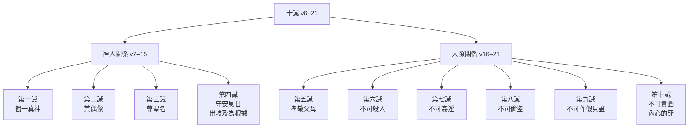

# 申命記 第5章

1. 摩西將以色列眾人召了來，對他們說：以色列人哪，我今日曉諭你們的律例典章，你們要聽，可以學習，謹守遵行。
2. 耶和華─我們的神在[[何烈山立約|何烈山]]與我們立約。
3. 這約不是與我們列祖立的，乃是與我們今日在這裡存活之人立的。
4. 耶和華在山上，從火中，面對面與你們說話─
5. 那時我站在耶和華和你們中間，要將耶和華的話傳給你們；因為你們懼怕那火，沒有上山─說：
6. 我是耶和華─你的神，曾將你從埃及地為奴之家領出來。
7. 除了我以外，你不可有別的神。
8. 不可為自己雕刻偶像，也不可做什麼形像，彷彿上天、下地和地底下、水中的百物。
9. 不可跪拜那些像，也不可事奉他，因為我耶和華─你的神是[[第二誡：不可雕刻偶像|忌邪的神]]。恨我的，我必追討他的罪，自父及子，直到三、四代；
10. 愛我、守我誡命的，我必向他們發慈愛，直到千代。
11. 不可妄稱耶和華─你神的名；因為妄稱耶和華名的，耶和華必不以他為無罪。
12. 當照耶和華─你神所吩咐的守安息日為聖日。
13. 六日要勞碌做你一切的工，
14. 但第七日是向耶和華─你神當守的安息日。這一日，你和你的兒女、僕婢、牛、驢、牲畜，並在你城裡寄居的客旅，無論何工都不可做，使你的僕婢可以和你一樣安息。
15. 你也要記念你在埃及地作過奴僕；耶和華─你神用大能的手和伸出來的膀臂將你從那裡領出來。因此，耶和華─你的神吩咐你守安息日。
16. 當照耶和華─你神所吩咐的孝敬父母，使你得福，並使你的日子在耶和華─你神所賜你的地上得以長久。
17. 不可殺人。
18. 不可姦淫。
19. 不可偷盜。
20. 不可作假見證陷害人。
21. 不可貪戀人的妻子；也[[第十誡：不可貪圖|不可貪圖]]人的房屋、田地、僕婢、牛、驢，並他一切所有的。
22. 這些話是耶和華在山上，從火中、雲中、幽暗中，大聲曉諭你們全會眾的；此外並沒有添別的話。他就把這話寫在兩塊石版上，交給我了。
23. 那時，火焰燒山，你們聽見從黑暗中出來的聲音；你們支派中所有的首領和長老都來就近我，
24. 說：看哪，耶和華─我們神將他的榮光和他的大能顯給我們看，我們又聽見他的聲音從火中出來。今日我們得見神與人說話，人還存活。
25. 現在這大火將要燒滅我們，我們何必冒死呢？若再聽見耶和華─我們神的聲音就必死亡。
26. 凡屬血氣的，曾有何人聽見永生神的聲音從火中出來，像我們聽見還能存活呢？
27. 求你近前去，聽耶和華─我們神所要說的一切話，將他對你說的話都傳給我們，我們就聽從遵行。
28. 你們對我說的話，耶和華都聽見了。耶和華對我說：這百姓的話，我聽見了；他們所說的都是。
29. 惟願他們存這樣的心敬畏我，常遵守我的一切誡命，使他們和他們的子孫永遠得福。
30. 你去對他們說：你們回帳棚去吧！
31. 至於你，可以站在我這裡，我要將一切誡命、律例、典章傳給你；你要教訓他們，使他們在我賜他們為業的地上遵行。
32. 所以，你們要照耶和華─你們神所吩咐的謹守遵行，[[摩西吩咐謹守遵行不偏左右|不可偏離左右]]。
33. 耶和華─你們神所吩咐你們行的，你們都要去行，使你們可以存活得福，並使你們的日子在所要承受的地上得以長久。

<!-- fhl-map-links:start -->
## 相關地圖

- [[appendix/fhl_maps/maps/025|〈申圖一〉應許之地全圖]]
<!-- fhl-map-links:end -->

---

## 本章知識節點

### 神學
- [[摩西重申十誡]]
- [[何烈山立約]]
- [[神從火中面對面說話]]
- [[百姓懼怕火不敢上山]]
- [[神願百姓存敬畏心謹守遵行]]
- [[摩西吩咐謹守遵行不偏左右]]

### 誡命
- [[第一誡：不可有別神]]
- [[第二誡：不可雕刻偶像]]
- [[第十誡：不可貪圖]]

### 歷史地理
- [[何烈山]]
- [[埃及地]]

---

## 本章整理

### 立約背景與中保職分（v1-5）

摩西召集全以色列，KC 指出：摩西預表主耶穌為教師傳講神的話。「聽」在本書頻繁出現——聽與行不可分割，聽是百姓存活的必要條件。摩西強調[[何烈山立約]]非與列祖亞伯拉罕、以撒、雅各所立，乃與「今日在這裡存活之人」立（v3）。KC 指出：這約不是與嘆息於罪惡捆綁中、拒絕進地的舊世代立的，而是與新世代——「活著的人」立的。這體現約的**當代性**與**代際責任**。經文回顧[[神從火中面對面說話]]的盛況（v4），並點出[[百姓懼怕火不敢上山]]，因此[[摩西重申十誡]]時特別提醒自己曾站在耶和華與百姓中間傳達話語（v5），確立中保地位。KC 預表解讀：摩西是中保，正如主耶穌站在神與我們之間——神在基督的面上向我們顯明自己（林後 4:6）；以色列因火懼怕，我們卻因愛而無懼（約壹 4:18）。

### 十誡重申：核心倫理與禮儀並重（v6-21）

本章將西乃山十誡（出 20）重述，並加入出埃及救贖動機（v6, 15）。KC 指出：神首先啟示自己為「救贖的神」——祂先愛了我們，才要求我們愛祂（約壹 4:9-10,19）。前四誡規範與神關係：[[第一誡：不可有別神]]（v7）——KC 強調：所有生活領域都在祂權柄之下，任何介入我們與神之間、誘使我們給予它尊榮的事物都是偶像（約壹 5:21）；[[第二誡：不可雕刻偶像]]（v8-10）嚴禁偶像崇拜，宣告神的忌邪與慈愛代際原則——KC 指出恨神的影響到三四代，愛神的影響到千代，愛遠超恨；第三誡禁妄稱神名（v11）——KC 擴展：不僅是咒罵，更包括以主名掩蓋己見、嘴上稱主名卻容許罪、以主名為聚會中心卻按己意安排；第四誡守安息日（v12-15）以「出埃及」取代創世記「創造」作為依據，強調救贖恩典是安息的根基。KC 指出：安息日是順服的「核心考驗」——其他誡命連不信者也能理解，唯獨安息日只因神如此吩咐；救贖是比創造更強大的順服動機。後六誡規範人際關係：孝敬父母（v16）——KC 指出家庭是神家的縮影，尊榮父母反映尊榮天父；不可殺人（v17）——KC 指出恨即屬靈的殺人（約壹 3:15）；姦淫（v18）、偷盜（v19）、作假見證（v20）、[[第十誡：不可貪圖]]（v21）將貪念內在化為罪。

### 百姓懼怕求中保，神悅納其心（v22-33）

神將誡命寫於兩塊石版（v22），百姓見火焰燒山、聽見聲音，懼怕死亡（v23-26），請求摩西作中保：「求你近前去……將他對你說的話都傳給我們，我們就聽從遵行」（v27）。耶和華應允並讚賞：「他們所說的都是。惟願他們存這樣的心敬畏我，常遵守我的一切誡命」（v28-29），這正是[[神願百姓存敬畏心謹守遵行]]的核心神學。KC 指出：神喜悅百姓敬畏的心——祂渴望人存這樣的心，使他們和子孫永遠得福。隨後神吩咐百姓回帳棚，摩西留下領受律例典章（v30-31），並以[[摩西吩咐謹守遵行不偏左右]]作結（v32-33），強調順服帶來生命、福樂與長久居住應許之地。

> [!important] 本章樞紐
> **「惟願他們存這樣的心敬畏我，常遵守我的一切誡命，使他們和他們的子孫永遠得福。」**（v29）
> 此節揭示律法賜予的目的：非外在律法主義，乃是內心敬畏與代際福樂的關鍵。

> [!note] 與出埃及記 20 章比較
> - **安息日理由**：出 20:11 本於創造（六日創造、第七日安息）；申 5:15 本於救贖（曾在埃及作奴僕，神大能手領出）。
> - **第十誡措辭**：出 20:17 「不可貪戀人的房屋……妻子」；申 5:21 將「妻子」提前，並加入「田地」，反映進入迦南產業分配的現實需求。
> - **後五誡連結**：申 5 在後五誡之間加入「和」字（出 20 無），強調誡命的整體性。

**參考資料**
https://www.ccbiblestudy.org/Old%20Testament/05Deut/05CT05.htm
https://www.ccbiblestudy.org/Old%20Testament/05Deut/05GT05.htm
https://www.kingcomments.com/en/bible-studies/Deu/5
https://biblehub.com/study/deuteronomy/5.htm
