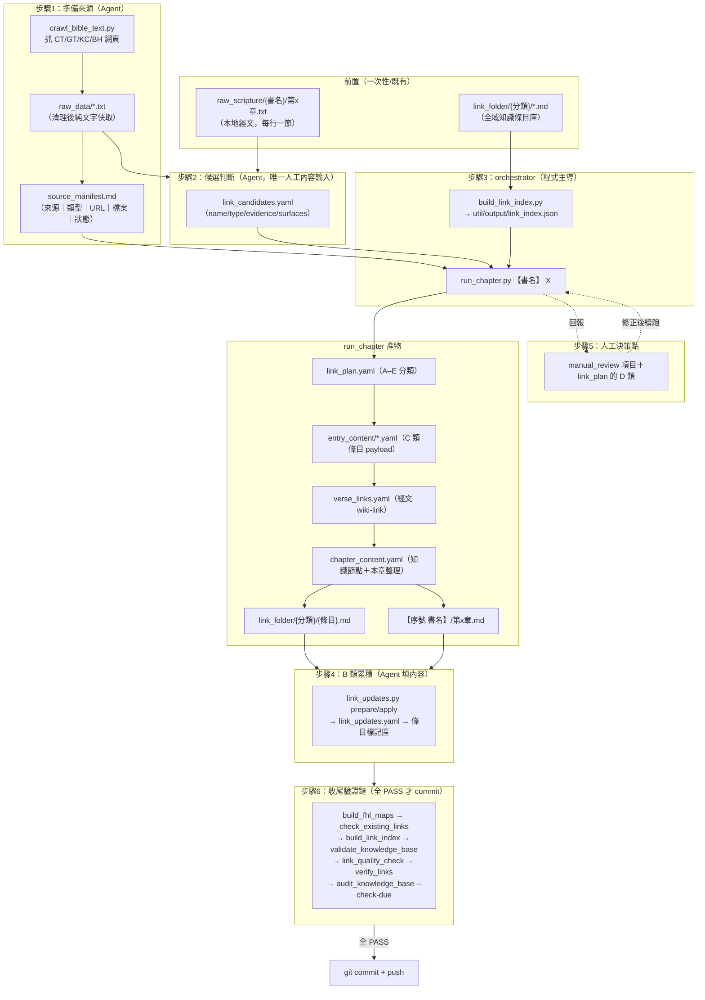
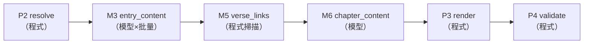

# 專案流程說明（從 agent_start_prompt 出發的完整走查）

> 本文從 [[agent_start_prompt]] 出發，逐步說明每章製作流程中：**誰做什麼（agent／程式／模型）、跑了哪支 `.py`、呼叫了哪些 function、產生什麼檔案、下一步又吃哪個檔案**，直到 commit 為止。
> 設計原則見 [[scheme]]；核心一句話：**模型不碰結構，程式不碰內容。**

---

## 0. 三種角色

| 角色 | 是誰 | 負責什麼 |
|---|---|---|
| **Agent**（你/Claude 對話中的代理） | 讀 `agent_start_prompt.md` 開工的那個 agent | 準備輸入（抓來源、寫 manifest）、判斷「哪些詞值得成為知識節點」（`link_candidates.yaml`）、填 B 類累積內容、處理人工決策點 |
| **程式** | `util/*.py` | 流程編排、A–E 分類、經文 wiki-link 標注、渲染全部 markdown、結構驗證——一切「結構性」工作 |
| **模型**（被程式呼叫的 LLM） | `util/model_client.py` 打的端點（`claude -p` 或本機 OpenAI 相容 proxy） | 只回 YAML payload（條目內容、本章整理），永遠看不到模板，寫不了成品檔 |

模型端點設定在 `_config/model_endpoints.yaml`，用 `python util/model_client.py list|use|test` 檢查／切換，也可用環境變數 `MODEL_ENDPOINT` 臨時覆蓋。

---

## 1. 全流程總覽圖



工作目錄約定：每章的所有中介檔都放在 `【序號 書名】/.tmp/第x章/`（例：`02 出埃及記/.tmp/第26章/`），章節成品是 `【序號 書名】/第x章.md`，條目成品在全域共用的 `link_folder/`。

---

## 2. 步驟 1：準備來源（Agent 手動執行）

### 2.1 確認經文在本地

經文必須已存在於 `raw_scripture/{標準書名}/第{章}.txt`（每行一節，不得改寫）。**缺檔即停**，回報使用者，不自行生成經文。

### 2.2 抓補充來源 → `crawl_bible_text.py`

四種來源（URL 模式見 [[scheme]] §7）：

| 標籤 | 來源 | URL 範例（出26） |
|---|---|---|
| CT | ccbiblestudy 註解 | `.../Old%20Testament/02Exo/02CT26.htm` |
| GT | ccbiblestudy 拾穗 | `.../Old%20Testament/02Exo/02GT26.htm` |
| KC | KingComments | `kingcomments.com/en/bible-studies/Exo/26` |
| BH | BibleHub Study | `biblehub.com/study/exodus/26.htm` |

每個 URL 執行：

```text
python util/crawl_bible_text.py "{URL}" --output_path raw_data --output_filename "{source}_{book_slug}_{chapter}"
```

程式內部流程（`util/crawl_bible_text.py`）：
1. `fetch(url, timeout)` —— 帶瀏覽器 UA 抓 HTML bytes，檢查 Content-Type。
2. `clean_bytes()`（來自 `util/clean_bible_html.py`）—— 把 HTML 清成純文字。
3. 寫入 `raw_data/{source}_{book_slug}_{chapter}.txt`（UTF-8）。已存在的檔**直接沿用，不加 `--overwrite`**。

規約：禁止硬猜 URL（用既有記錄或目錄頁確認）、禁止直接抓網頁進 context 整理——一律先落地成 `raw_data/*.txt` 再讀本地檔。

### 2.3 Agent 手寫 `source_manifest.md`

檢查每份 raw text 是否為**本章**有效內容（404／目錄頁／亂碼／無關＝無效），寫進 `.tmp/第x章/source_manifest.md`，表格欄位固定：`來源｜類型｜URL｜raw_data 檔案｜狀態`。

這張表之後是**唯一事實來源**：
- 只有狀態 OK 的來源會被程式讀入餵給模型（`source_excerpts.parse_manifest()`）。
- 條目「來源依據」與章節「參考資料」的 URL 都由程式從這張表取用／驗證（`manifest_urls()`、`manifest_kind_urls()`），模型不手寫 URL。

---

## 3. 步驟 2：建 `link_candidates.yaml`（Agent 唯一的內容判斷點）

依 `_config/schemas/link_candidates.schema.json` 手寫 `.tmp/第x章/link_candidates.yaml`：

```yaml
book: "出埃及記"
chapter: 26
candidates:
  - name: "十幅幔子（內層幕幔）"
    type: "主題"                    # 用 link_folder/ 現有資料夾名
    evidence: "出26:1-6 經文明確描述……"   # 必須能對回經文或有效 raw text
    surfaces:                       # 選填：經文用的字面詞
      - phrase: "幔子"
        verses: [1, 2, 3, 4, 5, 6]  # 同詞多義時限定節次
      - "十幅幔子"                   # 純字串 = 全章比對
```

判準（[[scheme]] §3.1）：**此詞是否由本章經文或有效 raw text 明確觸發？是否有足夠資料支撐一個條目？** 任一為否就不放。

`surfaces` 的用途：經文常用簡稱（「桌子」→ 條目「陳設餅桌子」），程式自動比對候選名／條目全名／括號前裸名／aliases 都對不上時，就要人工宣告 surfaces；同一詞在本章多義（出26「幔子」v1-13 是幕幔、v31-33 是內幔）用 `{phrase, verses}` 限定節次。

---

## 4. 步驟 3：跑 orchestrator（程式主導的核心）

```text
python util/build_link_index.py
python util/run_chapter.py 【書名】 X
```

### 4.1 `build_link_index.py` — 建全域索引

| function | 做什麼 |
|---|---|
| `collect_entries()` | 掃 `link_folder/**/*.md`（排除 `_index`、`_待分類` 等），讀 frontmatter，收 title/type/secondary_types/aliases/status |
| `load_resolutions()` | 讀 `_config/link_conflict_resolutions.yaml`（人工登記的衝突裁決） |
| `make_index()` | 建 `名稱→條目`、`alias→alias_of` 索引；重複名稱／alias 多重指向一律回報錯誤，不由掃描順序決定勝負 |

產出：**`util/output/link_index.json`**（`--check` 模式只驗證索引是否最新，CI 用）。

### 4.2 `run_chapter.py` — 六個子步驟

**斷點續跑原則：每個子步驟的輸出檔已存在就直接讀取跳過**，所以人工修正後重跑，已完成的步驟不重做。



入口 `run_chapter(book, chapter)` 先建 `ChapterContext`（負責路徑、`raw_verses()` 讀經文、`known_types()` 讀 link_folder 分類、`sources()` 解析 manifest），然後依序執行：

#### P2 `resolve_step()` → `link_plan.yaml`

呼叫 `resolve_link_candidates.py`（resolver）：

| function | 做什麼 |
|---|---|
| `load_candidates()` | 讀 `link_candidates.yaml`（或舊格式 `.md`），`_normalize_surfaces()` 正規化 surfaces |
| `load_homonyms()` | 讀 `_config/link_homonyms.yaml`（合法同名詞登記表） |
| `find_in_index()` | 逐候選比對索引：完全同名 → aliases → 音譯基名（`base_name()`：「皂莢木」命中「皂莢木（atzei shittim）」）→ 同名映射；歧義回 `conflict` |
| `type_compatible()` | 命中後核對分類相容（type 或 secondary_types） |
| `has_book_chapter_data()` | 檢查既有條目是否已含本章累積標記（決定 A 或 B） |
| `resolve()` + `build_plan_document()` | 產出 A–E 分類文件 |

A–E 類語義：

| 類 | 意義 | 後續動作 |
|---|---|---|
| **A** use_directly | 既有條目已含本章累積 | 直接連（verse_links 連 existing_title） |
| **B** needs_update | 既有條目，本章尚未累積 | 步驟 4 用 `link_updates.py` 累積 |
| **C** new_formal | 不存在且資料足夠 | M3 批量請模型建新條目 |
| **D** new_candidate | 同名／分類衝突、資料不足 | **人工判斷，不得自動建立或連結** |
| **E** skip | 不應建 link | 純文字 |

#### M3 `entry_content_step()` → `entry_content/*.yaml`（每個 C 類條目一檔）

1. 把 C 類候選**去重**後切成每批 5 條（`BATCH_SIZE = 5`）。
2. `_batch_entry_prompt()` 組 prompt：本章經文全文＋**全部 OK 來源全文**（`source_excerpts.full_source_text()`，超大章節等比截斷）＋規則＋輸出範例。
3. `model_client.call_model()` 呼叫模型：
   - `active_runner()` 依 `_config/model_endpoints.yaml` 選 `claude_runner`（shell 到 `claude -p --output-format json`）或 `openai_runner`（HTTP `/chat/completions`）。
   - `extract_payload()` 從回應抽出 YAML。
   - 驗證失敗時 `_retry_prompt()` 把「具體錯誤＋原輸出」回饋重試，上限 3 次；全敗丟 `ModelValidationError`。
4. 每個 payload 過三道驗證（**驗證左移**——payload 層擋錯，不等成品才發現）：
   - `render_entry.validate_payload()`：name 安全字元、type 是合法分類、status/accumulations/sources 結構、互文條目命名等。
   - `_entry_source_errors()`：sources 每項必須含 manifest 的 URL，且標籤（BH/CT/GT/KC）與 URL 類型成對。
   - `_entry_alias_errors()`（配 `_alias_owners()`）：aliases 不得撞既有條目或同批其他條目。
5. 失敗條目收集錯誤原因，**整批重做一輪（帶錯誤回饋）**；仍失敗者記入 `manual_review`。
6. 通過者寫 `.tmp/第x章/entry_content/{條目名}.yaml`。

#### M5 `verse_links_step()` → `verse_links.yaml`（純程式，不呼叫模型）

> 連詞是機械工作，程式比模型可靠——連出來的必是經文子字串、target 必是既有條目，零漂移。

1. `build_surface_map()` 建「經文詞 → target」對照表，詞彙推導層級（高層勝出）：
   - **0**：候選宣告的 `surfaces`（人工判斷，可帶 verses 限定）
   - **1**：候選名稱（A/B 對 existing_title、C 對實建全名）
   - **2**：條目全名＋括號前裸名（`_base_surface()`：皂莢木（atzei shittim）→ 皂莢木）
   - **3**：條目 aliases（A/B 取全庫索引、C 取本章 payload `_payload_aliases()`）
   - 同層同詞指向不同條目＝歧義 → 整詞不連，記 `manual_review`。
2. 逐節掃描：每詞每節只連首次出現、起點排序＋**長詞優先**、不重疊（「銅座」勝過「銅」）。
3. 宣告了 surfaces 卻沒連上任何節的，記 `manual_review`。

#### M6 `chapter_content_step()` → `chapter_content.yaml`

1. 組 prompt：經文＋全部來源全文＋本章新建條目清單＋份量要求。
2. `_org_requirements()` 依節數算門檻（≥15 節要 3 個 `### 小節（vX-Y）`、字數 `max(400, min(1500, 節數×40))`），`_chapter_payload_validator()` 強制執行——防止模型交三行條列。
3. 模型填 `knowledge_nodes`（分組→節點清單）＋ `organization`（整合性散文，標明「CT指出…」等出處）。
4. `_inject_references()`：**參考資料不由模型手寫**——程式從 `source_manifest.md` 注入 OK 來源 URL。

#### P3 `render_step()` → 全部 markdown 成品

條目部分（每個 entry payload）：
- `_related_title_map()` ＋ `_resolve_related()`：**related_entries 閉合**——裸名／別名／裸經文引用一律解析成實存條目全名，無法對應者移除並記 `manual_review`。
- `_would_destroy_data()`：目標檔已含**其他章節**累積標記時拒絕覆寫（防毀跨章資料），記 `manual_review` 改走 B 類。
- `render_entry.render_entry()`：payload → 完整 markdown（frontmatter、H2 順序「定義／按書卷累積／主題發展／相關條目／來源依據」、`<!-- accumulation:{書}:{章}:start/end -->` 標記、URL 自動包 `<>` 可點）→ 寫 `link_folder/{type}/{name}.md`。

章節部分：
- `_close_knowledge_nodes()`：知識節點同樣閉合成條目全名。
- `render_chapter.render_chapter()`：
  - 經文區＝`raw_scripture` 逐字 ＋ `_assign_spans()` 套 wiki-link（`[[條目全名|經文原詞]]`）；
  - 既有 `fhl-map-links` 地圖區塊原樣保留（passthrough）；
  - H1、知識節點、本章整理、參考資料全由程式排版；
  - → 寫 `【序號 書名】/第x章.md`。

#### P4 `validate_step()` — 立即結構驗證

對剛寫出的每個檔呼叫 `validate_knowledge_base.py` 的 `validate_chapter()` ／ `validate_file(strict=True)`；render 是程式產物，這裡出錯＝程式 bug（修程式，不是叫模型重寫）。

#### 執行結果回報

`run_chapter` 結束時印出：寫入檔數、新增條目數、`manual_review` 清單（需人工處理）、結構驗證錯誤。

### 4.3 `.tmp/第x章/` 完成後長這樣（實例：出26）

```text
02 出埃及記/.tmp/第26章/
├── source_manifest.md      ← Agent 手寫（步驟1）
├── link_candidates.yaml    ← Agent 手寫（步驟2）
├── link_plan.yaml          ← P2 resolver 產出
├── entry_content/          ← M3 模型 payload（22 檔，如 至聖所.yaml、皂莢木豎板.yaml）
├── verse_links.yaml        ← M5 程式掃描產出
├── chapter_content.yaml    ← M6 模型 payload
└── link_updates.yaml       ← 步驟4 prepare 骨架＋Agent 填寫
```

---

## 5. 步驟 4：B 類累積（`link_updates.py`）

既有條目（B 類）補上本章資料，**內容由 Agent 回到經文與有效 raw text 撰寫**，寫入動作由程式安全執行：

```text
python util/link_updates.py prepare 【書名】 X        # 產生骨架
（Agent 填 link_updates.yaml 每條的 summary / relation）
python util/link_updates.py apply <manifest> --dry-run  # 預覽
python util/link_updates.py apply <manifest>            # 套用
python util/link_updates.py apply <manifest> --dry-run  # 重跑必須 0 變更（冪等驗證）
```

| function | 做什麼 |
|---|---|
| `plan_updates()` | 讀 `link_plan.yaml` 的 `B_needs_update`，產生 `{title, path, summary: "", relation: ""}` 骨架 |
| `prepare()` | 寫 `link_updates.yaml`；**已存在即拒絕**（避免覆蓋人工內容） |
| `apply_updates()` | 每條驗證欄位齊全、路徑合法後，只動 `<!-- accumulation:{書}:{章}:start/end -->` 標記區：已有標記→原地替換；沒有→在「## 按書卷累積」內按書卷正典順序、章次順序插入 |

---

## 6. 步驟 5：人工決策點（Agent 判斷）

兩個來源：

1. **`run_chapter` 回報的 `manual_review`**：條目重做仍不合格、歧義詞不連、surfaces 沒連上、related_entries 被移除、覆寫保護跳過等。
2. **`link_plan.yaml` 的 D 類**：同名衝突（含 `_config/link_homonyms.yaml` 登記的合法同名詞）、分類衝突、資料不足。

D 類**不得自動建立或連結**。處理方式：判斷後修 `link_candidates.yaml`（改名／加限定詞／宣告 surfaces）或人工建檔，然後**重跑 `run_chapter`**——斷點續跑會跳過已完成的步驟，只補缺的部分。若要強制重做某步驟，刪掉對應的 `.tmp` 檔即可。

---

## 7. 步驟 6：收尾驗證鏈與 commit gate

依序執行，**全部 PASS 才 commit + push**：

| 指令 | 驗什麼 | PASS 條件 |
|---|---|---|
| `python util/build_fhl_maps.py` | 生成/同步 FHL 地圖筆記與章內 `fhl-map-links` 區塊 | 正常結束 |
| `python util/check_existing_links.py 【序號 書名】/第x章.md --missing` | 章節引用的既有條目是否都已含本章資料（用 `has_book_chapter_data()`） | 無缺漏 |
| `python util/build_link_index.py` | 索引可重現、無名稱/alias 衝突 | 無 ❌ |
| `python util/validate_knowledge_base.py` | 全庫結構：frontmatter、H2 順序、累積標記完整性、保護區（定義/主題發展）、內部來源行洩漏 | ERRORS=0 |
| `python util/link_quality_check.py 【書名】` | 語意品質：書卷/人物同名錯連、空 alias、短詞過度 link、同章同詞異 target 等 → `link_quality_report.json` | CRITICAL=0 |
| `python util/verify_links.py 【書名】` | 全部 wiki-link 分四類：BROKEN／PENDING_SCRIPTURE／INVALID_SCRIPTURE／UNKNOWN | BROKEN=0, INVALID=0, UNKNOWN=0（PENDING 可存在） |
| `python util/audit_knowledge_base.py --check-due` | 依 `_config/maintenance_policy.yaml` 檢查是否到期未稽核（每 10 章 `--all --checkpoint 10`、每卷 `--book`） | PASS |
| `python -m unittest discover -s util/tests` | 14 個工具測試檔（含 render round-trip：`render(parse(x)) == x`） | 全過（CI 必跑） |

回報使用者時只列結論數字（errors/critical/broken 計數）與 D 類決策，不貼完整報告。CI 為最終守門。

---

## 8. 檔案產物總表

| 檔案 | 產生者 | 被誰消費 |
|---|---|---|
| `raw_scripture/{書}/第x章.txt` | 使用者預先提供 | run_chapter（經文唯一來源）、render_chapter 逐字對齊 |
| `raw_data/{source}_{book}_{ch}.txt` | `crawl_bible_text.py` | source_excerpts → M3/M6 prompt 全文餵入 |
| `.tmp/第x章/source_manifest.md` | **Agent 手寫** | source_excerpts（OK 來源篩選、URL 唯一事實來源） |
| `.tmp/第x章/link_candidates.yaml` | **Agent 手寫** | P2 resolver |
| `util/output/link_index.json` | `build_link_index.py` | resolver、verse_links、related 閉合、各驗證器 |
| `.tmp/第x章/link_plan.yaml` | P2 `resolve_step` | M3（C 類清單）、M5（A/B target）、link_updates（B 類清單） |
| `.tmp/第x章/entry_content/*.yaml` | M3 模型（經驗證） | P3 render_entry、M5 aliases 推導 |
| `.tmp/第x章/verse_links.yaml` | M5 程式掃描 | P3 render_chapter |
| `.tmp/第x章/chapter_content.yaml` | M6 模型（經驗證＋程式注入 references） | P3 render_chapter |
| `.tmp/第x章/link_updates.yaml` | `link_updates.py prepare` 骨架＋**Agent 填內容** | `link_updates.py apply` |
| `link_folder/{分類}/{條目}.md` | P3 `render_entry` ／ apply 累積 | 全庫知識累積、下次 build_link_index |
| `【序號 書名】/第x章.md` | P3 `render_chapter` | 讀者順讀、驗證鏈 |
| `util/output/*_report.json` | 各驗證器 | 人工檢視（不進 commit gate 內容） |

---

## 9. 貫穿全程的機制與邊界

- **斷點續跑／冪等**：`.tmp` 檔存在即跳過；`link_updates apply` 重跑 0 變更；render 重渲染結果不變（round-trip 測試保證）。
- **驗證左移**：payload 層 schema＋語義驗證＋錯誤回饋重試（上限 3 次），不讓錯誤流到成品才發現。
- **覆寫保護**：含其他章累積的條目拒絕覆寫；`prepare` 拒絕覆蓋已填的 link_updates。
- **檔名安全**：半形 `:` 自動正規化為全形 `：`（`render_entry.safe_name()`；Windows 檔名限制）。
- **改名一律走** `python util/rename_markdown.py <src> <dst> [--dry-run]`——會同步全庫 WikiLink。
- **舊格式遷移**用 `normalize_format.py --scope all --dry-run` → 套用 → 再 dry-run 必須 0 變更。
- **內容邊界（程式無法代勞）**：一切內容必須能對回經文或有效 raw text；來源未提的不寫、不憑神學常識外推；不假裝無效來源有效；已完成且驗證通過的章節不重做。

## 10. 相關檔案索引

- 操作入口：[[agent_start_prompt]]
- 設計原則與決策記錄：[[scheme]]
- 重構緣由：[[refactor_guidelines]]
- 資料結構契約：`_config/schemas/`（link_candidates／entry_content／verse_links／chapter_content 四份 JSON Schema）
- 設定：`_config/bible_books.json`（書卷章數）、`link_homonyms.yaml`（同名詞）、`link_conflict_resolutions.yaml`（衝突裁決）、`model_endpoints.yaml`（模型端點）、`maintenance_policy.yaml`（稽核間隔）
