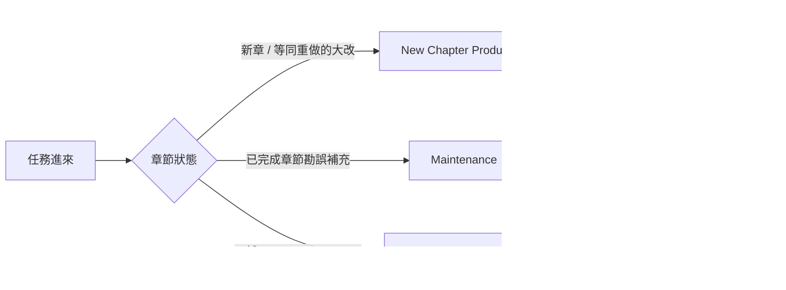
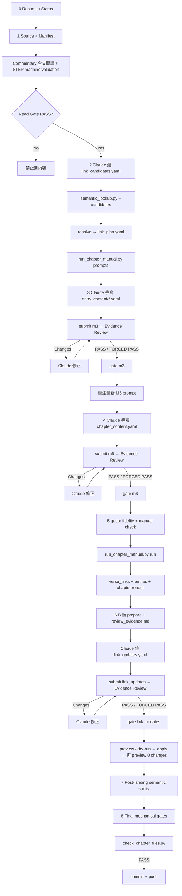

# 專案流程說明（CC-Suite / Multi-Agent Constitution 版）

> 本文件說明 **Bible_wiki_zh 目前真正使用的 production / maintenance / audit 流程**。
>
> 本版以 `cc-suite-and-agents-constitution` branch 的現況為準。它不是 `main` 舊流程的微調，而是一次 control-plane 重構：**Codex / Antigravity 負責流程總控與 evidence review，Claude Opus 負責研經內容，M3 / M6 已改為人工 payload，程式負責 deterministic orchestration、render、state 與 validation。**
>
> 本文件是「理解整個系統怎麼運作」的導覽，不取代權威規格。真正執行任務時，仍要依下面的權威順序讀正式文件。

---

## 0. 先記住：現在不是「一個 Agent 跑到底」

舊版流程最容易造成誤解的地方，是把整個專案想成：

```text
Agent 準備資料 → run_chapter.py 呼叫模型 → 模型生 YAML → 程式 render → 驗證
```

**這已經不是現在的正式 production 模式。**

目前的核心模式是：

```text
Codex / Antigravity：流程總控、deterministic steps、Evidence Review、落地、驗證、commit
Claude Opus：全文閱讀來源、候選判斷、M3 / M6 / B 類研經內容撰寫與修稿
Python pipeline：resolver、projection、schema、render、state、fingerprint、validation
Human：規則衝突或 evidence 無法消解時的最終裁決者
```

一句話概括：

> **內容作者、流程總控、證據審查、deterministic pipeline 四者分離。**

這個分離是目前專案避免「自己寫、自己審、自己宣告正確」的核心安全設計。

---

# 1. 規則權威階層

真正執行前，先判斷你在做哪一種工作。

| 情境 | 權威文件 |
| --- | --- |
| 所有 Agent 共用 evidence / source / validation / collaboration 規則 | `AGENTS.md` |
| 新章 production | `agent_start_prompt.md` |
| Codex 主導新章協作 | `agent_codex_orchestrator_prompt.md` |
| Codex quota / service unavailable 後接手 | `agent_antigravity_orchestrator_prompt.md` |
| M3 / M6 / B 類 evidence review | `agent_evidence_audit_prompt.md` |
| 已完成章節勘誤、補充 | `agent_maintenance_prompt.md` |
| 架構、來源、資料結構設計 | `scheme.md` |
| 當章 M3 / M6 的真正欄位、白名單、格式 | `run_chapter_manual.py prompts` 當次輸出的 prompt |
| YAML / payload 結構契約 | `_config/schemas/*.json` |

## 1.1 同時存在多份文件時怎麼判斷？

不是「新文件永遠蓋舊文件」這麼簡單，而是看規則的責任範圍：

- `AGENTS.md` 管跨任務 invariants。
- `agent_start_prompt.md` 管新章 production 的正式 SOP。
- orchestrator prompt 只管 **誰做什麼、review / fallback 怎麼跑**，不另造第二套 production SOP。
- `run_chapter_manual.py prompts` 對 **該次 M3 / M6 payload** 具有最高權威。
- 若權威文件真的互相矛盾，標記 `unresolved`，不要由 Agent 自己選一個喜歡的版本。

---

# 2. 系統分成四個層次

## 2.1 Source / Evidence Layer

這一層回答：「我們到底憑什麼寫？」

### 經文本文

```text
raw_scripture/{標準書名}/第x章.txt
```

- 經文本文與經文交叉引註的正式權威。
- Agent 不得改寫經文。
- Commentary raw 不能取代 `raw_scripture/` 成為經文本文來源。

### 四套 Commentary

```text
raw_data/...
```

正式 prose commentary：

- CT：ccbiblestudy 逐節註解
- GT：ccbiblestudy 拾穗 / 合訂研經資料
- KC：KingComments
- BH：BibleHub Study

Commentary 是「散文解讀層」。統計共識、分歧、解經立場時，只計這四套。

### STEP Bible

```text
raw_data/stepbible_*.txt
.stepbible_data/
```

STEP 是「原文證據層」，可支持：

- 原文字形
- lemma
- Strong / Extended Strong
- morphology
- context gloss
- lexicon 義域

**STEP 永遠不是第五套 commentary。**

另外兩條非常重要：

1. lexicon 是可能義域，不等於本節自動採用的語境義。
2. STEP 沒出現某資訊，不等於它反駁 commentary；**absence 不是否定證據**。

---

## 2.2 Semantic Authoring Layer

真正需要理解經文與資料、做語意判斷的內容主要由 Claude Opus 負責：

- 四套 Commentary 全文閱讀
- `read_log.md`
- `link_candidates.yaml`
- M3：`entry_content/*.yaml`
- M6：`chapter_content.yaml`
- B 類：`link_updates.yaml` 的研經內容
- Evidence Reviewer findings 的修稿

這些不是讓 Python 自己「猜」出來，也不是由舊 `model_client.py` 自動生成。

---

## 2.3 Deterministic Pipeline Layer

`util/*.py` 負責的是可以機械化、可以重現、可以驗證的工作，例如：

- source manifest
- source / STEP read gate
- link index
- semantic similarity report
- resolver / A-B-C-D 分類
- STEP projection
- prompt generation
- payload schema check
- verse links
- render
- pipeline fingerprints
- review fingerprints
- accumulation apply
- link / KB validation
- audit

**程式負責把流程鎖死，不負責替內容作者做神學判斷。**

---

## 2.4 Review / Orchestration Layer

### Codex — Primary Orchestrator + Evidence Reviewer

Codex 預設負責：

- source / manifest / machine gates
- similarity / resolve / prompt generation
- review checkpoint
- evidence audit
- `check` / `run` / render
- B 類 prepare / apply
- final gates
- commit

Codex **不應成為第一次研經內容作者**，否則就會變成自己寫、自己審。

### Claude Opus — Content Author

固定定位：

```text
model = opus
effort = max
```

Claude 負責內容，不主導 render / apply / final gates / commit，也不能替 reviewer 宣告 PASS。

### Antigravity — Codex fallback

當 Codex 因 quota / rate-limit / service unavailable 無法繼續：

- 不重做已完成工作。
- 從同一個 disk checkpoint 接手。
- 接手 orchestrator + Evidence Reviewer。
- 已使用的 review attempts 照算，不歸零。
- prose 工作仍交 Claude Opus。

目前 fallback policy 以 `.cc-suite.md` / `AGENTS.md` 為準：使用 `agy models` 中最新一代 High tier Gemini；branch 建立時的指定為 `gemini-3.7-flash-high`。

---

# 3. 三條 Lifecycle：不要混在一起

整個專案現在至少有三種完全不同的工作流。


```mermaid
flowchart LR
    A[任務進來] --> B{章節狀態}
    B -->|新章 / 等同重做的大改| N[New Chapter Production]
    B -->|已完成章節勘誤補充| M[Maintenance]
    B -->|只補 STEP infrastructure| S[STEP Migration / Audit]

    N --> N1[完整 read → candidate → M3 → review → M6 → review → B → review → render/gates]
    M --> M1[點狀勘誤 / 補充 → 只重跑受影響鏈]
    S --> S1[backfill / receipt / report-only audit]
```

## 3.1 新章 production

走 `agent_start_prompt.md` 全套流程。

## 3.2 已完成章節 maintenance

走 `agent_maintenance_prompt.md`。

核心原則：

> **對的保留，錯的才改；不是把舊章重新生成一遍。**

## 3.3 STEP-only migration / audit

已完成章節若只是補 STEP infrastructure：

- `backfill_step_sources.py`：補正式 STEP raw / manifest / receipt。
- `audit_original_language.py`：只出 report。

這種 migration **不等於重新開啟 production lifecycle**，也不表示要重跑 M3 / M6 / render / links / commentary reading。

---

# 4. 新章 Production：完整狀態機

這是目前最重要的流程。


```mermaid
flowchart TD
    START[0 Resume / Status] --> SRC[1 Source + Manifest]
    SRC --> READ[Commentary 全文閱讀 + STEP machine validation]
    READ --> RG{Read Gate PASS?}
    RG -->|No| STOP1[禁止進內容]
    RG -->|Yes| CAND[2 Claude 建 link_candidates.yaml]

    CAND --> SEM[semantic_lookup.py --candidates]
    SEM --> PLAN[resolve → link_plan.yaml]
    PLAN --> PROMPT[run_chapter_manual.py prompts]

    PROMPT --> M3[3 Claude 手寫 entry_content/*.yaml]
    M3 --> R3[submit m3 → Evidence Review]
    R3 -->|Changes| M3FIX[Claude 修正]
    M3FIX --> R3
    R3 -->|PASS / FORCED PASS| G3[gate m3]

    G3 --> PM6[重生最新 M6 prompt]
    PM6 --> M6[4 Claude 手寫 chapter_content.yaml]
    M6 --> R6[submit m6 → Evidence Review]
    R6 -->|Changes| M6FIX[Claude 修正]
    M6FIX --> R6
    R6 -->|PASS / FORCED PASS| G6[gate m6]

    G6 --> CHECK[5 quote fidelity + manual check]
    CHECK --> RUN[run_chapter_manual.py run]
    RUN --> RENDER[verse_links + entries + chapter render]

    RENDER --> BP[6 B 類 prepare + review_evidence.md]
    BP --> BWRITE[Claude 填 link_updates.yaml]
    BWRITE --> BR[submit link_updates → Evidence Review]
    BR -->|Changes| BFIX[Claude 修正]
    BFIX --> BR
    BR -->|PASS / FORCED PASS| BG[gate link_updates]
    BG --> APPLY[preview / dry-run → apply → 再 preview 0 changes]

    APPLY --> SANITY[7 Post-landing semantic sanity]
    SANITY --> FG[8 Final mechanical gates]
    FG --> CF[check_chapter_files.py]
    CF -->|PASS| COMMIT[commit + push]
```

下面逐步拆解。

---

# 5. Step 0 — Resume：先相信磁碟，不相信記憶

跨 session、跨 Agent、Codex → Antigravity handoff 時，真正的狀態不是聊天紀錄，而是本章磁碟產物。

主要 checkpoint：

```text
【序號 書名】/.tmp/第x章/
```

重要狀態檔包括：

- `pipeline_state.json`
- `agent_review.yaml`
- `source_manifest.md`
- `read_log.md`
- `step_source_receipt.json`
- `link_candidates.yaml`
- `candidate_similarity.md`
- `link_plan.yaml`
- `entry_content/*.yaml`
- `chapter_content.yaml`
- `link_updates.yaml`
- `review_evidence.md`
- `manual/*.prompt.md`

Resume 原則：

- fresh 的產物不重做。
- fingerprint stale 的 stage 從受影響點重來。
- 不因為換 Agent / session 就重置 review budget。
- 不因為「不知道前一個 Agent 做到哪」就從頭再生一次。

---

# 6. Step 1 — Source / Read Gate

## 6.1 準備經文

```text
raw_scripture/{標準書名}/第x章.txt
```

缺經文就停，不自行生成。

## 6.2 準備 Commentary raw

使用：

```text
python util/crawl_bible_text.py "{URL}" --output_path raw_data --output_filename "..."
```

規則：

- URL 依 source catalog / 既有規則確認，不硬猜。
- 已存在的有效 raw 預設沿用。
- 不為了方便把網頁臨時摘要塞進 prompt 當 source of truth。

## 6.3 準備 STEP

```text
python util/extract_stepbible.py "【書名】 X" --data_path .stepbible_data --output_path raw_data --download
```

STEP full raw 是 structured evidence，不要求 Agent 人工逐詞讀完整檔。

## 6.4 Manifest 必須由程式產生

```text
python util/build_source_manifest.py 【書名】 X
```

**禁止手寫 `source_manifest.md`。**

Manifest 是本章正式 source identity / path / status 的 canonical layer。

## 6.5 Commentary Read Receipt

四套 prose Commentary 必須 **每套全文閱讀一次**。

Claude 在：

```text
.tmp/第x章/read_log.md
```

為每套來源記錄：

- 行數
- 三段逐字引句
- 至少一段出自該檔後三分之一

這個設計不是為了多寫文件，而是防止 Agent 只看 source 開頭、只 grep 關鍵字、只讀 prompt 摘要。

## 6.6 STEP Machine Receipt

STEP 不做 400 多列人工 read receipt，而由 parser 驗證：

- book / chapter
- verse coverage
- word rows
- Strong
- morphology
- 原文字元
- SHA-256

產物：

```text
step_source_receipt.json
```

## 6.7 Read Gate

```text
python util/check_source_read.py 【書名】 X
```

必須同時確認：

- Commentary read receipt PASS
- STEP machine validation PASS

**未 PASS 前禁止修改 M3 / M6 / link payload 或正式 production markdown。**

---

# 7. Step 2 — Candidates：先決定「要不要成為知識節點」

Claude 建：

```text
link_candidates.yaml
```

這一層不是在寫完整條目，而是在做 semantic selection。

## 7.1 Candidate 基本判斷

候選至少要滿足：

- 本章經文或有效 source 明確觸發。
- 有研讀價值。
- 有內容可承載。
- 值得跨章累積或成為正式節點。
- 沒有更適合的既有條目承接。

不要因為 STEP 有 Strong 就替每個詞建頁。

## 7.2 Candidate 的結構性高風險

- `name` 不可拿斜線硬塞兩個概念。
- `type` 必須是 `link_folder/` 既有正式分類。
- 經文簡稱對不上正式條目名時要補 `surfaces`。
- 同詞多義時 surface 要限制 verse scope。
- 原文音譯 / 希伯來字母只能用本章 source 真正出現過的形式。

## 7.3 先查「字面存在性」

`search_wiki_entries` / link index 用來確認：

- B 類是不是真的已有正式條目。
- alias 是否已存在。
- 不要憑印象寫一個近似名字，最後被 resolver 靜默當成 C 類新條目。

## 7.4 再查「語義近鄰」

```text
python util/semantic_lookup.py --candidates 【書名】 X
```

產物：

```text
candidate_similarity.md
```

這一層解決的是：

> 字面不同，但其實是不是同一個概念？

報告是輔助判斷，不是模型一說相似就強制 merge；但目前 production 已把 candidate similarity readiness 當成正式前置，缺失或 stale 時 `prompts` 會拒絕繼續。

---

# 8. Step 3 — Resolver + Manual Prompts

先同步 link index：

```text
python util/build_link_index.py
```

再：

```text
python util/run_chapter_manual.py prompts 【書名】 X
```

`prompts` 會做 / 產生：

- candidate resolve
- `link_plan.yaml`
- `manual/sources.md`
- M3 prompt
- M6 prompt（若 M3 尚未完成，之後要重生）
- `prompt_metrics.json`
- STEP task-aware projection

## 8.1 A / B / C / D 概念

實務理解：

- A：直接使用既有條目，不需新增本章 accumulation。
- B：使用既有條目，且本章要補 accumulation。
- C：本章新建正式條目。
- D：同名 / 分類 / ambiguity 等人工決策，不能自動落地。

## 8.2 為什麼 M3 / M6 要人工 payload？

目前 `run_chapter_manual.py` 明確保證：

- `prompts` 只落地 prompt，不呼叫模型 API。
- `check` 驗證人工 payload。
- `run` 只跑剩餘 deterministic pipeline；如果缺 payload 而流程想觸發模型生成，直接報錯。

因此：

> **現在 M3 / M6 的 source of truth 是 Agent 手寫的 YAML，不是某個外部模型 endpoint 回傳值。**

---

# 9. Step 4 — M3：新條目 Payload

Claude 依正式 M3 prompt 手寫：

```text
.tmp/第x章/entry_content/*.yaml
```

## 9.1 STEP 在 M3 的輸入方式

不是把整節、整章 STEP raw 塞進 Claude context。

正式規則：

- 每個 candidate 只取得 candidate-matched evidence。
- evidence / surfaces / verses 是搜尋範圍，不是「把範圍內所有詞全灌進 prompt」。
- 找不到 candidate 對應原文時 fail-small。
- `evidence=全章` 也只略過該 candidate，不可 fallback 整章。
- 需要更多資訊時用 bounded STEP query。

常用 MCP / script 能力概念：

- exact Strong
- base Strong
- word
- verses
- bounded adjacent-chapter occurrences

核心是：**精確查，不猜，不 dump full raw。**

---

# 10. M3 Evidence Review Gate

Claude 寫完後 orchestrator 執行：

```text
python util/agent_review.py submit 【書名】 X m3
```

Reviewer 依 `agent_evidence_audit_prompt.md` 查：

- source attribution
- 引句
- 數字
- 經文
- 原文資料
- Commentary 分歧
- cross-chapter contamination
- `C_new_formal` 是否都有 payload
- **missing entry candidate**

Reviewer 記錄 verdict：

```text
python util/agent_review.py verdict 【書名】 X m3 <pass|changes_required|blocked> \
  --sha <sha> --reviewer <codex|antigravity> --findings-count N
```

最後：

```text
python util/agent_review.py gate 【書名】 X m3
```

M3 沒過 gate，不能進正式 M6。

---

# 11. Review Budget：最多兩次，不是無限來回

每一個 stage 分開計：

```text
m3
m6
link_updates
```

每 stage 最多 **2 次 substantive reviewer attempt**。

## Attempt 1

完整 audit，一次把 material findings 列齊。

## Attempt 2

最後一次 reviewer 機會：

- 複核上一輪修正。
- 查修改處與直接波及面。
- 一次列齊所有剩餘 material findings。

## 如果 Attempt 2 還是 CHANGES_REQUIRED？

Claude 做最後一次修正，再 `submit`。

若內容 hash 已改、兩次 reviewer budget 已用完，`agent_review.py` 會建立：

```yaml
forced_pass: true
reviewer_status: pass
```

這個 PASS 的意思是：

> 流程允許繼續，但不是 reviewer 宣告「零問題」。

**禁止第三次 reviewer call。**

另外：

- `BLOCKED` 不算 substantive attempt。
- Codex quota block 後 Antigravity 接同一 hash，不重置次數。
- 換 session / IDE 也不能歸零。

---

# 12. Step 5 — M6：本章整理 Payload

M3 gate PASS 後，**重新跑 prompts 取得最新 M6 prompt**。

原因：M6 的合法 wiki-link 白名單與本章實際建立的 M3 條目有關。

Claude 手寫：

```text
chapter_content.yaml
```

M6 的主要責任：

- 本章知識節點
- 本章整理
- Commentary 多家觀點
- STEP 語言事實
- M3 / M6 一致性
- 不壓平真實分歧

本章整理中的 wiki-link 不是隨便連 vault 任何真實條目；正式 prompt / validator 有本章白名單限制。

M6 review：

```text
python util/agent_review.py submit 【書名】 X m6
# reviewer audit + verdict
python util/agent_review.py gate 【書名】 X m6
```

**M6 gate PASS 前不得 run/render。**

---

# 13. Step 6 — Check → Run → Render

## 13.1 Quote Fidelity 先跑

```text
python util/check_quote_fidelity.py 【書名】 X
```

這一關專抓：

- 「」裡的字是否真的逐字存在。
- 截句後擅自補字。
- 把英文來源的中文翻譯放進「」冒充原句。
- 兩句拼成一句。
- 引句來源污染。

注意：

> 沒報錯不等於內容全部忠實；來源掛名、方向性誤讀、神學外推仍需 reviewer / 人工核對。

## 13.2 Check 人工 payload

```text
python util/run_chapter_manual.py check 【書名】 X
```

這補上人工 resume 路徑原本可能略過的 validator。

## 13.3 Run

```text
python util/run_chapter_manual.py run 【書名】 X
```

`run` 不再生成 M3 / M6，而是把已完成 payload 送進 deterministic 後半段：

- verse links
- entry render
- chapter render
- P3 / P4 等護欄
- pipeline state 更新

正式 reader-facing markdown 由 YAML render 出來。

因此若發現 M3 / M6 內容錯：

> **改 YAML → check → run。不要只手改 render 後的 markdown。**

否則下次 render 會把錯誤重新蓋回來。

---

# 14. Step 7 — B 類既有條目累積

既有條目要補本章資料時：

```text
python util/link_updates.py prepare 【書名】 X
```

除了 `link_updates.yaml`，還會產生：

```text
review_evidence.md
```

它濃縮 reviewer / author 真正需要看的既有條目狀態：

- definition
- development 摘要 / heading index
- 已累積章節

Claude 填：

- summary
- relation
- overview_review
- definition keep / update
- development keep / update / standing_debt 等判斷

## 14.1 三個區塊不能混用

### 定義

回答：「這是什麼？」

不是本章事件摘要。

### 主題發展

至少跨兩章 / 跨卷，整理推進、轉折、對照。

不是把逐章 accumulation 再寫一次。

### 逐章累積

只記本章：

- summary
- relation

## 14.2 B 類也要 Review

```text
python util/agent_review.py submit 【書名】 X link_updates
# reviewer verdict
python util/agent_review.py gate 【書名】 X link_updates
```

未 PASS 不 apply。

## 14.3 Apply

CLI 常用：

```text
python util/link_updates.py apply 【書名】 X --dry-run
python util/link_updates.py apply 【書名】 X
```

MCP 模式則遵守：

```text
preview → token → apply → 再 preview
```

最後必須確認再跑已是 **0 變更**。

B 類與 M3/M6 不同：它是 accumulator 寫進既有 `link_folder/*.md`，所以 B 類 source of truth / apply lifecycle 要依 `link_updates.py` 管理。

---

# 15. Post-Landing Semantic Sanity：機械全綠前還要再看一次內容

這是目前專案非常重要的哲學：

> **Validation PASS 只能證明結構合法，不能證明研經內容真的忠於 rawdata。**

render / apply 後，仍要回查高風險內容：

- source attribution 是否掛錯家
- 數字
- 「全部、唯一、首次、從未」等全稱詞
- 對照方向有沒有講反
- 經文 cross-reference 是否真的存在
- Commentary 是否真的提到那個延伸
- STEP 是否被過度解讀
- 是否出現異章污染
- 是否自己發明音譯 / 希伯來字母 / 解經史

如果發現錯：

- M3 → 改 `entry_content/*.yaml`
- M6 → 改 `chapter_content.yaml`
- B → 改 `link_updates.yaml` 再 apply

不要只修 rendered markdown。

---

# 16. Final Gates

新章完整收尾以 `agent_start_prompt.md` 的順序為準。目前核心鏈為：

```text
python util/build_appendix_links.py
python util/check_existing_links.py 【序號 書名】/第x章.md --missing
python util/build_link_index.py
python util/build_embedding_index.py
python util/validate_knowledge_base.py
python util/link_quality_check.py 【書名】
python util/verify_links.py 【書名】
python util/audit_knowledge_base.py --check-due
python util/check_chapter_files.py 【書名】 X
```

## 16.1 Embedding Index 不能只 check

新章建立的新條目必須實際進 embedding index，否則下一章的 semantic candidate report 看不到它們，而且會是靜默漏檢。

因此正式 production 是：

```text
build_link_index
→ build_embedding_index 實際增量更新
```

不是只跑 `--check`。

## 16.2 `check_chapter_files.py` 是最後一個完整性守門

它不只是「檔案存在嗎」，還會檢查整個鏈的重要完整性，例如：

- manifest
- candidates
- similarity report
- plan
- entry payload
- verse links
- chapter payload
- rendered chapter
- link updates
- validation outputs
- embedding index 同步
- verse link coverage
- git 未追蹤的新建條目

歷史上曾出現「六七道 gate 都 PASS，但 verse links 沿用 stale 舊檔，整章大量該連的詞沒連上」；這就是 `check_chapter_files` 現在存在的重要原因之一。

---

# 17. Pipeline State / Fingerprint：為什麼改一個檔有時要重跑下游？

`pipeline_state.json` 記錄下游真正依賴的 input fingerprint。

目前設計已不是粗暴地「上游任何 byte 變了就全部刪掉」。它會盡可能使用 projection：

- entry payload 主要跟 plan 的 C 類名單相關。
- chapter payload 主要跟可連白名單、entry name / aliases 相關。
- verse links 才需要吃更多 plan / surfaces 資訊。

因此：

- 只改 `surfaces`：通常不該讓手寫 M3 / M6 全部作廢。
- 只改條目 definition / development 正文：也不應無條件毀掉 payload。
- 新增 / 刪除 candidate：會影響 plan / downstream，重跑是合理的。
- alias 身分改動：可能使 M6 / verse links stale。

`run_chapter_manual.py` 在真正刪除人工產物前會先模擬 invalidation，避免「重跑一個 command，手寫一小時的 YAML 被靜默刪掉」。

---

# 18. Agent Review State / Fingerprint

`agent_review.yaml` 是另一套獨立 state machine。

三個 stage 的 fingerprint：

## M3

```text
entry_content/*.yaml
```

## M6

```text
chapter_content.yaml
+ current M3 fingerprint
```

## link_updates

```text
link_updates.yaml
+ current M3 fingerprint
+ current M6 fingerprint
```

這表示：

- M3 後來變了，舊 M6 review 不能假裝還有效。
- M6 變了，舊 B 類 review 也不能自動沿用。
- reviewer verdict 必須綁目前 SHA；過期 review 不能寫進 state。

這是防止「review 的其實是上一版，現在檔案已經換過」的核心機制。

---

# 19. Maintenance：已完成章節怎麼改

Maintenance **不是重新跑新章 production**。

核心任務通常分三類：

1. 從 rawdata 找漏掉的候選 / surface。
2. 勘誤章整理與相關 link entry。
3. 補充 M3 / M6 / B 類內容，但保持原本正確內容。

## 19.1 點狀修正原則

- 不 100% 相信歷史內容。
- 但也不因為「想寫得更完整」就全面重寫。
- 找到 evidence mismatch 才改。
- 原本有 source 支撐的內容保留。

## 19.2 Maintenance 的 source of truth 仍然要分清楚

- M3 / M6 若由 pipeline 管理 → 改 YAML，再 render。
- B 類 accumulation → 走 `link_updates` apply。
- 允許直接維護的既有條目欄位依 maintenance SOP。
- 大改到接近「整章重新 production」時，升級成完整新章 lifecycle。

## 19.3 Development Debt

既有條目可能累積很多章，但 `主題發展` 還停在早期版本。

`link_updates.py` 已有 debt 機制記錄這類欠帳。

維護不是把每章 summary 貼在一起，而是重新做真正的跨章 synthesis。

---

# 20. STEP Migration / Original-Language Audit

已完成章節需要補 STEP infrastructure 時：

```text
python util/backfill_step_sources.py ...
```

特性：

- 冪等
- 有效既存檔預設沿用
- 壞檔 fail closed
- 補 raw / manifest / receipt

原文 audit：

```text
python util/audit_original_language.py ...
```

它只輸出 findings / reports，**不修改 production content**。

不要因為 audit 報告存在，就讓 script 自動把研經正文重寫掉；修正仍是人工 evidence-based maintenance。

---

# 21. CI 是最後機械守門，不是內容作者

GitHub Actions `Knowledge Base Quality` 目前會執行：

```text
python -m unittest discover -s util/tests -v
python util/build_link_index.py --check
python util/validate_knowledge_base.py --base HEAD^
python util/link_quality_check.py
python util/verify_links.py
python util/audit_knowledge_base.py --check-due
```

CI 的定位：

- 防結構回歸
- 防 link / schema / audit regression
- 防未同步 index

但它依然不能證明：「這句研經內容真的忠於 Commentary」。

所以 production 的正確性是兩層：

```text
Evidence Review / semantic proofreading
+
Mechanical validation / CI
```

兩者缺一不可。

---

# 22. Appendix / Website 是條件式支線

若本章同時修改 `appendix/website/**`：

先做網站 production build，再同步 appendix links：

```text
python appendix/website/build.py --build --deploy-dir .tmp/website-deploy
python util/build_appendix_links.py
```

`build_appendix_links.py` 的責任是讀已產出的網站入口並建立附錄索引，不應在索引階段偷偷替你執行 npm build。

---

# 23. 一章完成的 Definition of Done

對「新章 production」而言，完成不是「第x章.md 出現了」。

真正完成至少代表：

1. 經文、四套 Commentary、STEP source 有效。
2. Manifest 是程式產生的。
3. Commentary 全文 read receipt PASS。
4. STEP machine receipt PASS。
5. Candidate existence / semantic-neighbor 檢查完成。
6. M3 payload 已寫並通過 review gate。
7. M6 payload 已寫並通過 review gate。
8. `check` / `run` 成功。
9. B 類 accumulation 已通過 review gate 並 apply；重跑 0 changes。
10. Quote / semantic sanity 已做。
11. link / KB / audit / embedding / chapter files gates PASS。
12. 新建正式條目沒有漏 git add。
13. CI 可通過。
14. 一章一 commit（多章工作預設如此）。

---

# 24. 最常見的錯誤理解（新版請直接忘掉）

## 錯誤 1：`run_chapter.py` 會替我把 M3 / M6 生出來

現在正式 production 不這樣做。

**M3 / M6 = 人工 payload。**

---

## 錯誤 2：Agent 可以手寫 `source_manifest.md`

不可以。

Manifest 必須由 `build_source_manifest.py` 依磁碟正式來源重建。

---

## 錯誤 3：STEP 是第五家 Commentary

不是。

STEP 是 original-language evidence layer。

---

## 錯誤 4：四套 Commentary prompt 有摘要，所以不用讀全文

錯。

Prompt 不重複塞全文，是為了節省重讀 context；**全文閱讀義務仍存在。**

---

## 錯誤 5：Reviewer 可以一直 review 到零問題

現在刻意限制為每 stage 最多兩次 substantive attempt。

第二次後由 Claude 最後修正，必要時明示 FORCED PASS，再靠 post-landing sanity + final gates 收尾。

---

## 錯誤 6：Codex 沒額度就整章重做

不需要。

Antigravity 從同一 disk checkpoint 接手，review budget 照原 state 繼續。

---

## 錯誤 7：所有 gate PASS = 內容一定正確

錯。

Gate 大部分是結構與機械驗證；source fidelity 仍需要 Evidence Reviewer / semantic proofreading。

---

## 錯誤 8：修 rendered markdown 就好了

對 M3 / M6 pipeline-managed 內容通常錯。

要改 source-of-truth YAML 再 render。

---

# 25. 最短版工作清單

如果只想快速確認「新章現在到底怎麼跑」，記這條：

```text
Codex 準備 source / manifest / STEP machine gate
→ Claude Opus 全文讀四套 Commentary + read_log
→ read gate
→ Claude candidates
→ semantic similarity + resolve + prompts
→ Claude M3
→ m3 review（最多 2 次）→ gate
→ 重生 M6 prompt
→ Claude M6
→ m6 review（最多 2 次）→ gate
→ quote fidelity + check → run/render
→ B prepare + review_evidence
→ Claude link_updates
→ B review（最多 2 次）→ gate
→ preview/apply → 0 changes
→ semantic sanity
→ appendix / links / embedding / KB / audit / chapter-files gates
→ commit
```

Codex quota 不足：

```text
current disk checkpoint
→ Antigravity 接手 orchestrator/reviewer
→ review_attempts 不重置
→ Claude 仍然是內容作者
→ 繼續同一條流程
```

---

# 26. 文件維護原則

未來若 pipeline 再演進，本文件應只維護：

- 整體架構
- 角色責任
- lifecycle
- artifact / state dataflow
- 高層 command sequence

不要把每一個 prompt 欄位、每個 schema 細節全部複製進來，否則它很快又會成為第二份過期真相。

細節應繼續留在：

- `AGENTS.md`
- `agent_start_prompt.md`
- `agent_maintenance_prompt.md`
- orchestrator / audit prompts
- `_config/schemas/`
- 當次 `run_chapter_manual.py prompts`
- `util/*.py`

本文件的任務，是讓人一眼看懂：

> **資料從哪裡來、誰負責判斷、誰負責審、程式在哪裡接手、什麼時候才真正算完成。**
